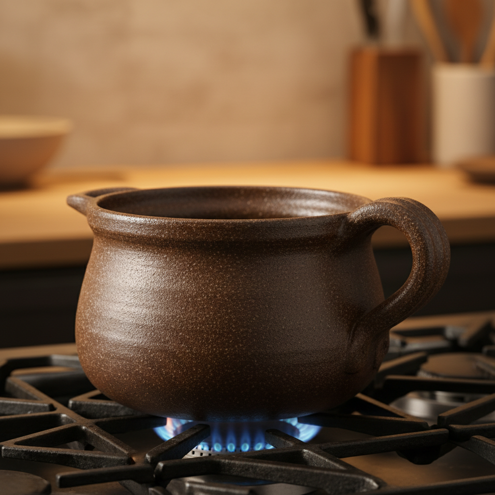

# Flameware Art 火焰器艺术

> "Flameware is ceramics that laughs at thermal shock — clay bodies engineered with high percentages of petalite, spodumene, or other lithium minerals that expand so little when heated that a pot can go from freezer to open flame without cracking, the ancient dream of cooking directly in clay made reliable by modern mineralogy, functional pottery that bridges the gap between the kiln and the kitchen stove." — Unknown

## 概述

火焰器艺术（Flameware Art）是一种专门设计用于直接在明火上加热的陶瓷器具艺术。火焰器使用特殊的耐热冲击配方——通常含有高比例的锂辉石（spodumene）、透锂长石（petalite）或其他低膨胀矿物——使陶瓷器具能够承受从冷到热的急剧温度变化而不开裂。火焰器将陶瓷的古老烹饪功能与现代材料科学结合，创造出可以直接在炉灶上使用的美丽陶瓷器具。

火焰器艺术的核心要素包括：1）耐热冲击——承受急剧温度变化；2）特殊配方——含锂矿物的低膨胀坯体；3）烹饪功能——可直接在明火上使用；4）材料科学——精确的矿物配比；5）功能美学——实用与美观的结合；6）日常使用——为日常烹饪设计；7）传统回归——回归陶瓷的烹饪本源。

## 核心特征

| 特征 | 描述 |
|------|------|
| 耐热冲击 | 承受急剧温度变化 |
| 特殊配方 | 低膨胀矿物配方 |
| 明火使用 | 可直接在火上加热 |
| 功能至上 | 为烹饪功能设计 |
| 材料科学 | 精确的科学配方 |
| 日常实用 | 日常厨房使用 |

## 视觉特征

- **质朴造型**：功能导向的质朴器形
- **厚实器壁**：适合加热的厚壁设计
- **深色坯体**：含铁矿物的深色坯体
- **把手设计**：隔热的把手设计
- **烹饪痕迹**：使用后的火焰痕迹
- **自然质感**：未施釉或薄釉的自然表面

## 代表作品

| 作品 | 艺术家/文化 | 年代 | 意义 |
|------|-------------|------|------|
| *中国砂锅* | 中国 | 各时期 | 中国传统火焰器 |
| *摩洛哥塔吉锅* | 摩洛哥 | 各时期 | 北非火焰器传统 |
| *Flameproof陶器* | 各地陶艺家 | 当代 | 现代火焰器设计 |
| *日本土锅* | 日本 | 各时期 | 日本火焰器传统 |
| *当代火焰器* | 各地陶艺家 | 当代 | 火焰器的当代创作 |

## 历史时间线

| 时期 | 事件 |
|------|------|
| 远古 | 最早的陶制烹饪器 |
| 各时期 | 各文化的耐火烹饪陶器 |
| 20世纪 | 锂矿物配方的科学化 |
| 当代 | 现代火焰器的精确设计 |
| 当代 | 火焰器在手工陶艺中的复兴 |

## 中国语境

中国有极其丰富的火焰器传统——砂锅是中国厨房中最重要的陶瓷烹饪器具之一。中国的砂锅传统可以追溯到数千年前，广东、云南等地至今仍大量生产和使用砂锅。中国砂锅的配方通常含有高比例的石英砂和耐火粘土，使其能够承受明火加热。中国的煲仔饭、砂锅粥、药膳等烹饪方式都依赖砂锅的特殊性能。中国当代陶艺家开始重新关注火焰器的设计——将传统砂锅的功能性与当代设计美学结合，创造出既实用又美观的现代火焰器。中国的火焰器传统证明了陶瓷最原始的功能——烹饪——在当代仍然有重要的价值。

## AI生成概念图

## 与其他风格的关系

- **Functional Pottery** → 功能陶器
- **Stoneware** → 炻器
- **Cooking Vessel** → 烹饪器
- **Material Science** → 材料科学
- **Kitchen Design** → 厨房设计
- **Traditional Craft** → 传统工艺

---

*浮光艺志 | Chronicle of Artistry*
