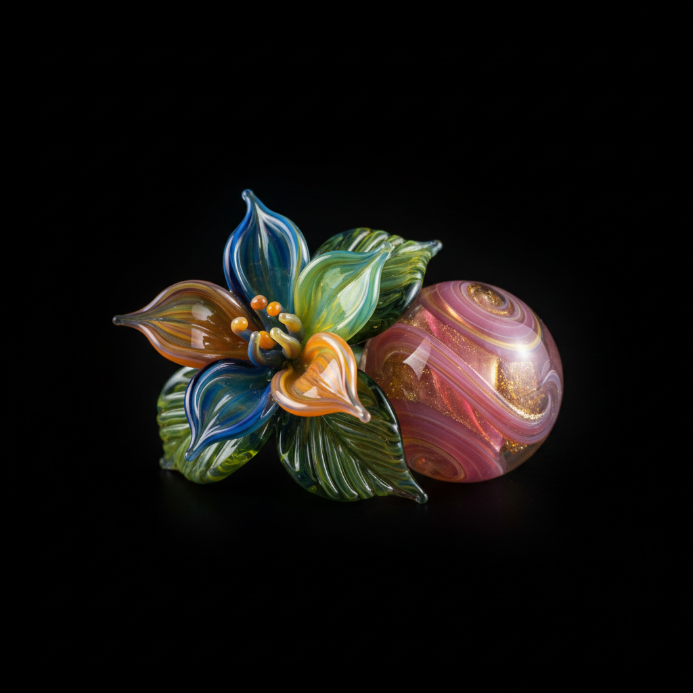

# Flamework Art 灯工玻璃艺术

> "Flamework is sculpting with molten glass at the tip of a torch — rods and tubes of colored glass are heated in a focused flame until they flow like honey, then shaped by gravity, breath, and simple tools into intricate miniatures, beads, marbles, and sculptural forms that capture light within their transparent walls like frozen drops of color." — Unknown

## 概述

灯工玻璃艺术（Flamework Art）是一种使用火焰（通常为氧气-丙烷或氧气-天然气火焰）加热玻璃棒或玻璃管，然后通过吹制、拉伸、缠绕和塑形来创造精细玻璃制品的工艺——也称为lampwork（灯工）。灯工玻璃以其精细的细节、丰富的色彩和透明的质感著称，常用于制作珠子、小型雕塑、科学仪器和艺术品。

灯工玻璃艺术的实践包括：1）加热——用火焰加热玻璃棒或管；2）缠绕——将熔化的玻璃缠绕在芯棒上；3）吹制——通过玻璃管吹制中空形态；4）拉丝——拉出细丝进行装饰；5）内含物——在玻璃内部嵌入装饰元素；6）退火——缓慢冷却防止应力开裂；7）当代灯工——将传统技法与现代艺术创作结合。

## 核心特征

| 特征 | 描述 |
|------|------|
| 火焰 | 使用集中火焰加热 |
| 精细 | 极其精细的细节 |
| 透明 | 玻璃的透明质感 |
| 色彩 | 丰富的玻璃色彩 |
| 微型 | 常为微型作品 |
| 即时 | 即时的塑形过程 |

## 视觉特征

- **透明**：玻璃的透明和半透明
- **色彩**：丰富鲜艳的色彩
- **光泽**：玻璃的光泽和折射
- **精细**：极其精细的细节
- **流动**：熔融玻璃的流动感
- **内含**：内部嵌入的装饰元素

## 代表作品

| 作品 | 艺术家/文化 | 年代 | 意义 |
|------|-------------|------|------|
| *Venetian glass beads* | 意大利 | 15世纪起 | 威尼斯玻璃珠 |
| *Scientific glassblowing* | 欧洲 | 17世纪起 | 科学玻璃吹制 |
| *Paul Stankard botanicals* | 美国 | 20世纪 | 保罗·斯坦卡德植物玻璃 |
| *Lucio Bubacco figures* | 意大利 | 当代 | 卢西奥·布巴科人物 |
| *Contemporary flamework* | 国际 | 当代 | 当代灯工玻璃 |

## 历史时间线

| 时期 | 事件 |
|------|------|
| 古代 | 早期的火焰玻璃加工 |
| 15世纪 | 威尼斯灯工珠子的发展 |
| 17世纪 | 科学玻璃仪器的制作 |
| 20世纪 | 灯工玻璃的艺术化发展 |
| 当代 | 灯工玻璃艺术运动的繁荣 |

## 中国语境

灯工玻璃在中国有快速发展的趋势。中国的琉璃工艺——传统的玻璃制作有悠久的历史。中国的博山琉璃——山东博山是中国传统琉璃的重要产地。中国当代的灯工玻璃艺术家——在国际灯工玻璃界越来越活跃。中国的玻璃艺术教育——在各大美术院校中逐渐发展。中国的手工艺市场中，灯工玻璃珠和小型雕塑——有越来越大的市场需求。中国的灯工玻璃工作室——在各大城市逐渐增多。

## AI生成概念图

## 与其他风格的关系

- **Glassblowing** → 吹制玻璃
- **Murano Glass** → 穆拉诺玻璃
- **Bead Making** → 珠子制作
- **Millefiori** → 千花玻璃
- **Borosilicate Art** → 硼硅酸盐玻璃艺术
- **Studio Glass** → 工作室玻璃

---

*浮光艺志 | Chronicle of Artistry*
