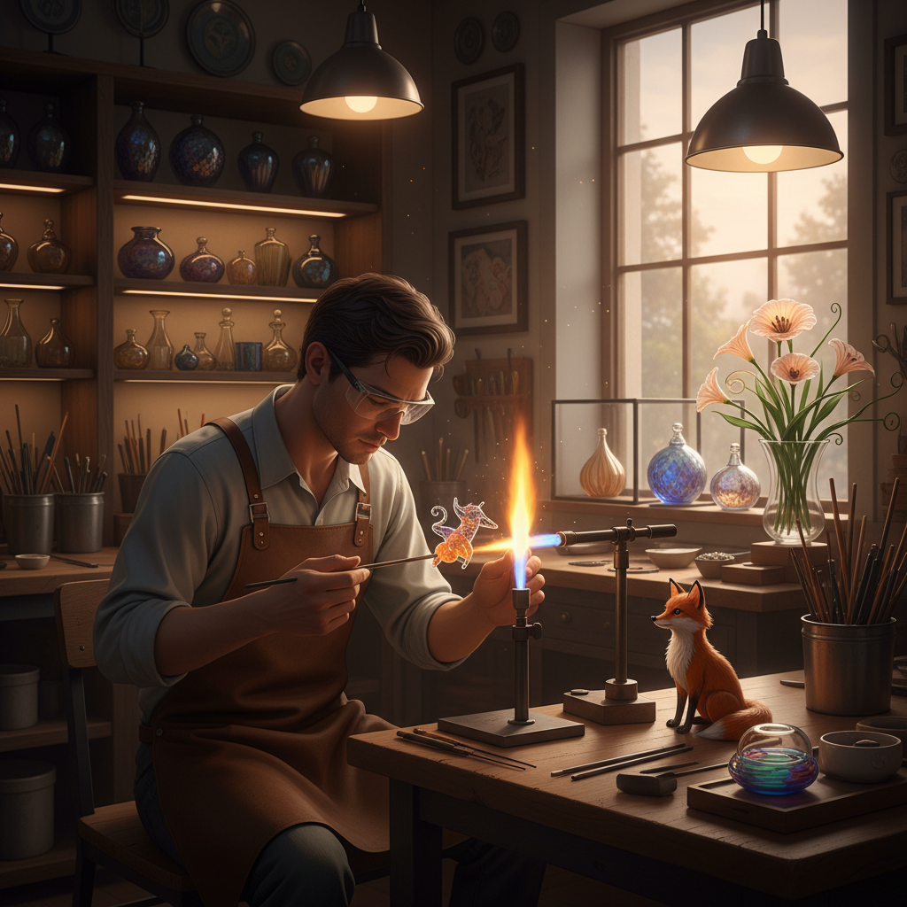

# Flamework 火焰加工玻璃

> "Flamework is glass at its most intimate — just you, the torch, and a molten drop of light between your fingers." — Unknown

## 概述

火焰加工（Flamework），也称灯工（Lampworking），是使用火焰（通常是氧气-丙烷或氧气-天然气火焰）直接加热和塑造玻璃棒或玻璃管的技法。与窑炉工艺不同，火焰加工是在开放环境中进行的——艺术家坐在工作台前，用火焰局部加热玻璃，然后用工具和重力塑造形态。这种技法特别适合制作小型精细作品——从珠子、雕塑到科学仪器。

火焰加工的独特之处在于：即时反馈——玻璃在火焰中的每一秒都在变化，艺术家必须在极短的时间窗口内做出决定，这是一种需要极高手眼协调的"实时雕塑"。

## 核心特征

| 特征 | 描述 |
|------|------|
| 火焰 | 使用明火直接加热 |
| 精细 | 适合小型精细作品 |
| 即时 | 即时的塑形反馈 |
| 棒管 | 使用玻璃棒和管 |
| 桌面 | 桌面尺度的工作 |
| 技巧 | 高度的手工技巧 |

## 视觉特征

- **精细**：极其精细的细节
- **流动**：熔融玻璃的流动感
- **色彩**：丰富的色彩应用
- **微型**：常为微型作品
- **光泽**：火焰抛光的光泽
- **有机**：有机的自然形态

## 代表作品

| 作品 | 艺术家 | 年代 | 意义 |
|------|--------|------|------|
| *Blaschka glass flowers* | Leopold & Rudolf Blaschka | 1887-1936 | 科学玻璃花模型 |
| *Venetian glass beads* | 匿名 | 15世纪+ | 威尼斯玻璃珠 |
| *Scientific glassware* | Various | 19-20世纪 | 科学仪器玻璃 |
| *Milon Townsend sculptures* | Milon Townsend | 当代 | 火焰加工雕塑 |
| *Bandhu Dunham works* | Bandhu Dunham | 当代 | 当代灯工大师 |

## 历史时间线

| 时期 | 事件 |
|------|------|
| 古代 | 油灯加热玻璃珠的制作 |
| 15世纪 | 威尼斯灯工珠子产业 |
| 17-18世纪 | 科学仪器玻璃的发展 |
| 19世纪 | Blaschka的科学玻璃模型 |
| 1960s+ | 艺术灯工的兴起 |
| 当代 | 火焰加工艺术的繁荣 |

## 中国语境

中国有悠久的灯工玻璃传统——北京的"料器"就是典型的火焰加工玻璃艺术，被列为国家级非物质文化遗产。料器艺人使用酒精灯加热彩色玻璃料棒，制作花鸟鱼虫等精美小品。当代中国的灯工玻璃艺术家也在探索更当代的表达方式。此外，中国的科学玻璃吹制（实验室玻璃器皿制作）也是火焰加工的重要应用领域。

## AI生成概念图

## 与其他风格的关系

- **Lampwork** → 灯工（同义词）
- **Glass Blowing** → 吹制玻璃（炉前工作）
- **Beadmaking** → 玻璃珠制作
- **Scientific Glass** → 科学玻璃
- **Millefiori** → 千花玻璃技法
- **Borosilicate Art** → 硼硅玻璃艺术

---

*浮光艺志 | Chronicle of Artistry*
