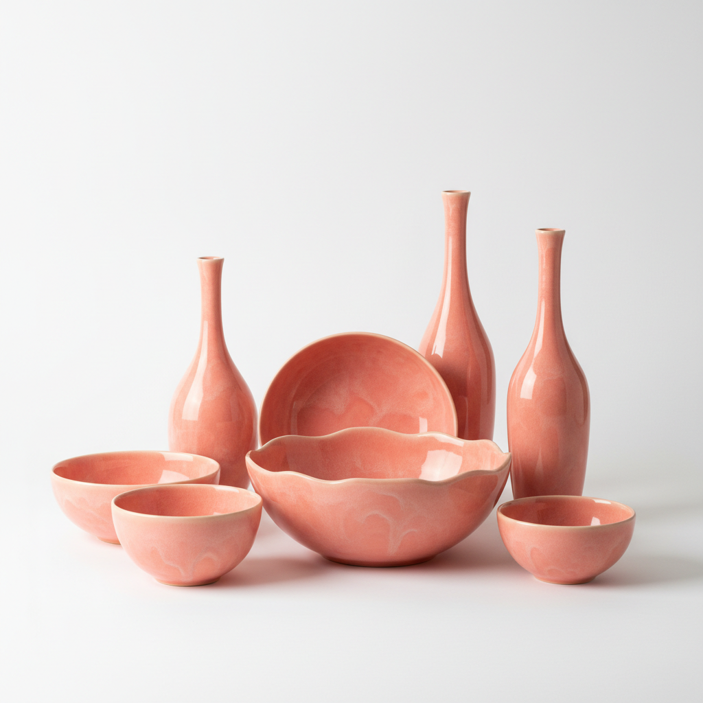

# Flamingo Glaze Art 火烈鸟釉艺术

> "Flamingo glaze is sunset captured on clay — a warm coral pink that deepens to salmon and blushes toward peach, achieved through careful control of chrome-tin or iron in an oxidizing atmosphere, a color that brings the warmth of tropical birds and Mediterranean evenings to the surface of ceramic, cheerful and sophisticated in equal measure, pink without being precious." — Unknown

## 概述

火烈鸟釉艺术（Flamingo Glaze Art）是一种以温暖的珊瑚粉红色调为特征的陶瓷釉色艺术。火烈鸟釉因其色泽如同火烈鸟羽毛般的温暖粉红而得名——其色调从浅桃色到深珊瑚色不等，带有温暖的橙色底调。火烈鸟釉的呈色通常来自铬锡红或铁在氧化气氛中的作用，是一种需要精确控制的釉色。

火烈鸟釉艺术的核心要素包括：1）珊瑚粉红——温暖的珊瑚粉红色调；2）铬锡呈色——铬锡红或铁的呈色；3）氧化烧成——在氧化气氛中烧成；4）温暖感——温暖愉悦的色彩感受；5）精确控制——需要精确的温度控制；6）装饰性强——强烈的装饰效果；7）当代流行——当代陶艺中的流行色。

## 核心特征

| 特征 | 描述 |
|------|------|
| 珊瑚粉红 | 温暖珊瑚粉红色 |
| 铬锡呈色 | 铬锡红或铁呈色 |
| 氧化烧成 | 氧化气氛烧成 |
| 温暖感 | 温暖愉悦的色彩 |
| 精确控制 | 需要精确温度控制 |
| 装饰性强 | 强烈装饰效果 |

## 视觉特征

- **珊瑚粉**：温暖的珊瑚粉红色
- **橙色底调**：带有温暖的橙色底调
- **柔和光泽**：柔和的釉面光泽
- **均匀覆盖**：均匀的色彩覆盖
- **温暖感**：给人温暖愉悦的感受
- **优雅感**：优雅而不甜腻

## 代表作品

| 作品 | 艺术家/文化 | 年代 | 意义 |
|------|-------------|------|------|
| *Art Deco粉红瓷* | 欧洲 | 1920-30年代 | 装饰艺术风格 |
| *中世纪现代粉红* | 美国 | 1950年代 | 中世纪现代设计 |
| *当代珊瑚釉* | 各地陶艺家 | 当代 | 当代的流行应用 |
| *北欧粉红陶瓷* | 北欧 | 当代 | 北欧设计风格 |
| *日本粉红釉* | 日本 | 当代 | 日本当代陶艺 |

## 历史时间线

| 时期 | 事件 |
|------|------|
| 18世纪 | 铬锡红釉的发明 |
| 19世纪 | 粉红釉在欧洲的流行 |
| 1920年代 | Art Deco时期的粉红陶瓷 |
| 1950年代 | 中世纪现代的粉红色 |
| 当代 | 火烈鸟粉红的全球流行 |

## 中国语境

粉红色在中国陶瓷中有独特的传统——清代的胭脂红（粉红色珐琅彩）是中国粉红釉的经典代表。胭脂红釉以金为着色剂，在低温中烧成，产生如同胭脂般的粉红色——这与火烈鸟釉的铬锡红机理不同，但视觉效果有相似之处。中国的粉彩瓷器中也大量使用粉红色——粉彩的"粉"字本身就指其柔和的粉色调。中国当代陶艺中，珊瑚粉红色越来越受欢迎——它代表了一种温暖、现代、优雅的审美趋势。火烈鸟釉在中国当代生活陶瓷设计中也有广泛应用——从餐具到花器，珊瑚粉红色为日常生活增添了温暖和愉悦。

## AI生成概念图

## 与其他风格的关系

- **Chrome-Tin Pink** → 铬锡粉红
- **Coral Color** → 珊瑚色
- **Art Deco** → 装饰艺术
- **Mid-Century Modern** → 中世纪现代
- **Famille Rose** → 粉彩
- **Contemporary Design** → 当代设计

---

*浮光艺志 | Chronicle of Artistry*
