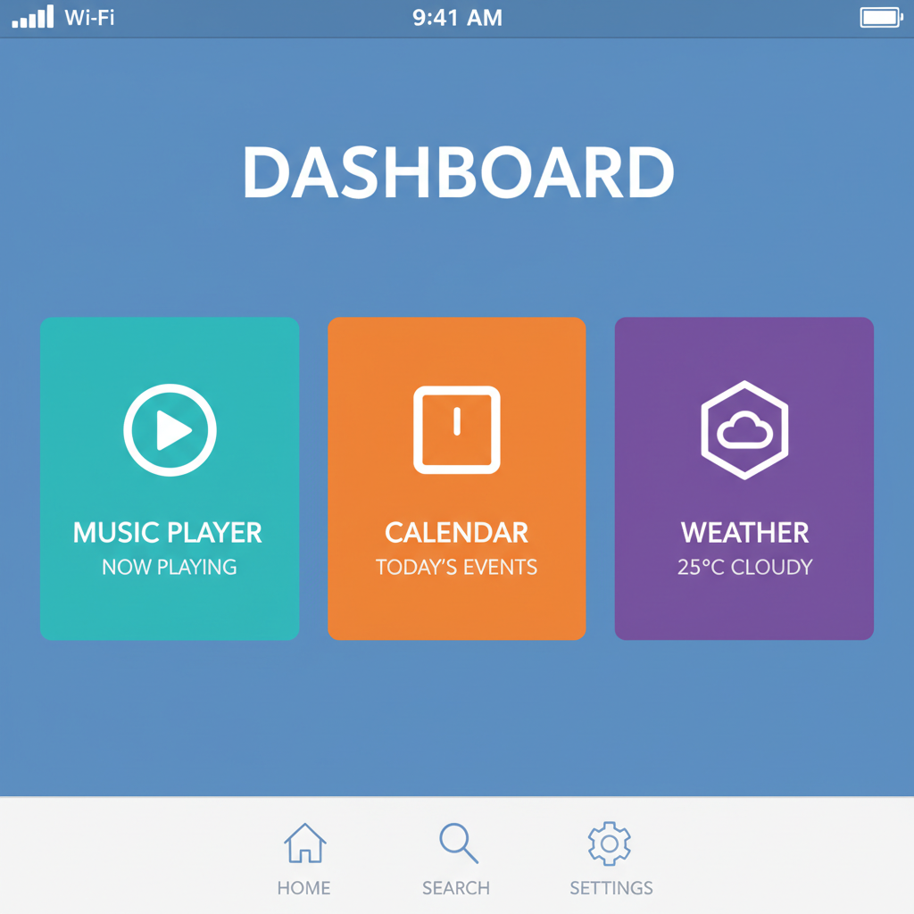

# Flat Design 扁平设计



> **"去掉阴影、渐变和纹理——让界面回归信息本身。"**

## 概述

| 维度 | 描述 |
|------|------|
| 时期 | 2012–至今（2012–2017 鼎盛） |
| 别名 | Flat Design, Flat UI, Metro Design Language |
| 核心色彩 | 高饱和纯色、白色、黑色 |
| 关键元素 | 无阴影、无渐变、几何图形、大色块、简洁字体 |
| 代表人物 | Microsoft (Metro)、Apple (iOS 7)、Google (Material) |
| 关联风格 | Swiss Design, Minimalism, Corporate Memphis, Frutiger Aero (对立) |

---

## 历史脉络

### 2012：拟物主义的终结

| 年份 | 事件 |
|------|------|
| 2010 | Microsoft 发布 Windows Phone 的 Metro UI |
| 2012 | Microsoft 将 Metro 扩展到 Windows 8 |
| 2013 | Apple iOS 7 彻底抛弃拟物设计 |
| 2014 | Google 发布 Material Design（Flat + 层次） |
| 2015–17 | Flat Design 成为全球 UI 标准 |
| 2018+ | 逐渐演变为 "Flat 2.0"（加回微妙阴影） |

### 为什么拟物主义必须死？

| 原因 | 解释 |
|------|------|
| 用户成熟 | 不再需要"皮革纹理"来理解"笔记本" |
| 响应式设计 | 纹理和阴影在小屏幕上是噪音 |
| 性能 | 纯色比位图渲染更快 |
| 国际化 | 抽象图形比拟物隐喻更跨文化 |
| 审美疲劳 | 10年的拟物让人厌倦 |

### Flat Design 的哲学

核心信条：**"内容即界面"**
- 去掉一切装饰，让信息说话
- 颜色用于区分功能，不是装饰
- 字体层级 > 视觉装饰
- 留白 = 呼吸空间

---

## 视觉语法

### 色彩系统

```
主色：
  高饱和蓝 (#0078D7) — Microsoft
  高饱和绿 (#4CD964) — 成功/确认
  高饱和红 (#FF3B30) — 警告/删除
  高饱和橙 (#FF9500) — 注意
  纯白 (#FFFFFF) — 背景
  纯黑 (#000000) — 文字

规则：
  - 纯色，无渐变（早期）
  - 高对比度
  - 大色块分区
  - 白色为主背景

质感：
  无 — 这就是重点
  （后期 Flat 2.0 加回微妙阴影）
```

### 标志性元素

| 类别 | 元素 |
|------|------|
| 图标 | 线性图标、几何形状、无填充或纯色填充 |
| 字体 | 无衬线、粗细对比、大标题 |
| 按钮 | 纯色矩形、无圆角（早期）或微圆角 |
| 布局 | 网格、卡片、大量留白 |
| 动效 | 简洁过渡、无弹跳（早期） |
| 插画 | 几何人物、纯色、无阴影 |

---

## 与千禧怀旧的关系

### Frutiger Aero 的"杀手"
- Flat Design 直接终结了 Frutiger Aero 时代
- iOS 7 (2013) = 拟物主义的死亡证明
- 现在人们怀念 Frutiger Aero，正是因为 Flat Design 把它杀死了

### 2012–2017 的时代标记
- 如果你在这个时期学习设计，Flat Design 就是你的"母语"
- 它定义了一代设计师的审美基础
- 未来它也会成为怀旧对象

---

## 中国语境

- "扁平化设计"成为国内设计圈的热词（2013–2016）
- 微信、支付宝等 App 的扁平化改版
- "去拟物化"成为设计面试必考题
- 与"新拟物"(Neumorphism) 的短暂对抗

---

## 设计应用

| 场景 | 应用方式 |
|------|----------|
| UI | 纯色+无衬线字体+线性图标+卡片布局 |
| 品牌 | 几何logo+纯色+简洁排版 |
| 图表 | 纯色柱状图/饼图+无3D效果 |
| 动效 | 简洁过渡+功能性动画 |

---

## 相关风格

← [Frutiger Aero](frutiger-aero.md) | [Corporate Memphis 企业孟菲斯](corporate-memphis.md) →

↑ [返回千禧怀旧目录](README.md) | [返回总目录](../README.md)
