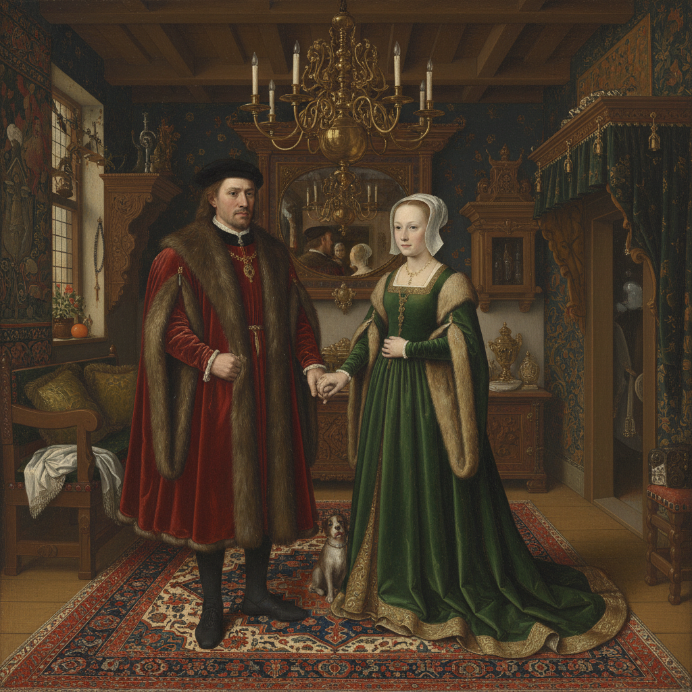

# Flemish Painting 佛兰德斯画派

> "I paint flowers to keep from crying." — Peter Paul Rubens

## 概述

佛兰德斯画派（Flemish Painting）是15–17世纪在今比利时佛兰德斯地区（以布鲁日、根特、安特卫普为中心）发展起来的绘画传统。从扬·凡·艾克发明油画技法开始，到鲁本斯的巴洛克辉煌，佛兰德斯画派以其对细节的极致追求、油画材质的革新和对光线质感的精湛表现，深刻影响了整个欧洲绘画史。

## 核心特征

| 特征 | 描述 |
|------|------|
| 油画技法 | 凡·艾克完善了油画颜料的使用，实现前所未有的细节和光泽 |
| 极致细节 | 放大镜级别的精细描绘——珠宝、织物、毛发 |
| 光泽质感 | 多层透明罩染（glazing）产生的宝石般光泽 |
| 隐藏象征 | 日常物品中隐含的宗教和道德寓意 |
| 肖像传统 | 四分之三侧面肖像的确立 |
| 祭坛画 | 大型多联祭坛画的传统 |

## 视觉特征

- **质感**：丝绒、毛皮、金属、玻璃的极致写实
- **光线**：柔和的自然光，多层罩染产生的内发光效果
- **色彩**：深沉饱和的宝石色调——深红、宝蓝、翠绿
- **细节**：微观级别的精确——每根毛发、每颗珍珠
- **空间**：精确的线性透视和大气透视
- **构图**：对称庄严（宗教画）或亲密自然（肖像画）

## 代表人物

| 画家 | 代表作 | 特点 |
|------|--------|------|
| Jan van Eyck | *Arnolfini Portrait* (1434) | 油画技法之父 |
| Rogier van der Weyden | *Descent from the Cross* | 情感表达大师 |
| Peter Paul Rubens | *The Descent from the Cross* | 巴洛克佛兰德斯巅峰 |
| Anthony van Dyck | 英国宫廷肖像 | 优雅肖像画传统 |
| Pieter Bruegel the Elder | *Hunters in the Snow* (1565) | 农民生活与风景 |
| Hans Memling | 圣母子系列 | 宁静优美的宗教画 |

## 历史演变

1. **1420年代**：凡·艾克兄弟完善油画技法，开创早期佛兰德斯画派
2. **15世纪中后期**：布鲁日和根特成为艺术中心
3. **16世纪**：布鲁盖尔发展风俗画和风景画
4. **17世纪**：鲁本斯将佛兰德斯画派推向巴洛克辉煌
5. **17世纪后期**：随着荷兰独立，佛兰德斯画派逐渐式微

## 与其他风格的关系

- **Dutch Golden Age** → 从佛兰德斯传统中分化出来
- **Italian Renaissance** → 相互影响，技法交流
- **Baroque** → 鲁本斯是巴洛克的核心人物
- **Realism** → 佛兰德斯的写实传统影响了19世纪现实主义
- **Pre-Raphaelite** → 拉斐尔前派崇拜早期佛兰德斯画家

## 概念图

---

*浮光艺志 | Chronicle of Artistry*
