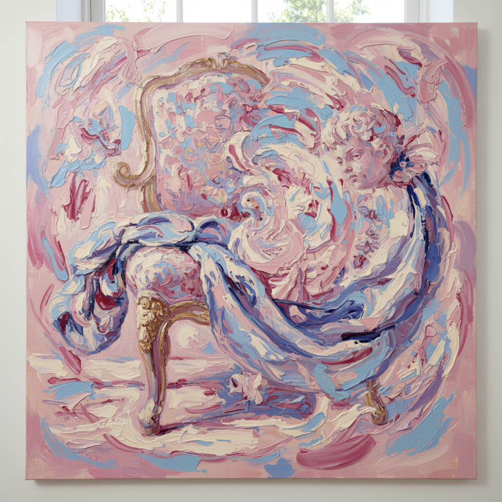

# Flora Yukhnovich 弗洛拉·尤赫诺维奇

> **时期：** 1990–至今  
> **关键词：** 洛可可解构、糖果色抽象、笔触狂欢、当代女性绘画

## 概述

Flora Yukhnovich 是英国当代画家，以对洛可可绘画（尤其是布歇和弗拉戈纳尔）的当代重新诠释闻名。她将18世纪的甜美构图溶解为半抽象的色彩漩涡，在精致与粗犷、历史与当下之间创造出令人眩晕的视觉体验。

## 风格特征

- **洛可可引用**：以布歇、弗拉戈纳尔的构图为起点，将其解构为抽象笔触
- **糖果色调**：粉红、淡蓝、奶油白、薰衣草紫——甜美到近乎过度
- **笔触表演**：大尺幅画面上的每一笔都清晰可见，兼具控制与放纵
- **半抽象**：人物和场景在辨认与消失之间摇摆，如同记忆的模糊
- **物质感**：颜料从薄涂到厚堆并存，画面具有雕塑般的起伏

## 代表作品

- *Warm, Wet N' Wild*（2020）
- *I'll Have What She's Having*（2020）
- *Bonfire of the Vanities*（2020）

## 历史意义

Yukhnovich 代表了Z世代画家对艺术史的态度——既不崇拜也不否定，而是将其作为可以自由取用的视觉素材库。她的成功（2021年苏富比拍卖创纪录）证明了绘画市场对年轻女性艺术家的新开放。

## 概念图

