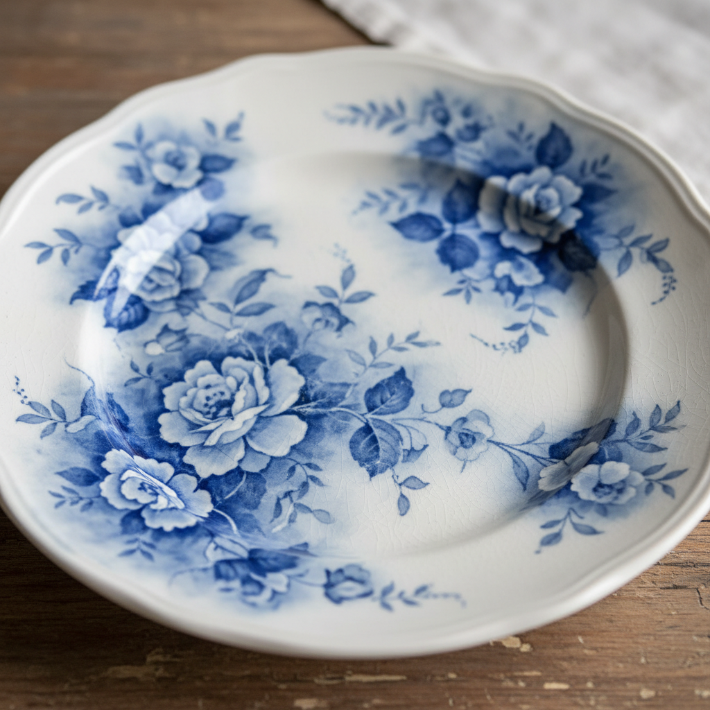

# Flow Blue Art 流蓝陶瓷艺术

> "Flow blue is the poetry of imperfection — where cobalt escapes its boundaries and bleeds into dream." — Victorian ceramic collecting

## 概述

流蓝陶瓷艺术（Flow Blue Art）是19世纪英国发展的一种独特的蓝白陶瓷装饰风格——通过在烧成过程中加入特殊的化学物质（通常是氯化铵或石灰），使钴蓝色的转印图案在釉下"流动"和"晕染"，产生柔和、朦胧、梦幻般的蓝色效果。

流蓝最初可能是一个"美丽的错误"——早期英国陶瓷工匠在试图模仿中国青花瓷时，偶然发现了使钴蓝色"流动"的方法。这种"缺陷"反而产生了独特的美学效果——图案的边缘变得柔和模糊，蓝色如同水墨般晕染开来，创造出一种梦幻般的氛围。流蓝在维多利亚时代极为流行——从1830年代到1900年代，英国和美国生产了大量流蓝陶瓷，涵盖餐具、茶具、装饰盘等各种器形。

流蓝陶瓷艺术的核心要素包括：1）蓝色晕染——钴蓝色的流动和晕染效果；2）朦胧美学——图案边缘的柔和模糊；3）转印基础——以转印图案为基础；4）化学控制——通过化学物质控制流动程度；5）维多利亚风格——19世纪英国的审美趣味；6）中国风影响——受中国青花瓷启发；7）收藏价值——当代的重要收藏品类。

## 核心特征

| 特征 | 描述 |
|------|------|
| 蓝色晕染 | 钴蓝色流动晕染效果 |
| 朦胧美学 | 图案边缘柔和模糊 |
| 转印基础 | 以转印图案为基础 |
| 化学控制 | 化学物质控制流动程度 |
| 维多利亚风格 | 19世纪英国审美 |
| 收藏价值 | 当代重要收藏品类 |

## 视觉特征

- **蓝色晕染**：从深蓝到浅蓝的自然晕染
- **模糊边缘**：图案边缘的柔和过渡
- **梦幻氛围**：如同水中倒影的朦胧感
- **深浅变化**：从几乎全蓝到轻微流动的变化
- **白色留白**：蓝色中的白色空间
- **东方图案**：中国风和日本风的图案

## 代表作品

| 作品 | 年代 | 意义 |
|------|------|------|
| *早期流蓝实验* | 1820年代 | 技术起源 |
| *Scinde图案* | 1840年代 | 经典设计 |
| *Touraine图案* | 1890年代 | 晚期经典 |
| *Chapoo图案* | 1850年代 | 中国风 |
| *La Belle系列* | 1890年代 | 美国生产 |
| *当代流蓝* | 21世纪 | 现代复兴 |

## 历史时间线

| 时期 | 事件 |
|------|------|
| 1820年代 | 流蓝效果首次出现 |
| 1830-40年代 | 早期流蓝商业化 |
| 1850-60年代 | 流蓝在英美流行 |
| 1870-80年代 | 多种图案风格发展 |
| 1890-1900年代 | 晚期流蓝，美国生产增加 |
| 20世纪初 | 流蓝生产衰落 |
| 当代 | 成为重要收藏品类 |

## 中国语境

流蓝与中国青花瓷有着直接的血缘关系。流蓝的诞生本身就是英国陶工试图模仿中国青花瓷的副产品——中国青花瓷的蓝色在釉下清晰锐利，而英国流蓝的蓝色则柔和朦胧，两者形成了有趣的对比。流蓝的"晕染"美学与中国水墨画的"墨分五色"有着精神上的共鸣——都追求色彩的自然渐变和边界的模糊。中国青花瓷中也有类似"流蓝"的现象——当钴料浓度过高或烧成温度过高时，青花也会出现"晕散"效果，在中国传统中这通常被视为缺陷，但在某些审美语境中也被欣赏为自然之美。流蓝在19世纪大量出口到中国——形成了"中国启发英国，英国回销中国"的有趣文化循环。

## 概念图

## 与其他风格的关系

- **Transfer Ware** → 转印陶瓷（技术基础）
- **Chinese Blue-and-White** → 中国青花瓷（灵感来源）
- **Delft** → 代尔夫特（蓝白传统）
- **Victorian Art** → 维多利亚艺术
- **Chinoiserie** → 中国风
- **Ink Wash Painting** → 水墨画（晕染美学）

---

*浮光艺志 | Chronicle of Artistry*
