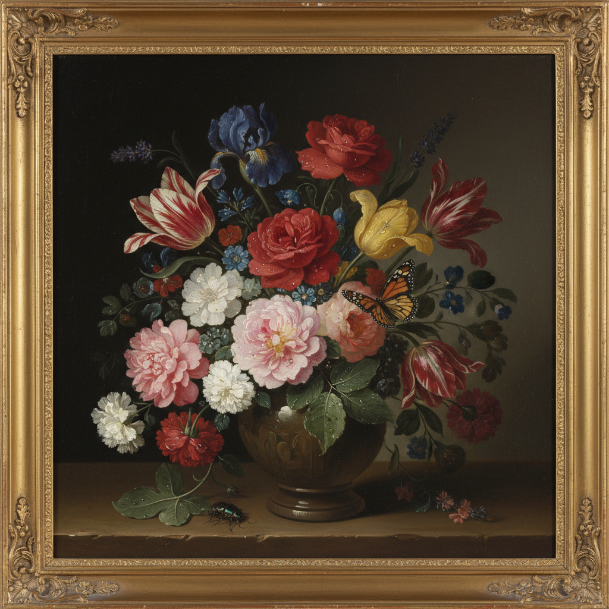

# Flower Painting 花卉画

> **时期：** 16世纪–至今  
> **关键词：** 植物学精确、象征意义、荷兰黄金时代、郁金香狂热、四季轮回

## 概述

Flower Painting（花卉画）是以花卉为主题的静物画分支，在17世纪荷兰黄金时代达到巅峰。一束花中可能包含不同季节的品种——这在现实中不可能同时绽放——每朵花都携带象征含义：玫瑰代表爱情、百合代表纯洁、枯萎的花瓣提醒生命短暂。花卉画是植物学、象征学和纯粹视觉愉悦的完美结合。

## 风格特征

- **植物学精确**：每个花瓣和叶脉的忠实描绘
- **象征系统**：花语和道德寓意
- **光影戏剧**：深色背景上的明亮花朵
- **昆虫细节**：蝴蝶、蜜蜂、露珠的点缀
- **构图丰盈**：层层叠叠的花束安排

## 代表人物与作品

- 扬·凡·海以森 花卉静物
- 拉赫尔·鲁伊斯 花卉与昆虫
- 乔治亚·奥基夫 花卉特写
- 当代：Marc Quinn 冰冻花卉雕塑

## 概念图

