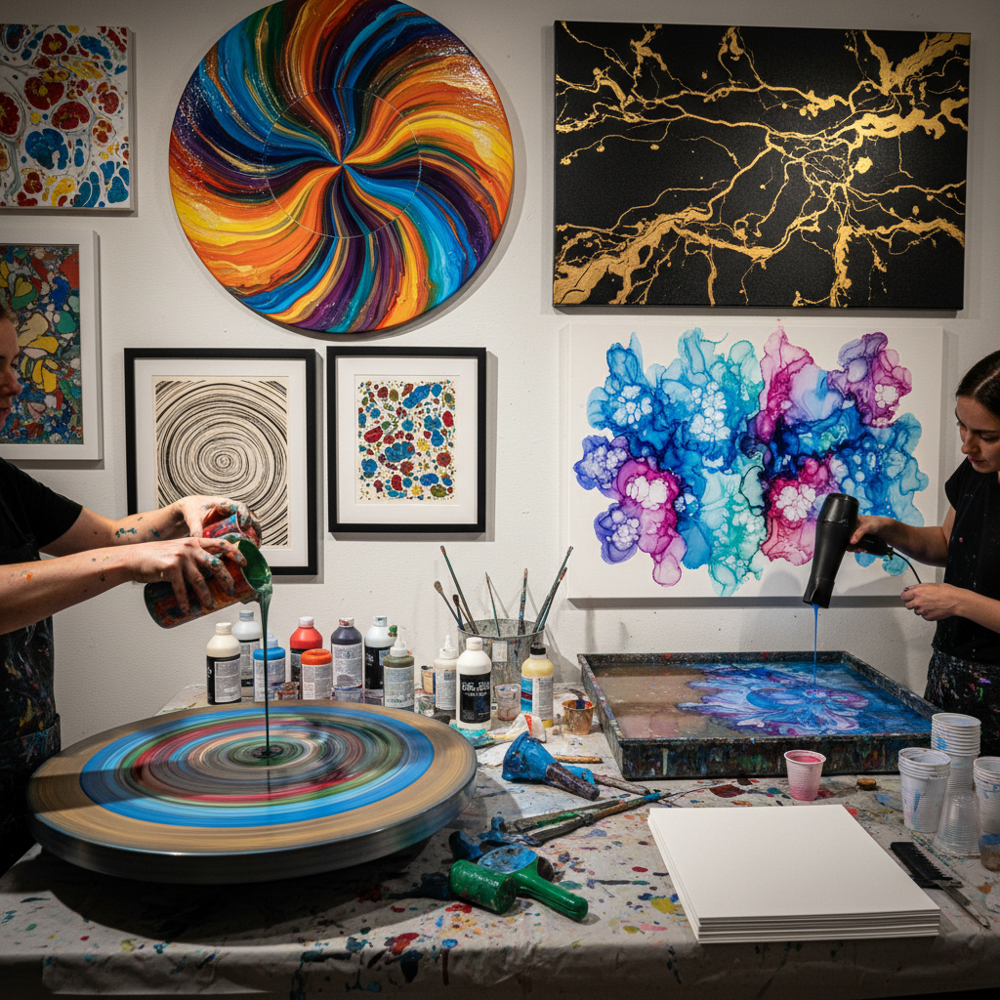

# Fluid Art 流体艺术

> "Fluid art is painting without brushes — liquid pigments released onto surfaces to find their own equilibrium, guided by gravity, density, and surface tension into patterns that echo the turbulence of rivers, the swirl of galaxies, and the marbling of ancient stone." — Unknown

## 概述

流体艺术（Fluid Art）是一个涵盖所有利用液态颜料的流动性来创作的艺术形式的总称——包括倾倒绘画（pour painting）、旋转艺术（spin art）、吹画（blow painting）、大理石纹（marbling）、墨流（suminagashi）等。流体艺术的核心是放弃传统画笔的精确控制，让液态颜料在物理力（重力、离心力、表面张力、密度差异）的作用下自由流动和混合。

流体艺术的魅力在于其"可控的不可控"——艺术家选择颜色、调配粘度、决定倾倒方式和角度，但最终的图案由物理定律决定。每件作品都是独一无二的，无法精确复制。流体艺术在2010年代通过社交媒体（YouTube、Instagram）获得了全球性的爆发式流行，从专业艺术家到业余爱好者都参与其中。

## 核心特征

| 特征 | 描述 |
|------|------|
| 流动 | 液态颜料流动 |
| 物理 | 利用物理力 |
| 偶然 | 偶然性的美 |
| 抽象 | 抽象的图案 |
| 多技法 | 包含多种子技法 |
| 即时 | 即时的视觉效果 |

## 视觉特征

- **流动**：液态的流动感
- **有机**：有机的自然形态
- **色彩**：丰富的色彩混合
- **细胞**：细胞状的图案
- **大理石**：大理石纹效果
- **动态**：动态的视觉张力

## 代表作品

| 作品 | 艺术家 | 年代 | 意义 |
|------|--------|------|------|
| *Suminagashi prints* | 日本工匠 | 传统 | 日本墨流艺术 |
| *Turkish Ebru* | 土耳其工匠 | 传统 | 土耳其水拓画 |
| *Morris Louis veils* | Morris Louis | 1960s | 色域绘画的流动 |
| *Contemporary fluid art* | Various | 当代 | 当代流体艺术 |
| *Digital fluid simulations* | Various | 当代 | 数字流体模拟 |

## 历史时间线

| 时期 | 事件 |
|------|------|
| 古代 | 日本墨流（suminagashi）的起源 |
| 15世纪 | 土耳其水拓画（Ebru）的发展 |
| 1960年代 | 色域绘画中的流动技法 |
| 2010年代 | 社交媒体推动的全球流行 |
| 当代 | 流体艺术的持续发展和多样化 |

## 中国语境

流体艺术在中国有爆发式的流行——通过抖音、小红书等社交媒体平台迅速传播。中国的手工体验工作室大量开设流体艺术课程（倾倒画、旋转画等）。中国的传统水墨画中的"泼墨"技法与流体艺术有天然的联系——张大千的泼彩山水就是中国传统流体艺术的代表。中国的当代艺术家探索将传统水墨的流动性与现代流体艺术材料结合的可能性。

## AI生成概念图

## 与其他风格的关系

- **Pour Painting** → 倾倒绘画
- **Resin Art** → 树脂艺术
- **Alcohol Ink Art** → 酒精墨水艺术
- **Marbling** → 大理石纹
- **Abstract Expressionism** → 抽象表现主义
- **Ink Wash Painting** → 水墨画

---

*浮光艺志 | Chronicle of Artistry*
