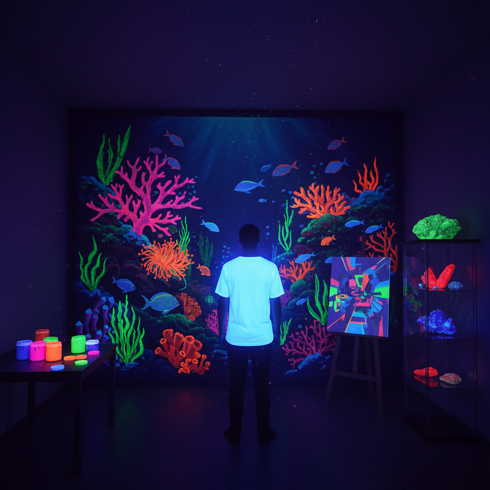

# Fluorescent Art 荧光艺术

> "Fluorescence is light transformed — ordinary ultraviolet radiation, invisible to the eye, strikes a fluorescent material and is instantly converted into vivid visible color. Under UV light, the world becomes a different place: whites blaze like snow in sunlight, certain minerals glow like jewels, and fluorescent paints create a parallel universe of impossible color intensity that exists only in the presence of the black light." — Unknown

## 概述

荧光艺术（Fluorescent Art）是利用荧光材料在紫外线（黑光）照射下产生强烈可见光的特性进行艺术创作的实践——使用荧光颜料、荧光织物和荧光材料，创造出在紫外线下呈现超饱和色彩的作品。荧光艺术探索了可见光谱的极限和感知的边界。

荧光艺术的实践包括：1）黑光绘画——在紫外线下观看的荧光画作；2）荧光壁画——大型荧光墙面画；3）荧光装置——使用黑光和荧光材料的空间装置；4）荧光人体彩绘——在紫外线下发光的人体彩绘；5）荧光派对——使用荧光元素的沉浸式活动；6）荧光摄影——拍摄荧光效果的艺术摄影；7）荧光矿物——展示天然荧光矿物的艺术化呈现。

## 核心特征

| 特征 | 描述 |
|------|------|
| 超饱和 | 超饱和的色彩 |
| UV激发 | 紫外线激发发光 |
| 即时 | 即时的发光反应 |
| 对比 | 与黑暗的强烈对比 |
| 沉浸 | 沉浸式的体验 |
| 变换 | 明暗两种状态 |

## 视觉特征

- **荧光色**：超饱和的荧光色彩
- **黑光**：紫外线照射的环境
- **对比**：与黑暗背景的强烈对比
- **发光**：材料似乎自发光
- **饱和**：超越正常的色彩饱和度
- **梦幻**：梦幻般的视觉效果

## 代表作品

| 作品 | 艺术家 | 年代 | 意义 |
|------|--------|------|------|
| *Fluorescent paintings* | Various | 1960年代至今 | 荧光绘画 |
| *Black light rooms* | Various | 当代 | 黑光房间装置 |
| *UV body painting* | Various | 当代 | 紫外线人体彩绘 |
| *Fluorescent minerals* | Various | 当代 | 荧光矿物展示 |
| *Immersive UV experiences* | Various | 当代 | 沉浸式荧光体验 |

## 历史时间线

| 时期 | 事件 |
|------|------|
| 1852 | George Stokes命名"荧光"现象 |
| 1930年代 | 荧光灯和黑光灯的发明 |
| 1960年代 | 荧光艺术与迷幻文化 |
| 1990年代 | 荧光在派对文化中的应用 |
| 当代 | 荧光艺术的多元化发展 |

## 中国语境

荧光艺术在中国近年来发展迅速。中国的沉浸式娱乐产业大量使用荧光元素——从荧光主题的密室逃脱到荧光派对、从荧光迷你高尔夫到荧光艺术展。中国的一些当代艺术家将荧光材料融入创作——用荧光颜料创造在紫外线下才显现的隐藏图像、将荧光元素与中国传统美学结合。中国的荧光跑（夜光跑）活动非常流行——参与者穿戴荧光装备在夜间奔跑。中国的一些博物馆和科技馆设有荧光矿物展区——展示天然矿物在紫外线下的奇妙荧光。中国的荧光材料产业也在快速发展——为荧光艺术提供了丰富的材料选择。

## AI生成概念图

## 与其他风格的关系

- **Phosphorescent Art** → 磷光艺术
- **Light Art** → 光艺术
- **UV Art** → 紫外线艺术
- **Psychedelic Art** → 迷幻艺术
- **Body Painting** → 人体彩绘
- **Installation Art** → 装置艺术

---

*浮光艺志 | Chronicle of Artistry*
