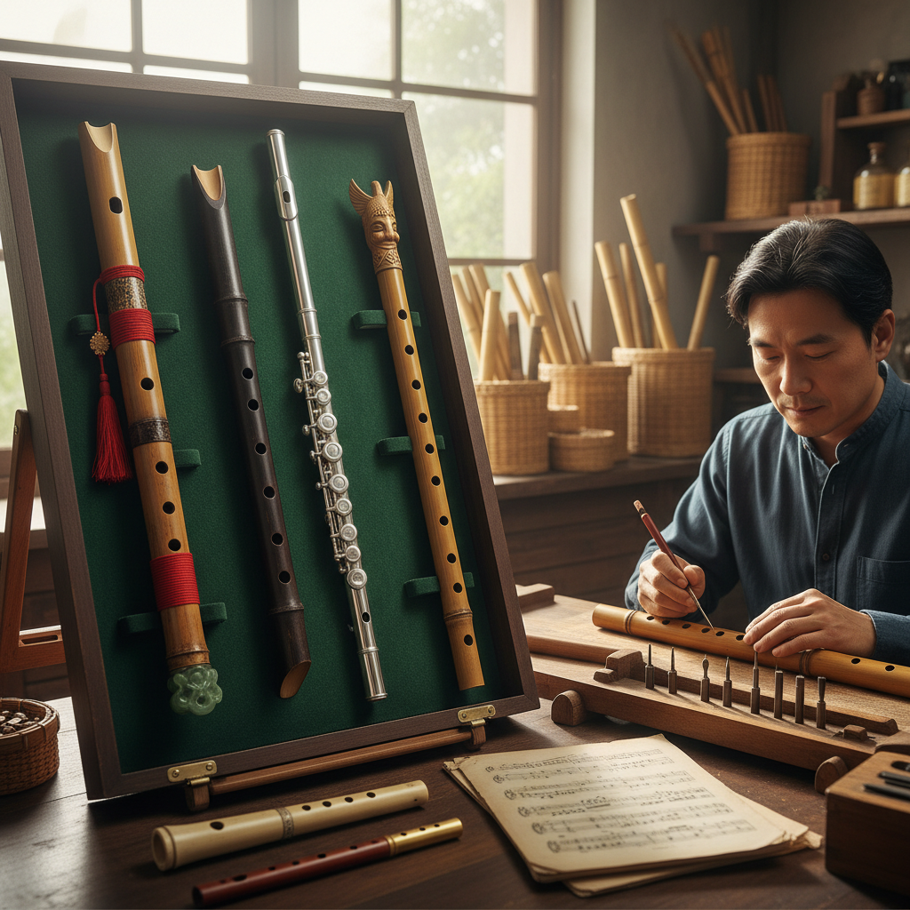

# Flute Art 笛艺术

> "A flute is breath made visible through sound — the most intimate of instruments, powered by nothing but human air passing over an edge to split into vibration. It is the oldest melodic instrument, found in caves alongside the first paintings, suggesting that music and visual art were born together. A flute transforms the invisible act of breathing into something that can move listeners to tears." — Unknown

## 概述

笛艺术（Flute Art）是以笛类乐器为创作媒介、装饰对象或表演核心的艺术形式——包括笛的制作工艺、笛身的装饰艺术、笛乐表演艺术和以笛为灵感的当代创作。笛是人类最古老的旋律乐器，在世界各文化中都有独特的传统。

笛艺术的实践包括：1）笛的制作——传统手工制笛工艺；2）笛身装饰——笛身的雕刻、镶嵌和彩绘；3）笛乐表演——笛乐的表演艺术；4）笛的收藏——珍贵笛器的收藏和展示；5）笛与视觉艺术——以笛为主题的绑画和雕塑；6）实验笛——非传统材料和形式的实验性笛器；7）笛装置——以笛或笛声为元素的艺术装置。

## 核心特征

| 特征 | 描述 |
|------|------|
| 气息 | 以人的气息为动力 |
| 旋律 | 旋律性的乐器 |
| 古老 | 最古老的旋律乐器 |
| 材质 | 多种材质（竹、木、金属） |
| 精密 | 精密的音孔设计 |
| 诗意 | 诗意和抒情的象征 |

## 视觉特征

- **管状**：优美的管状造型
- **音孔**：精确排列的音孔
- **材质**：竹、木或金属的质感
- **雕刻**：笛身的雕刻装饰
- **漆艺**：漆器笛的光泽
- **镶嵌**：贵金属或宝石镶嵌

## 代表作品

| 作品 | 艺术家/传统 | 年代 | 意义 |
|------|-------------|------|------|
| *Hohle Fels flute* | 史前人类 | 4万年前 | 最古老的乐器 |
| *Chinese dizi* | 中国传统 | 古代至今 | 中国竹笛 |
| *Japanese shakuhachi* | 日本传统 | 古代至今 | 日本尺八 |
| *Native American flute* | 原住民传统 | 古代至今 | 美洲原住民笛 |
| *Irish tin whistle* | 爱尔兰传统 | 19世纪至今 | 爱尔兰锡笛 |

## 历史时间线

| 时期 | 事件 |
|------|------|
| 4万年前 | 最早的骨笛（德国Hohle Fels） |
| 9000年前 | 中国贾湖骨笛 |
| 古代 | 各文明的笛传统形成 |
| 中世纪 | 欧洲横笛的发展 |
| 当代 | 笛的当代艺术实践 |

## 中国语境

笛艺术在中国有极其悠久和丰富的传统——中国是世界上最早使用笛类乐器的文明之一。河南贾湖遗址出土的骨笛（约9000年前）是世界上最古老的可演奏乐器之一——证明了中国笛文化的深远历史。中国的竹笛（笛子）是中国传统音乐中最重要的旋律乐器之一——分为梆笛和曲笛两大类。中国的箫（洞箫）是另一种重要的竹制吹管乐器——以其深沉悠远的音色著称。中国的笛箫制作是精细的手工艺——选材、开孔、调音都需要丰富的经验。中国传统文化中，笛箫有深厚的文人意象——"玉笛"、"铁笛"等意象在诗词中频繁出现。中国当代的一些音乐家和艺术家在探索笛的新可能——将传统笛乐与电子音乐、装置艺术相结合。

## AI生成概念图

## 与其他风格的关系

- **Sound Art** → 声音艺术
- **Wind Instrument** → 管乐器
- **Bamboo Art** → 竹艺术
- **Performance Art** → 表演艺术
- **Meditation Art** → 冥想艺术
- **Folk Art** → 民间艺术

---

*浮光艺志 | Chronicle of Artistry*
