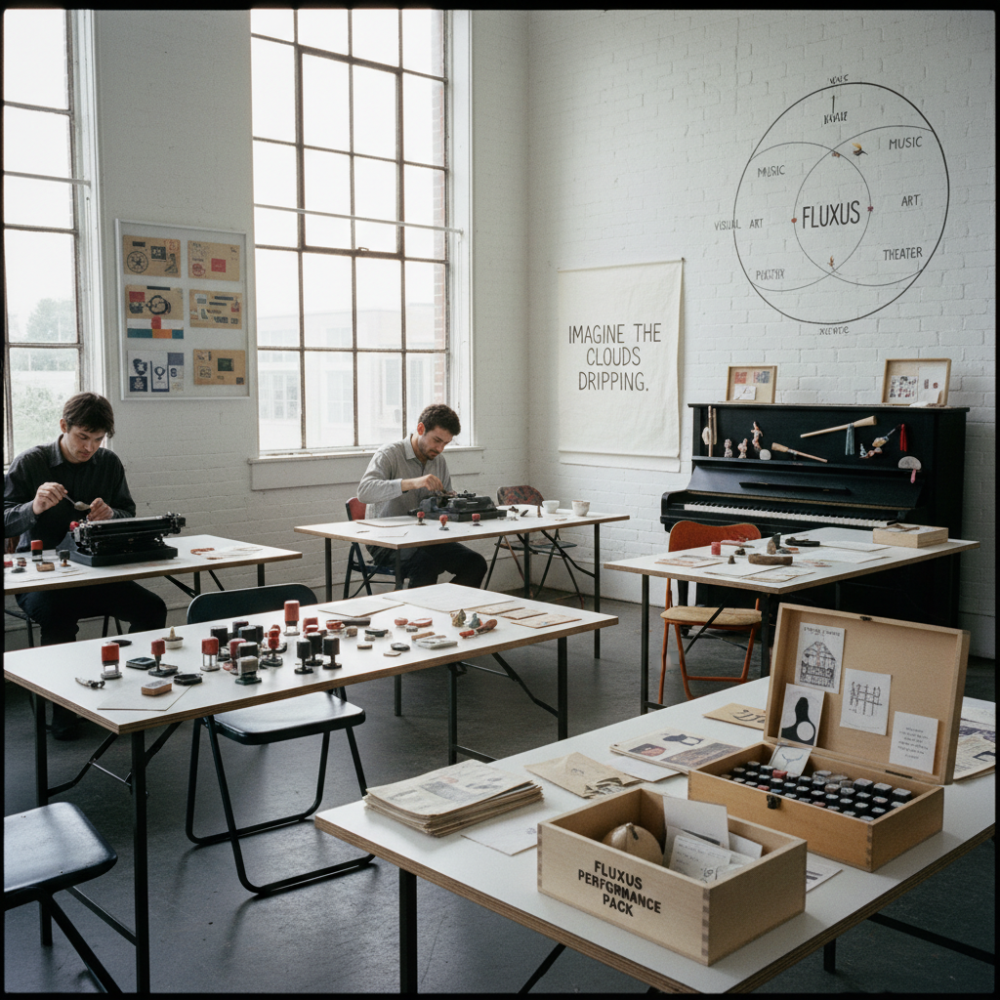

# Fluxus Art 激浪派艺术

> "Fluxus is anti-art made with a smile — erasing the boundary between art and everyday life not through grand gestures but through small acts of playful subversion, event scores that anyone can perform, mail art that travels the world in envelopes, intermedia that refuses to be one thing, and a spirit of collective joy that insists art belongs to everyone and everything is already art if you pay attention." — Unknown

## 概述

激浪派（Fluxus）是1960-70年代兴起的一个国际性前卫艺术运动，强调艺术与日常生活的融合、跨媒介实验、集体创作、反商业化和游戏精神。Fluxus不是一种特定的视觉风格，而是一种态度和方法——它包括事件乐谱（event scores）、邮件艺术、表演、出版物、多媒体装置、音乐等多种形式。

Fluxus由立陶宛裔美国人乔治·马修纳斯（George Maciunas）在1961年组织和命名。"Fluxus"来自拉丁语，意为"流动"。Fluxus的核心成员包括约翰·凯奇（John Cage，精神导师）、小野洋子（Yoko Ono）、白南准（Nam June Paik）、约瑟夫·博伊斯（Joseph Beuys）、迪克·希金斯（Dick Higgins）等。Fluxus强调"简单"——最好的Fluxus作品往往是最简单的指令，如小野洋子的《切片》（Cut Piece）或乔治·布莱希特的事件乐谱。

## 核心特征

| 特征 | 描述 |
|------|------|
| 跨媒介 | 打破媒介界限 |
| 日常 | 艺术与日常融合 |
| 游戏 | 游戏和幽默精神 |
| 集体 | 集体创作和网络 |
| 反商业 | 反对艺术商业化 |
| 简单 | 追求简单和直接 |

## 视觉特征

- **简单**：极度简单的形式
- **文字**：文字指令和乐谱
- **盒子**：Fluxus盒子和套件
- **邮件**：邮件艺术的信封
- **多媒介**：混合媒介
- **幽默**：幽默和荒诞

## 代表作品

| 作品 | 艺术家 | 年代 | 意义 |
|------|--------|------|------|
| *Cut Piece* | Yoko Ono | 1964 | 小野洋子的切片表演 |
| *Fluxus boxes* | George Maciunas | 1960年代 | 马修纳斯的Fluxus盒子 |
| *Water Music* | George Brecht | 1962 | 布莱希特的事件乐谱 |
| *Zen for Head* | Nam June Paik | 1962 | 白南准的头禅 |
| *How to Explain Pictures to a Dead Hare* | Joseph Beuys | 1965 | 博伊斯的表演 |

## 历史时间线

| 时期 | 事件 |
|------|------|
| 1961 | Maciunas组织第一次Fluxus活动 |
| 1962 | 威斯巴登Fluxus音乐节 |
| 1963-70年代 | Fluxus的国际扩展 |
| 1978 | Maciunas去世 |
| 当代 | Fluxus精神的持续影响 |

## 中国语境

激浪派在中国当代艺术中有重要影响。白南准作为韩裔Fluxus成员，其亚洲背景为东亚艺术家提供了参照。中国的"85新潮"运动中的一些行为艺术和实验艺术受到Fluxus精神的影响。中国当代的一些艺术家（如颜磊、郑国谷等）在创作中体现了Fluxus式的日常美学和游戏精神。有趣的是，Fluxus的"禅"元素（受约翰·凯奇和铃木大拙的影响）与中国的禅宗传统有深层联系——Fluxus的"事件乐谱"与禅宗公案有相似的简洁和悖论性。

## AI生成概念图

## 与其他风格的关系

- **Dada** → 达达主义
- **Happening** → 偶发艺术
- **Conceptual Art** → 概念艺术
- **Performance Art** → 行为艺术
- **Mail Art** → 邮件艺术
- **Intermedia** → 跨媒介艺术

---

*浮光艺志 | Chronicle of Artistry*
