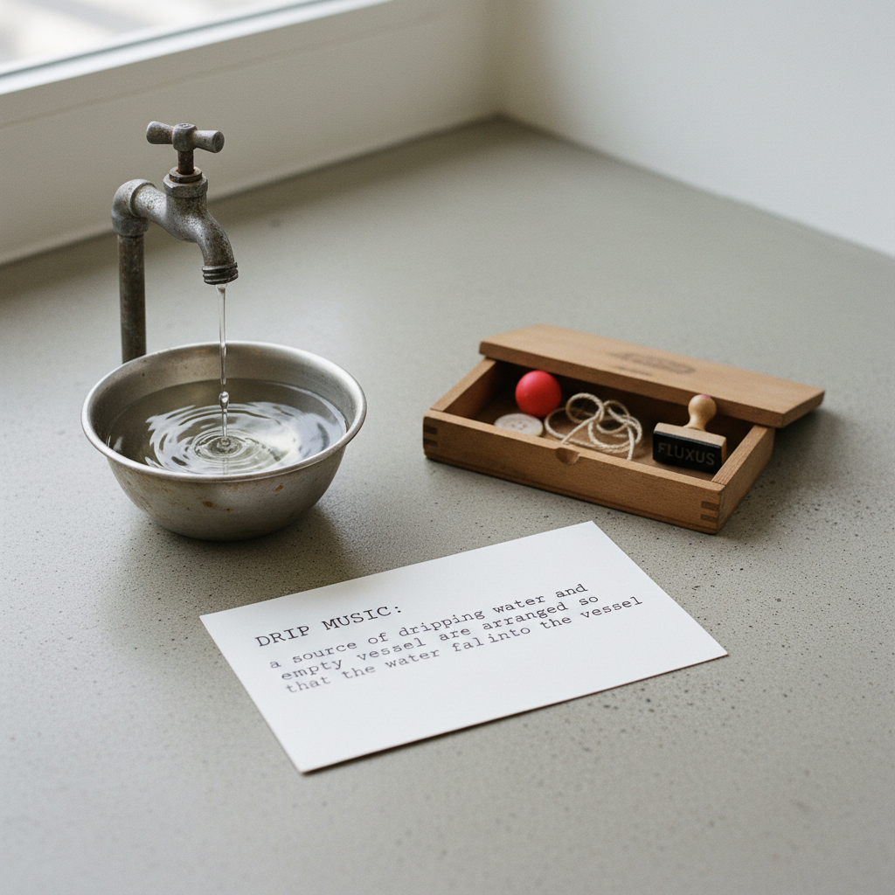

# Fluxus 激浪派

> "Fluxus is not a moment in history, or an art movement. Fluxus is a way of doing things." — George Maciunas

## 概述

激浪派（Fluxus）是1960年代兴起的国际性前卫艺术网络，由乔治·马修纳斯（George Maciunas）组织和命名。Fluxus不是一种风格，而是一种态度——反艺术、反严肃、反商品化，拥抱日常生活、幽默、简单和集体性。

Fluxus的"作品"可能是一个简单的指令（"请微笑"）、一个装在盒子里的小物件、一场只有几秒钟的表演、或一封寄给陌生人的明信片。它模糊了艺术与生活、严肃与玩笑、创作与接收的一切边界。

## 核心特征

| 特征 | 描述 |
|------|------|
| 反艺术 | 质疑"艺术"的定义和体制 |
| 简单 | 追求最简单、最直接的表达 |
| 幽默 | 玩笑、荒诞、不正经 |
| 日常 | 日常动作和物品即是艺术 |
| 集体 | 网络化的集体创作和交流 |
| 事件 | 短暂的事件（event）是核心形式 |

## 视觉特征

- **盒子**：Fluxkit——装满小物件的盒子
- **卡片**：事件卡片（Event Score）——简短的文字指令
- **物件**：日常小物品的微妙改造
- **印刷**：简单的打字机文字、复印件
- **表演**：极简的身体动作——几秒到几分钟
- **邮件**：通过邮寄流通的微型作品

## 代表作品

| 作品 | 艺术家 | 年代 | 意义 |
|------|--------|------|------|
| *Water Yam* | George Brecht | 1963 | 事件卡片集——Fluxus的经典 |
| *Cut Piece* | Yoko Ono | 1964 | 观众剪去艺术家衣服的表演 |
| *Fluxkit* | George Maciunas | 1964 | 盒装的Fluxus作品集 |
| *Zen for Head* | Nam June Paik | 1962 | 用头蘸墨在纸上画线 |
| *Drip Music* | George Brecht | 1959 | 水滴落入容器的声音 |
| *Grapefruit* | Yoko Ono | 1964 | 指令诗集——想象即创作 |

## 历史时间线

| 时期 | 事件 |
|------|------|
| 1961 | Maciunas在纽约AG Gallery组织第一次活动 |
| 1962 | "Fluxus Internationale Festspiele"在威斯巴登 |
| 1963 | Fluxus名称正式确立 |
| 1964 | Fluxkit出版——盒装作品的流通 |
| 1960s | 全球Fluxus网络——纽约、欧洲、日本 |
| 1970s | Fluxus继续但逐渐分散 |
| 1978 | Maciunas去世 |
| 1990s-至今 | Fluxus的历史化和博物馆化 |

## 子类型

| 子类型 | 特征 |
|--------|------|
| 事件 | Brecht——极简的指令和动作 |
| Fluxfilm | 极短的实验电影 |
| Fluxkit | 盒装的多媒体作品集 |
| 邮件Fluxus | 通过邮寄流通的作品 |
| 音乐Fluxus | Paik——对音乐的解构 |
| 文字Fluxus | Ono——指令诗和想象作品 |

## 中国语境

Fluxus在中国没有直接的分支，但其精神在中国当代艺术中有回响。中国的"85新潮"中的一些行为和事件与Fluxus有精神上的相似。当代中国的独立出版、邮件交换、微型艺术项目、以及对"轻"和"日常"的关注都延续了Fluxus的精神。中国禅宗的"平常心是道"与Fluxus的日常美学有深层共鸣。

## AI生成概念图

## 与其他风格的关系

- **Dadaism** → 达达主义是Fluxus的直接精神先驱
- **Happening** → 偶发艺术与Fluxus平行发展
- **Conceptual Art** → 概念艺术继承了Fluxus的去物质化
- **Mail Art** → 邮件艺术是Fluxus网络的延伸
- **Sound Art** → 声音艺术从Fluxus的音乐实验中发展
- **Video Art** → Paik从Fluxus走向影像艺术

---

*浮光艺志 | Chronicle of Artistry*
