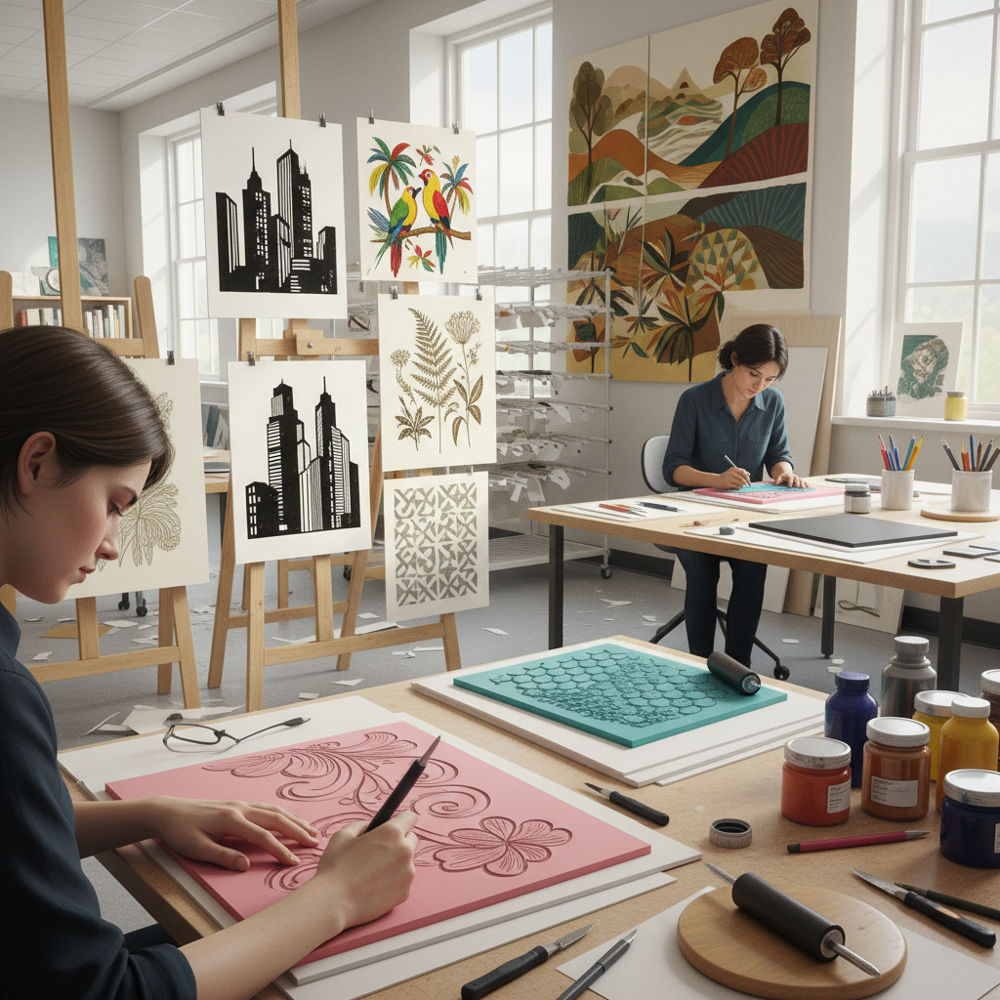

# Foam Printing 泡沫印刷

> "Foam printing turns the simplest material into a printing press — a sheet of craft foam, carved or cut, becomes a stamp that transfers ink with surprising clarity, proving that printmaking needs no expensive equipment, only imagination and a willingness to press ink to paper." — Unknown

## 概述

泡沫印刷（Foam Printing）是一种使用泡沫材料（EVA泡沫板、泡沫橡胶等）作为印版的凸版印刷技法。泡沫材料柔软、易于切割和雕刻，可以用铅笔、圆珠笔或刻刀在表面压出或切出图案，然后涂上颜料或油墨进行印刷。泡沫印刷是最易于入门的版画技法之一——材料便宜、工具简单、安全无毒。

泡沫印刷的方式多样：可以在泡沫板上用钝笔压出凹线（压印法），凹线不着墨形成白线效果；可以用刀切割泡沫板形成凸起图案（切割法）；也可以将泡沫片剪成形状粘贴在基底上形成印章（拼贴法）。泡沫印刷虽然常被视为儿童艺术活动，但许多当代艺术家和插画师也使用泡沫印刷创作精美的版画作品。

## 核心特征

| 特征 | 描述 |
|------|------|
| 泡沫 | 使用泡沫材料 |
| 简单 | 工具和材料简单 |
| 凸版 | 凸版印刷原理 |
| 安全 | 安全无毒 |
| 经济 | 成本极低 |
| 多样 | 多种制版方式 |

## 视觉特征

- **质朴**：质朴的印刷质感
- **纹理**：泡沫的微妙纹理
- **大胆**：大胆的图形效果
- **不完美**：手工的不完美美感
- **重复**：可重复印刷
- **色彩**：鲜明的色彩对比

## 代表作品

| 作品 | 艺术家 | 年代 | 意义 |
|------|--------|------|------|
| *Foam relief prints* | Various | 当代 | 泡沫浮雕版画 |
| *Foam stamp art* | Various | 当代 | 泡沫印章艺术 |
| *Educational foam prints* | Various | 当代 | 教育用泡沫版画 |
| *Foam plate lithography* | Various | 当代 | 泡沫板石版效果 |
| *Contemporary foam prints* | Various | 当代 | 当代泡沫版画 |

## 历史时间线

| 时期 | 事件 |
|------|------|
| 20世纪中期 | EVA泡沫材料的发明 |
| 1970年代 | 泡沫印刷在教育中的应用 |
| 1980年代 | 泡沫版画技法的系统化 |
| 2000年代 | 手工创作社区的推广 |
| 当代 | 泡沫印刷的艺术化发展 |

## 中国语境

泡沫印刷在中国的美术教育中有广泛的应用——中国的小学和幼儿园美术课程中，泡沫印刷是最常见的版画入门活动之一。中国的儿童美术培训机构大量使用泡沫板进行版画教学。中国的手工创作者也使用泡沫印刷制作贺卡、包装纸和装饰品。一些中国的插画师和独立出版者使用泡沫印刷创作限量版画和独立出版物。

## AI生成概念图

## 与其他风格的关系

- **Relief Printing** → 凸版印刷
- **Linocut** → 麻胶版画
- **Rubber Stamping** → 橡皮章
- **Block Printing** → 木版印刷
- **Stencil Art** → 模板艺术
- **Gelatin Printing** → 明胶版印刷

---

*浮光艺志 | Chronicle of Artistry*
