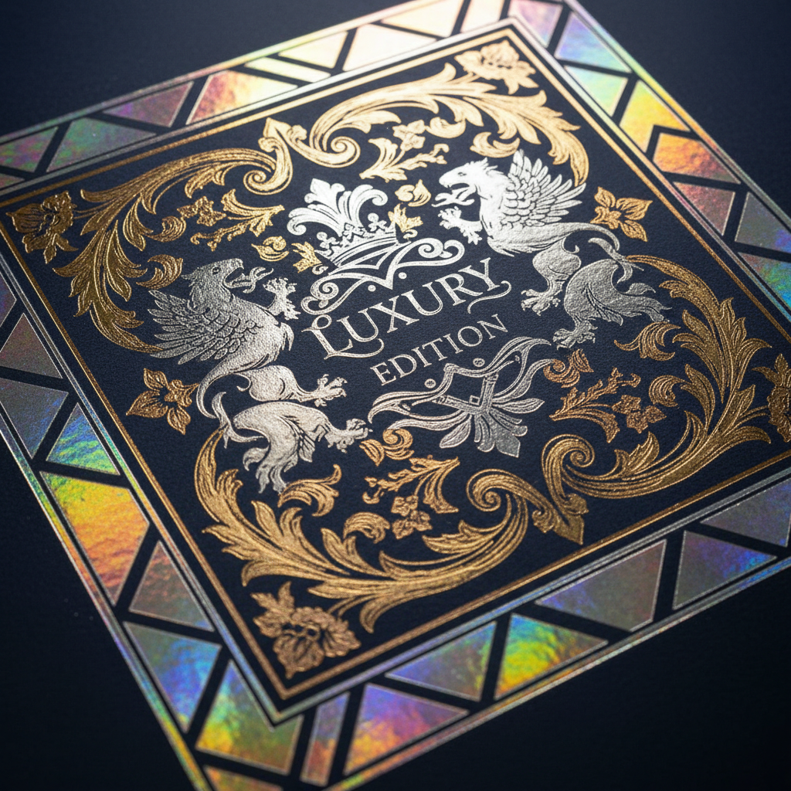

# Foil Stamping Art 烫金艺术

> "Foil stamping is alchemy made real — a heated die presses metallic or pigmented foil onto paper, transferring a mirror-bright layer of gold, silver, copper, or holographic color in a single kiss of heat and pressure. The result catches light like jewelry on the page, transforming ordinary printed matter into something precious that demands to be touched and tilted in the light." — Unknown

## 概述

烫金艺术（Foil Stamping Art）是一种通过加热的金属模具将金属箔或颜料箔转印到纸张、皮革或其他材料表面的装饰印刷技法。烫金（也称为烫印、热压转印）以其华丽的金属光泽和精确的图案再现著称，是印刷品和包装中最具视觉冲击力的装饰工艺之一。

烫金艺术的实践包括：1）模具制作——雕刻或蚀刻金属烫印模具；2）箔材选择——选择金、银、铜或彩色箔；3）温度控制——精确控制烫印温度；4）压力控制——控制烫印压力和时间；5）多色烫印——使用多种颜色的箔；6）全息烫印——使用全息箔创造彩虹效果；7）当代烫金——将传统技法与现代设计结合的创作。

## 核心特征

| 特征 | 描述 |
|------|------|
| 金属 | 金属光泽的效果 |
| 热压 | 通过热和压力转印 |
| 华丽 | 极其华丽的视觉 |
| 精确 | 精确的图案再现 |
| 多色 | 多种箔色可选 |
| 高端 | 高端品质的标志 |

## 视觉特征

- **光泽**：镜面般的金属光泽
- **华丽**：华丽夺目的效果
- **精确**：精确清晰的边缘
- **反射**：光线的反射效果
- **对比**：金属与纸面的对比
- **珍贵**：珍贵高端的感觉

## 代表作品

| 作品 | 艺术家/文化 | 年代 | 意义 |
|------|-------------|------|------|
| *Gold-tooled bookbindings* | 欧洲 | 15世纪起 | 金工书籍装帧 |
| *Art Deco foil designs* | 国际 | 1920-30年代 | 装饰艺术风格烫金 |
| *Luxury brand packaging* | 国际 | 当代 | 奢侈品牌包装烫金 |
| *Contemporary foil art* | 国际 | 当代 | 当代烫金艺术 |
| *Holographic foil prints* | 国际 | 当代 | 全息烫金印刷 |

## 历史时间线

| 时期 | 事件 |
|------|------|
| 15世纪 | 书籍装帧金工的起源 |
| 19世纪 | 工业化烫金技术的发展 |
| 20世纪初 | 商业烫金的广泛应用 |
| 1960年代 | 全息箔的发明 |
| 当代 | 烫金技术的多样化发展 |

## 中国语境

烫金在中国的印刷和设计中有极其广泛的应用。中国是全球最大的烫金加工市场之一——在包装、书籍、名片和各种印刷品中大量使用。中国的传统文化中，金色象征尊贵和吉祥——烫金在中国文化语境中有特殊的意义。中国的春节红包、请柬和礼品包装——烫金是最常见的装饰工艺。中国的书籍装帧设计中，烫金——是精装书和限量版的标配工艺。中国的包装设计产业中，烫金——是提升产品档次的核心工艺之一。中国的印刷教育中，烫金作为重要的印后工艺——在相关课程中深入教授。中国的烫金箔材生产——在全球供应链中占有重要地位。

## AI生成概念图

## 与其他风格的关系

- **Blind Embossing** → 无墨压凸
- **Debossing** → 压凹
- **Letterpress** → 活版印刷
- **Gold Leaf** → 贴金箔
- **Typography** → 字体设计
- **Luxury Design** → 奢侈品设计

---

*浮光艺志 | Chronicle of Artistry*
