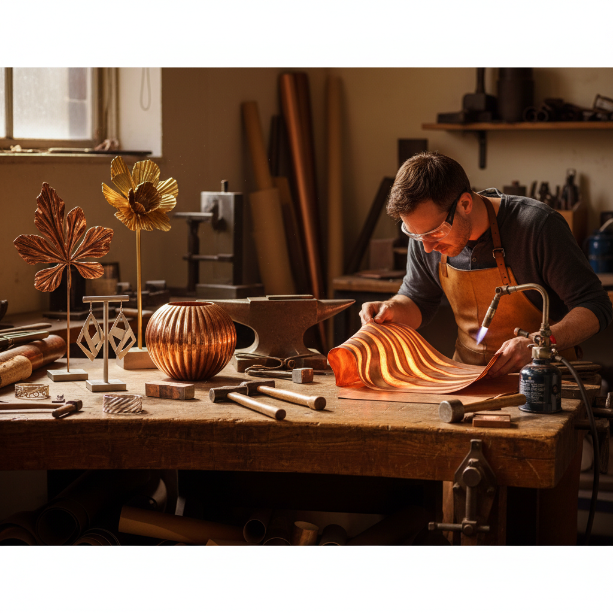

# Fold Forming 折叠成型

> "Fold forming is origami in metal — the sheet is folded, hammered, annealed, and unfolded to reveal organic forms that no amount of conventional raising or planishing could produce." — Unknown

## 概述

折叠成型（Fold Forming）是由加拿大金属艺术家Charles Lewton-Brain在1980年代系统化的一种金属成型技法——通过反复折叠、锤打、退火和展开金属板来创造复杂的三维形态。折叠成型的核心理念是：金属板经过折叠和锤打后，折痕处的金属被压缩和拉伸，当展开时会产生意想不到的曲面和褶皱。

折叠成型不需要复杂的工具——只需要金属板、锤子、砧子和退火设备。但它能产生极其丰富的形态——从类似树叶的有机形状到复杂的褶皱结构。折叠成型特别适合铜、黄铜和银等延展性好的金属。这种技法在当代金属首饰和雕塑中被广泛使用。

## 核心特征

| 特征 | 描述 |
|------|------|
| 折叠 | 反复折叠金属板 |
| 锤打 | 折叠后锤打 |
| 展开 | 展开后形成形态 |
| 有机 | 有机的自然形态 |
| 简单 | 工具简单 |
| 当代 | 当代金属艺术技法 |

## 视觉特征

- **有机**：有机的曲面形态
- **褶皱**：自然的褶皱
- **流动**：流动的线条
- **叶形**：类似树叶的形状
- **轻盈**：轻盈的视觉感
- **动态**：动态的形态

## 代表作品

| 作品 | 艺术家 | 年代 | 意义 |
|------|--------|------|------|
| *Charles Lewton-Brain works* | Lewton-Brain | 1980s起 | 折叠成型的发明者 |
| *Fold-formed jewelry* | Various | 当代 | 折叠成型首饰 |
| *Fold-formed vessels* | Various | 当代 | 折叠成型器皿 |
| *Fold-formed sculpture* | Various | 当代 | 折叠成型雕塑 |
| *T-fold and line-fold works* | Various | 当代 | T折和线折作品 |

## 历史时间线

| 时期 | 事件 |
|------|------|
| 传统 | 金属折叠在传统工艺中的零星使用 |
| 1980s | Charles Lewton-Brain系统化折叠成型 |
| 1990s | 折叠成型在金属工艺教育中的推广 |
| 2000s | 全球金属艺术家的广泛采用 |
| 当代 | 折叠成型的持续创新和发展 |
| 当代 | 在线教程和工作坊的普及 |

## 中国语境

折叠成型在中国的金属工艺教育和当代首饰设计领域正在获得关注。中国的一些珠宝设计学校和金属工艺课程引入了折叠成型技法。中国的独立首饰设计师使用折叠成型创作具有有机形态的金属首饰。折叠成型的"简单工具、丰富效果"特点使其适合工作室环境。中国的金属工艺社区中有关于折叠成型的讨论和实践分享。

## AI生成概念图

## 与其他风格的关系

- **Raising** → 起形
- **Repoussé** → 锤揲
- **Anticlastic Raising** → 反曲起形
- **Metal Sculpture** → 金属雕塑
- **Jewelry Making** → 首饰制作
- **Origami** → 折纸

---

*浮光艺志 | Chronicle of Artistry*
