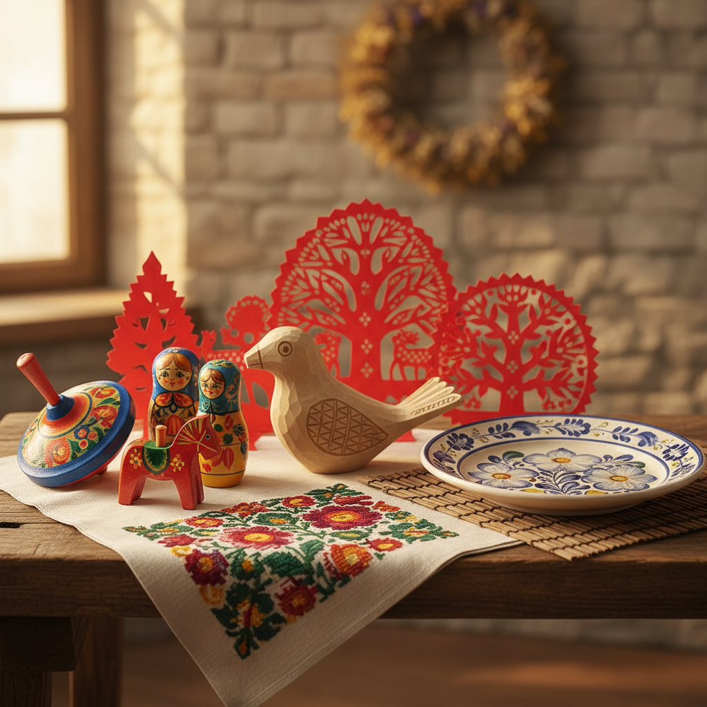

# Folk Art 民间艺术

> "Folk art is the art of the everyday, made by the people, for the people." — Henry Glassie

## 概述

民间艺术（Folk Art）是由普通人——农民、工匠、家庭主妇——在日常生活中创作的艺术，通常遵循地方传统和社区规范，而非学院训练。它包括绘画、雕刻、纺织、陶器、剪纸、面具等多种形式，是人类最广泛、最持久的艺术传统。

民间艺术的价值不在于个人天才的表达，而在于集体智慧的传承——每一件作品都承载着社区的记忆、信仰和审美。

## 核心特征

| 特征 | 描述 |
|------|------|
| 传统传承 | 技艺和图案代代相传 |
| 社区性 | 服务于社区的功能和仪式需求 |
| 匿名性 | 创作者通常不署名 |
| 功能性 | 兼具实用和装饰功能 |
| 地方性 | 反映特定地区的文化特征 |
| 手工性 | 手工制作，非工业化生产 |

## 视觉特征

- **图案**：传统的、重复的、象征性的图案
- **色彩**：鲜艳的、对比强烈的、来自天然染料
- **材料**：当地可得的天然材料
- **比例**：不遵循学院透视——主观的大小关系
- **装饰**：密集的装饰性——horror vacui
- **象征**：每个图案都有特定的象征意义

## 代表作品

| 作品/传统 | 地区 | 特征 |
|-----------|------|------|
| 剪纸 | 中国 | 红纸剪出的吉祥图案 |
| Rosemaling | 挪威 | 花卉装饰绘画 |
| Wycinanki | 波兰 | 对称的彩色剪纸 |
| Ex-votos | 墨西哥 | 感恩还愿的小型绘画 |
| Molas | 巴拿马库纳族 | 多层布料的反向贴花 |
| Hex Signs | 美国宾州 | 谷仓上的几何装饰 |
| 年画 | 中国 | 新年张贴的吉祥画 |

## 历史时间线

| 时期 | 事件 |
|------|------|
| 远古 | 民间艺术与人类文明同样古老 |
| 18-19世纪 | 浪漫主义对民间文化的"发现" |
| 1890s | 工艺美术运动——重新评价手工艺 |
| 1930s | 美国WPA项目记录民间艺术 |
| 1950s | 民俗学作为学科的建立 |
| 1970s | 民间艺术进入博物馆体系 |
| 2000s | 非物质文化遗产保护运动 |
| 2010s-至今 | 民间艺术的当代转化和全球化 |

## 中国语境

中国拥有世界上最丰富的民间艺术传统——剪纸、年画、刺绣、泥塑、皮影、风筝、面塑、木版年画、蓝印花布、蜡染、扎染……每个地区都有独特的民间艺术形式。中国的非物质文化遗产保护体系为民间艺术提供了制度性保障。当代中国的"国潮"运动将民间艺术元素融入现代设计，使传统图案获得新的生命力。

## AI生成概念图

## 与其他风格的关系

- **Outsider Art** → 局外人艺术与民间艺术共享非学院背景
- **Arts and Crafts** → 工艺美术运动重新评价了民间手工艺
- **Primitivism** → 原始主义对"原始"艺术的浪漫化包括民间艺术
- **Pattern and Decoration** → P&D运动引用民间装饰传统
- **Naive Art** → 素朴艺术与民间艺术有重叠但不完全相同
- **Pop Art** → 波普艺术的大众文化关注与民间艺术的民众性相通

---

*浮光艺志 | Chronicle of Artistry*
