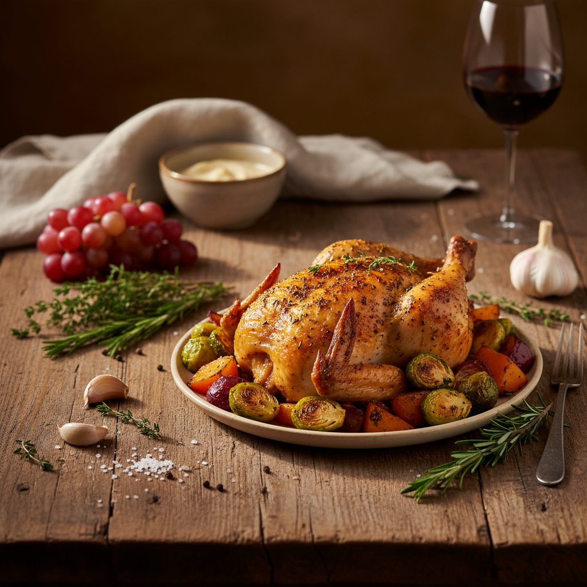

# Food Photography 美食摄影

> **时期：** 1920年代–至今  
> **关键词：** 食欲诱发、质感表现、色彩搭配、造型艺术、生活方式

## 概述

Food Photography（美食摄影）是将食物转化为视觉欲望的专业摄影领域。从早期广告的"完美"食物照到当代社交媒体的美食文化，食物摄影发展出一套精密的视觉语言——通过光线角度、色彩搭配、道具造型和后期调色，让观者"看到"味道、温度和质感。

## 风格特征

- **质感表现**：酥脆、多汁、绵密等口感的视觉化
- **自然光线**：侧光和逆光营造的食物光泽
- **色彩食欲**：暖色调激发的食欲反应
- **造型艺术**：食物摆盘和道具的精心编排
- **氛围营造**：餐桌场景的生活方式叙事

## 代表人物与作品

- 欧文·佩恩（经典食物静物）
- 大卫·莱特（暗调食物摄影）
- 社交媒体时代的美食博主文化
- 《Bon Appétit》杂志视觉风格

## 概念图

