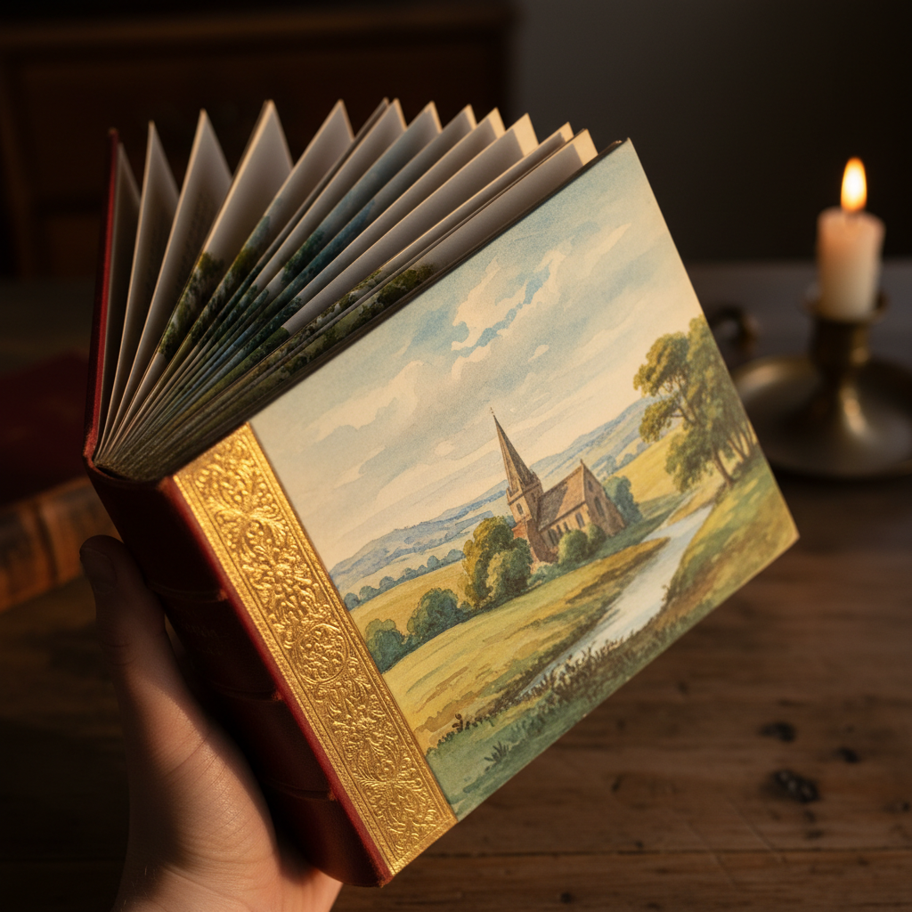

# Fore-edge Painting Art 书口绘画艺术

> "Fore-edge painting is the book's secret — a scene painted on the fanned edges of a book's pages that vanishes completely when the book is closed, leaving only a gilt edge that reveals nothing of the hidden treasure within. It is art that exists only in the act of opening, a painting that lives in the threshold between closed and open, visible only to those who know to look." — Unknown

## 概述

书口绘画艺术（Fore-edge Painting Art）是一种在书籍页面边缘（书口）上绘制图画的传统装饰技法——当书页被扇形展开时，隐藏的画面显现；当书页合拢时，画面消失在镀金的书口之下。这种"消失的绘画"技法起源于17世纪的英国，是书籍装帧中最神秘和最令人惊叹的装饰形式之一。

书口绘画艺术的实践包括：1）固定——将书页扇形展开并固定；2）绘画——在展开的书口上用水彩绘画；3）镀金——合拢后在书口镀金隐藏画面；4）双面书口画——正反两面各有不同画面；5）分离书口画——将书页分成两组各画一幅；6）当代书口画——将传统技法与现代主题结合的创作；7）修复——古籍书口画的修复保护。

## 核心特征

| 特征 | 描述 |
|------|------|
| 隐藏 | 合拢时画面消失 |
| 惊喜 | 展开时的惊喜 |
| 镀金 | 金色书口的掩饰 |
| 精细 | 极其精细的绘画 |
| 英国 | 源自英国的传统 |
| 珍稀 | 极其珍稀的技艺 |

## 视觉特征

- **隐藏**：合拢时不可见
- **精细**：极其精细的水彩画
- **风景**：常见风景和建筑主题
- **金色**：镀金书口的华丽
- **惊喜**：展开时的视觉惊喜
- **古典**：古典优雅的画风

## 代表作品

| 作品 | 艺术家/文化 | 年代 | 意义 |
|------|-------------|------|------|
| *Samuel Mearne bindings* | 英国 | 17世纪 | 最早的书口画 |
| *Edwards of Halifax* | 英国 | 18世纪 | 书口画的黄金时代 |
| *Double fore-edge paintings* | 英国 | 19世纪 | 双面书口画 |
| *Martin Frost works* | 英国 | 当代 | 当代书口画大师 |
| *Contemporary fore-edge art* | 国际 | 当代 | 当代书口画发展 |

## 历史时间线

| 时期 | 事件 |
|------|------|
| 10世纪 | 最早的书口装饰（文字） |
| 17世纪 | 隐藏式书口画的发明 |
| 18世纪 | Edwards of Halifax的黄金时代 |
| 19世纪 | 双面和分离书口画的发展 |
| 当代 | 书口画的艺术化复兴 |

## 中国语境

书口绘画在中国的认知相对有限但正在增长。中国传统的书籍装帧中没有完全对应的技法——但中国古籍的书口装饰（如染色书口）有类似的装饰意图。中国当代的手工书爱好者开始学习书口绘画技法——将其视为一种神奇的书籍装饰艺术。中国的一些图书馆和博物馆收藏有西方的书口画古籍——作为书籍艺术的珍贵藏品。中国的设计教育中，书口画作为书籍设计的特殊技法——在一些专业课程中有所介绍。中国的一些独立书店和手工书工作坊开始推广书口画——作为一种独特的书籍艺术体验。中国的社交媒体上，书口画的展示视频获得了大量关注——因其"魔术般"的视觉效果。

## AI生成概念图

## 与其他风格的关系

- **Bookbinding** → 书籍装帧
- **Miniature Painting** → 微型绘画
- **Watercolor** → 水彩画
- **Gilding** → 镀金工艺
- **Hidden Art** → 隐藏艺术
- **Book Art** → 书籍艺术

---

*浮光艺志 | Chronicle of Artistry*
