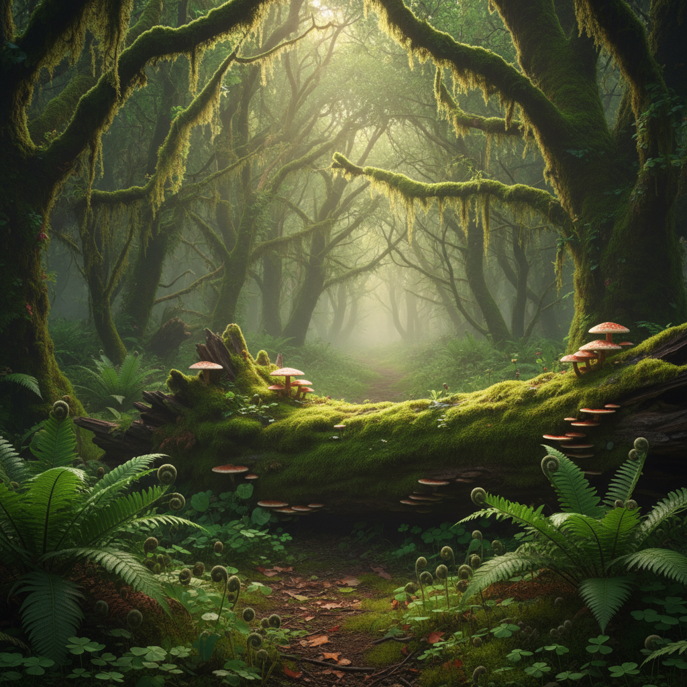

# Forestcore 森林核



> **"苔藓小径、树冠光斑、蕨类卷曲——在绿色的沉默中找到安宁。"**

## 概述

| 维度 | 描述 |
|------|------|
| 时期 | 2020–至今 |
| 别名 | Forestcore, Woodland Aesthetic, Deep Forest |
| 核心色彩 | 深绿、苔藓绿、棕色、金色光斑、雾白 |
| 关键元素 | 古树、苔藓、蕨类、蘑菇、溪流、雾 |
| 代表人物 | Pinterest/TikTok 社区驱动 |
| 关联风格 | Cottagecore, Dark Folk, Goblincore, Mushroomcore |

---

## 历史脉络

| 年份 | 事件 |
|------|------|
| 古代 | 森林在各文化中的神圣/恐惧双重地位 |
| 浪漫主义 | 森林作为"崇高"的象征 |
| 1990s | 森林浴（Shinrin-yoku）概念从日本传播 |
| 2020 | Forestcore 作为独立美学在社交媒体兴起 |
| 2022 | 与"森林浴"/"自然疗愈"运动交叉 |

### 核心哲学

Forestcore 的精神是**"森林是最古老的教堂——在树冠下找到平静"**：
- 森林 = 庇护所（逃离城市）
- 沉默 = 治愈
- 古老 = 智慧（"这棵树比我们都老"）
- 循环 = 生死（落叶→腐朽→新生）
- "在森林里，时间是不同的"

---

## 视觉语法

### 色彩系统

```
主色：
  深绿 (#1B5E20) — 树冠、常绿
  苔藓绿 (#4A7C59) — 地面、石头
  棕色 (#5D4037) — 树干、土壤
  金色 (#DAA520) — 光斑、秋叶
  雾白 (#E8E8E8) — 晨雾

辅色：
  暗红 (#8B0000) — 秋叶、浆果
  紫色 (#4B0082) — 野花
  黑色 (#1A1A1A) — 阴影、深处

质感：
  苔藓 — 柔软、湿润
  树皮 — 粗糙、有纹理
  蕨类 — 卷曲、精致
  雾气 — 朦胧、神秘
  落叶 — 层叠、腐朽
```

### 标志性元素

| 类别 | 元素 |
|------|------|
| 植物 | 古树、蕨类、苔藓、常春藤、野花 |
| 动物 | 鹿、狐狸、猫头鹰、松鼠 |
| 光线 | 树冠光斑、晨雾、金色斜阳 |
| 水 | 溪流、露珠、雨后 |
| 地面 | 落叶、苔藓、蘑菇、根系 |
| 态度 | 安宁、敬畏、沉默、治愈 |

---

## 与千禧怀旧的关系

### 自然系"-core"家族
- Forestcore = 自然美学中的"深度版"
- vs Cottagecore（花园、人工化的自然）
- vs Goblincore（收集、怪异的自然）
- vs Mushroomcore（专注菌类）
- Forestcore = 最"纯粹"的自然沉浸

### 森林浴运动
- 日本"Shinrin-yoku"的全球传播
- 科学证实森林对心理健康的益处
- 从美学到实践的转化
- "去森林里走走"= 当代自我疗愈

---

## 中国语境

- 中国丰富的森林文化（竹林、松林）
- "山林隐逸"的中国传统
- 与中国"森林公园"/"自然教育"的交叉
- 莫干山/神农架 = 中国的森林美学圣地
- 与中国山水画的精神对话

---

## 设计应用

| 场景 | 应用方式 |
|------|----------|
| 品牌 | 深绿+天然材料+手工+安宁 |
| 空间 | 木材+植物+自然光+苔藓+石头 |
| 时尚 | 绿色调+天然面料+层叠+有机 |
| 数字 | 绿色渐变+光斑动效+自然音效 |

---

## 相关风格

← [Cottagecore 田园核](cottagecore.md) | [Mushroomcore 蘑菇核](mushroomcore.md) →

↑ [返回千禧怀旧目录](README.md) | [返回总目录](../README.md)
