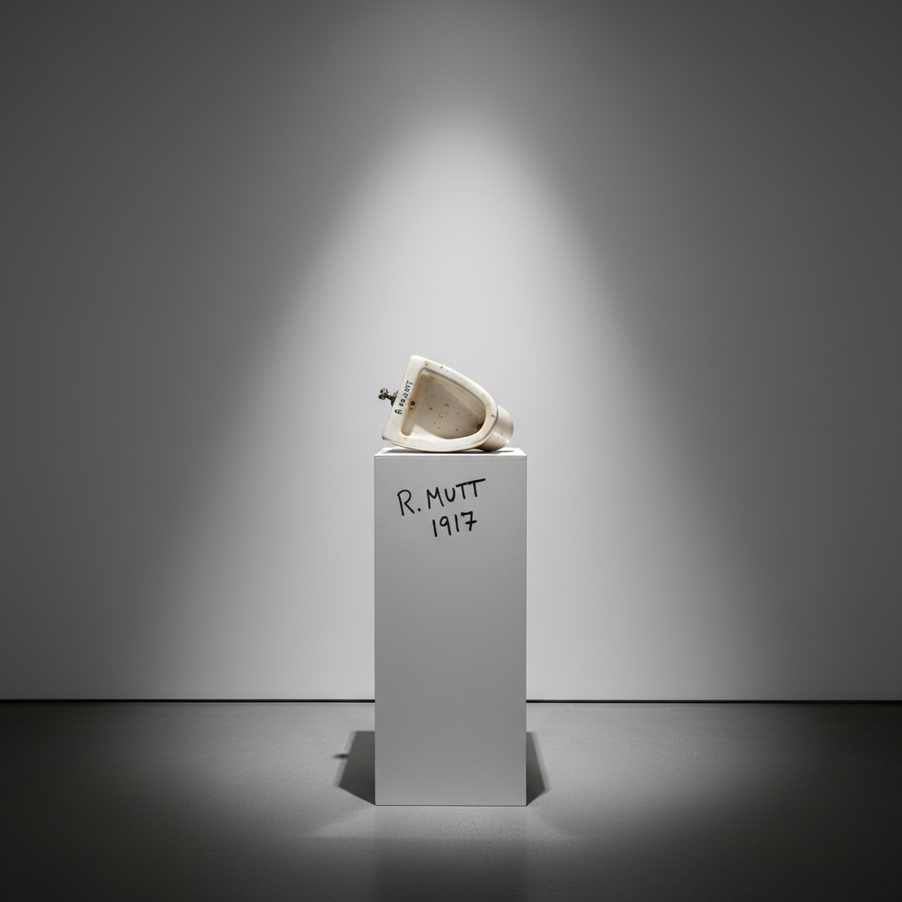

# Found Object Art 现成品艺术

> "Whether Mr. Mutt made the fountain with his own hands or not has no importance. He CHOSE it." — Marcel Duchamp

## 概述

现成品艺术（Found Object Art / Readymade / Objet Trouvé）是将日常物品——工业产品、自然物、废弃物——直接作为艺术品展示或作为艺术创作材料的实践。马塞尔·杜尚（Marcel Duchamp）1917年将一个小便池签名后送去展览，这一行为彻底改变了"什么是艺术"的定义。

现成品艺术的核心不是制作，而是选择和命名——艺术家的意图和语境赋予了普通物品以艺术身份。这是20世纪最具颠覆性的艺术观念之一。

## 核心特征

| 特征 | 描述 |
|------|------|
| 选择即创作 | 选择物品的行为本身就是艺术行为 |
| 去技术化 | 不需要传统的手工技能 |
| 语境转换 | 将物品从日常语境移入艺术语境 |
| 观念优先 | 观念比物质形态更重要 |
| 反美学 | 挑战传统的美学判断标准 |
| 制度批判 | 质疑艺术体制的权威 |

## 视觉特征

- **物品**：工业产品、日常用品、废弃物、自然物
- **呈现**：通常以原样展示，或做最小改动
- **底座**：放在底座上或挂在墙上——语境的转换
- **组合**：有时将多个现成品组合（assemblage）
- **标题**：标题往往是作品意义的关键
- **签名**：艺术家的签名赋予物品艺术身份

## 代表作品

| 作品 | 艺术家 | 年代 | 意义 |
|------|--------|------|------|
| *Fountain* | Marcel Duchamp | 1917 | 小便池——现成品艺术的起点 |
| *Bicycle Wheel* | Marcel Duchamp | 1913 | 第一件现成品——自行车轮 |
| *Bottle Rack* | Marcel Duchamp | 1914 | 瓶架——纯粹的选择行为 |
| *Monogram* | Robert Rauschenberg | 1955-59 | 山羊标本+轮胎——组合艺术 |
| *One and Three Chairs* | Joseph Kosuth | 1965 | 椅子+照片+定义——概念艺术 |
| *My Bed* | Tracey Emin | 1998 | 未整理的床——YBA的现成品 |

## 历史时间线

| 时期 | 事件 |
|------|------|
| 1913 | Duchamp的*Bicycle Wheel*——第一件现成品 |
| 1917 | *Fountain*——艺术史的转折点 |
| 1930s | 超现实主义的"发现物"（objet trouvé） |
| 1950s | Rauschenberg的"组合"（combines） |
| 1960s | 新现实主义——Arman的积累、César的压缩 |
| 1960s | 波普艺术——Warhol的Brillo Box |
| 1980s | Koons的吸尘器——新波普的现成品 |
| 1990s | YBA——Emin的床、Hirst的鲨鱼 |
| 2000s-至今 | 现成品作为当代艺术的基本语汇 |

## 子类型

| 子类型 | 特征 |
|--------|------|
| 纯粹现成品 | Duchamp——未经改动的工业产品 |
| 辅助现成品 | 经过最小改动的物品 |
| 组合艺术 | Rauschenberg——多个物品的组合 |
| 积累 | Arman——大量同类物品的堆积 |
| 概念现成品 | Kosuth——物品作为概念的载体 |
| 废品艺术 | 废弃物的艺术转化 |

## 中国语境

现成品艺术在中国当代艺术中有重要地位。艾未未的大量作品使用现成品——从古代陶罐到自行车、从螃蟹到葵花籽。黄永砯将中国传统物品（如洗衣机洗过的书）转化为当代艺术。中国的"垃圾艺术"、废品雕塑、以及对日常物品的挪用都延续了现成品艺术的传统。中国丰富的物质文化和快速的城市化为现成品艺术提供了独特的素材库。

## 争议与遗产

- **争议**：选择一个物品就算艺术吗？这是否太容易了？
- **原创性**：如果任何人都可以选择物品，艺术家的特殊性在哪里？
- **市场悖论**：一个小便池的复制品卖数百万——荒诞还是深刻？
- **遗产**：永久改变了艺术的定义——从"怎么做"到"为什么选"
- **当代回响**：概念艺术、装置艺术、日常美学、策展即创作

## AI生成概念图

## 与其他风格的关系

- **Dadaism** → 达达主义是现成品艺术的直接起源
- **Conceptual Art** → 概念艺术继承了现成品的观念优先
- **Pop Art** → 波普艺术将商品作为现成品的图像来源
- **Neo-Pop** → 新波普将现成品升华为奢侈品
- **Assemblage** → 组合艺术是现成品的多物组合形式
- **Institutional Critique** → 制度批判继承了现成品对体制的质疑

---

*浮光艺志 | Chronicle of Artistry*
