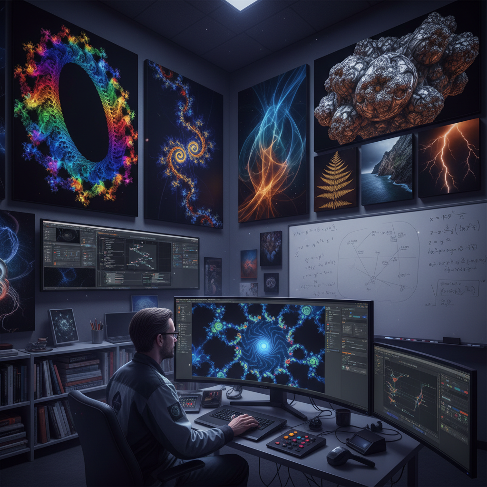

# Fractal Art 分形艺术

> "Fractal art reveals the infinite hidden in the finite — zooming endlessly into mathematical boundaries to discover that complexity repeats at every scale, coastlines within coastlines, spirals within spirals, each magnification unveiling new worlds that echo the whole, a visual proof that simple equations iterated millions of times can generate beauty as intricate and surprising as anything in nature, where mathematics becomes meditation and computation becomes wonder." — Unknown

## 概述

分形艺术（Fractal Art）是一种基于分形几何学（Fractal Geometry）的数字艺术形式，通过计算机迭代数学公式来生成具有自相似性（self-similarity）的复杂视觉图像。分形图像的核心特征是"无限细节"——无论放大多少倍，都能发现新的结构和图案，而这些局部结构往往与整体结构相似。

分形艺术的数学基础由本华·曼德博（Benoit Mandelbrot）在1975年奠定，他创造了"fractal"一词并发展了分形几何学。最著名的分形图像是曼德博集合（Mandelbrot Set）——一个由简单的复数迭代公式 z = z² + c 生成的无限复杂的边界。朱利亚集合（Julia Set）是另一类经典分形。1980年代个人计算机的普及使得分形艺术成为一种大众化的数字艺术形式。

## 核心特征

| 特征 | 描述 |
|------|------|
| 自相似 | 局部与整体的相似性 |
| 无限 | 无限的细节层次 |
| 迭代 | 数学公式的迭代 |
| 复杂 | 简单规则的复杂结果 |
| 数学 | 基于数学方程 |
| 计算 | 需要计算机生成 |

## 视觉特征

- **螺旋**：无限嵌套的螺旋
- **分支**：树状的分支结构
- **色彩**：丰富的渐变色彩
- **细节**：无穷的细节层次
- **对称**：近似的对称性
- **有机**：类似自然的有机形态

## 代表作品

| 作品 | 艺术家 | 年代 | 意义 |
|------|--------|------|------|
| *Mandelbrot Set visualizations* | Various | 1980年代起 | 曼德博集合的可视化 |
| *Julia Set explorations* | Various | 1980年代起 | 朱利亚集合的探索 |
| *Fractal Flame* | Scott Draves | 1992 | 分形火焰算法 |
| *Mandelbulb* | Daniel White & Paul Nylander | 2009 | 三维曼德博集合 |
| *Electric Sheep* | Scott Draves | 1999 | 分布式分形动画 |

## 历史时间线

| 时期 | 事件 |
|------|------|
| 1975 | Mandelbrot创造"fractal"一词 |
| 1980 | 曼德博集合的首次计算机可视化 |
| 1980年代 | 分形艺术的大众化 |
| 1990年代 | 分形火焰和IFS系统 |
| 2000年代 | 三维分形和实时渲染 |

## 中国语境

分形艺术在中国有广泛的爱好者群体和学术研究。中国的数学家和计算机科学家对分形理论有深入研究。中国的数字艺术社区积极创作分形艺术作品。有趣的是，中国传统艺术和哲学中有许多与分形思想相通的概念——如道家的"一生二，二生三，三生万物"的生成逻辑、中国传统山水画中"远山如近山"的自相似构图、以及中国传统建筑中的递归结构（如斗拱的层层叠加）。中国传统的太极图本身也可以被视为一种简单的自相似结构。

## AI生成概念图

## 与其他风格的关系

- **Algorithmic Art** → 算法艺术
- **Generative Art** → 生成艺术
- **Computer Art** → 计算机艺术
- **Mathematical Art** → 数学艺术
- **Digital Art** → 数字艺术
- **Psychedelic Art** → 迷幻艺术

---

*浮光艺志 | Chronicle of Artistry*
