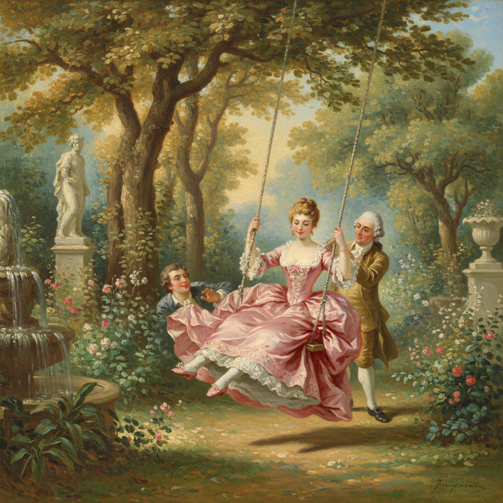

# Jean-Honoré Fragonard 弗拉戈纳尔

> "I would paint with my backside." — Jean-Honoré Fragonard (on his speed)

## 概述

让-奥诺雷·弗拉戈纳尔（Jean-Honoré Fragonard，1732–1806）是法国洛可可晚期最才华横溢的画家，以描绘爱情的欢愉、秘密花园中的调情和飞扬的裙摆闻名。他的笔触极其快速自由，色彩明亮温暖，将洛可可的轻盈推向了最后的辉煌。

## 核心特征

| 特征 | 描述 |
|------|------|
| 爱情主题 | 调情、偷吻、秘密约会 |
| 飞速笔触 | 极其快速自由的画法 |
| 金色光线 | 温暖的阳光穿透树叶 |
| 飘动织物 | 飞扬的裙摆和丝带 |
| 花园场景 | 秘密花园中的浪漫邂逅 |
| 戏剧性 | 瞬间动作的捕捉 |

## 代表作品

| 作品 | 年代 | 意义 |
|------|------|------|
| *The Swing* | 1767 | 洛可可最著名的图像——飞扬的秘密 |
| *The Bolt* | 1777 | 激情的瞬间 |
| *The Reader* | 1770 | 安静的专注之美 |
| *Progress of Love* series | 1771–72 | 爱情四部曲 |

## AI生成概念图

## 与其他风格的关系

- **Rococo** → 洛可可的最后辉煌
- **Boucher** → 老师布歇的继承者
- **Watteau** → 继承雅宴画的精神
- **Impressionism** → 快速笔触预示了印象派
