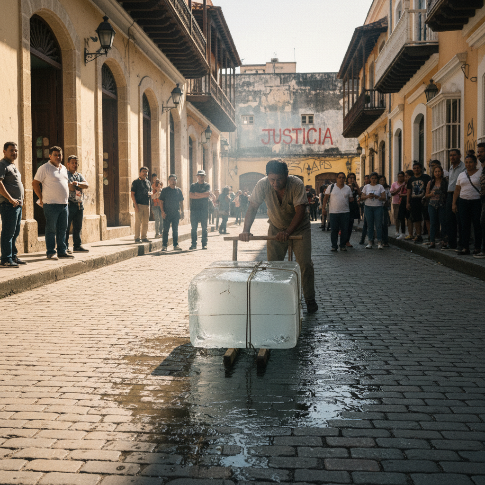

# Francis Alÿs 弗朗西斯·阿利斯

> **时期：** 1959–至今  
> **关键词：** 行走艺术、政治寓言、拉美城市、西西弗斯式行动

## 概述

Francis Alÿs 是比利时裔墨西哥艺术家，以诗意的行为艺术和动画闻名。他推一块冰穿越墨西哥城直到融化、带500名志愿者用铲子移动一座沙丘、沿以色列-巴勒斯坦绿线倒绿色油漆——这些看似徒劳的行动成为关于劳动、边界和信仰的政治寓言。

## 风格特征

- **行走与行动**：身体在城市中的移动是核心媒介
- **西西弗斯式**：看似无意义的重复劳动暗含深意
- **政治寓言**：个人行动映射集体政治处境
- **拉美城市**：墨西哥城的街道是主要舞台
- **小画与动画**：同时创作小幅油画和手绘动画

## 代表作品

- *Paradox of Praxis 1 (Sometimes Making Something Leads to Nothing)*（1997）
- *When Faith Moves Mountains*（2002）
- *The Green Line*（2004）
- *REEL-UNREEL*（2011）

## 概念图

