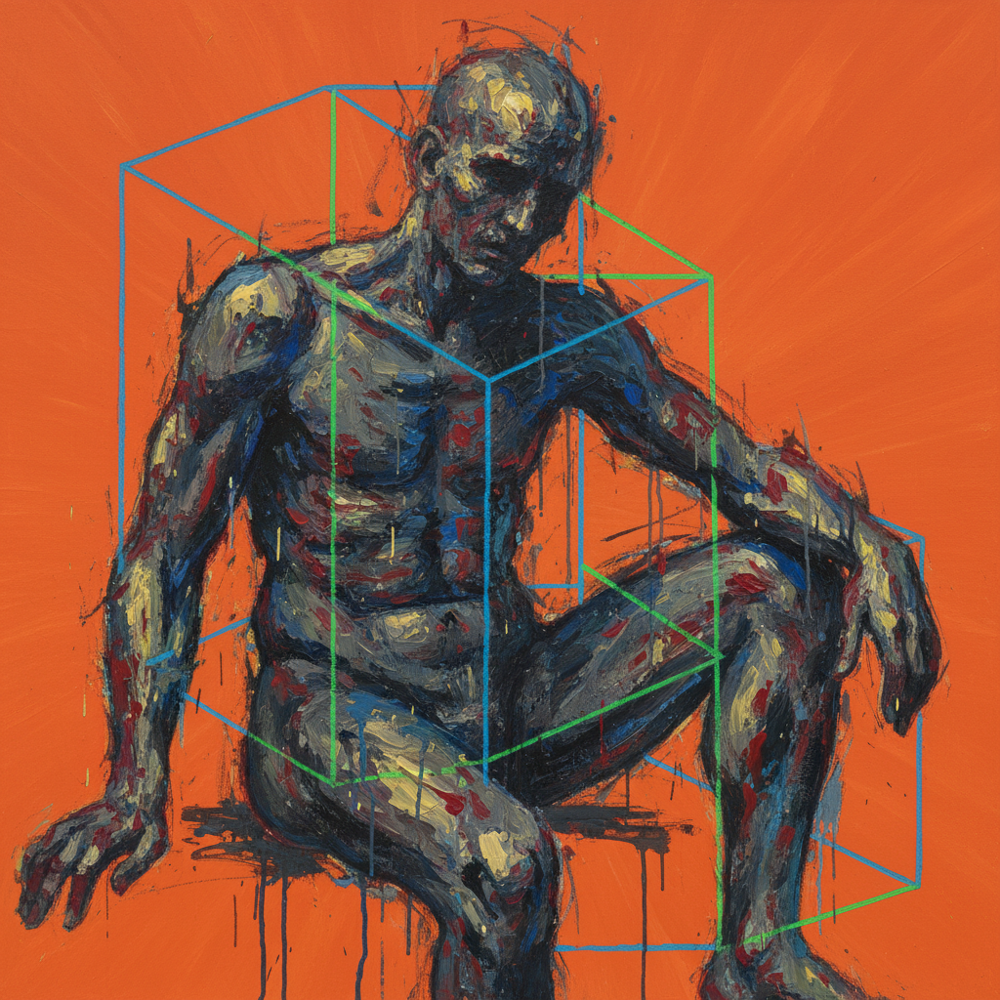

# Francis Bacon 弗朗西斯·培根

> "The job of the artist is always to deepen the mystery." — Francis Bacon

## 概述

弗朗西斯·培根（Francis Bacon，1909–1992）是爱尔兰裔英国画家，20世纪最具争议和影响力的具象画家之一。他以扭曲变形的人体、笼中的尖叫教皇和模糊的肖像闻名，将人类存在的恐惧、欲望和暴力转化为令人不安却无法移开目光的画面。

## 核心特征

| 特征 | 描述 |
|------|------|
| 扭曲人体 | 变形、溶解、痉挛的肉体 |
| 笼状结构 | 透明的几何线框困住人物 |
| 尖叫面孔 | 张开的嘴巴——无声的恐惧 |
| 平涂背景 | 鲜艳的橙色、紫色单色背景 |
| 三联画 | 大型三联画的叙事结构 |
| 偶然性 | 利用意外的泼洒和擦拭 |

## 代表作品

| 作品 | 年代 | 意义 |
|------|------|------|
| *Three Studies for Figures at the Base of a Crucifixion* | 1944 | 战后英国艺术的震撼开端 |
| *Study after Velázquez's Portrait of Pope Innocent X* | 1953 | 尖叫教皇——恐惧的经典 |
| *Three Studies of Lucian Freud* | 1969 | 拍卖史上最贵画作之一 |
| *Triptych, May–June 1973* | 1973 | 爱人之死的悲痛 |

## AI生成概念图

## 与其他风格的关系

- **Giacometti** → 同代人，共享存在主义焦虑
- **Lucian Freud** → 挚友与对手，不同路径的肉体画家
- **Velázquez** → 反复重新诠释委拉斯开兹
- **Expressionism** → 继承表现主义的情感强度
