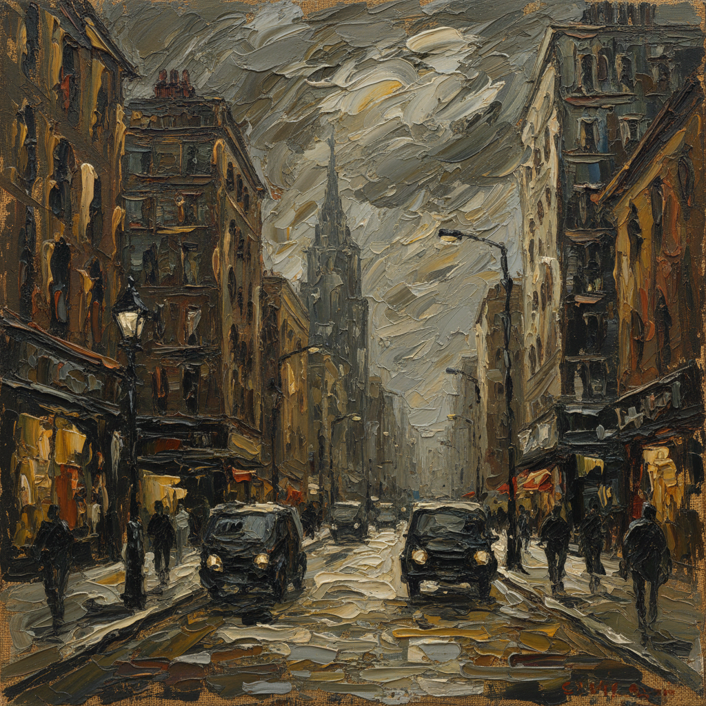

# Frank Auerbach 弗兰克·奥尔巴赫

> **时期：** 1931–2024  
> **关键词：** 极厚堆积、反复重画、伦敦风景、战后英国绘画

## 概述

Frank Auerbach 是德裔英国画家，以极端厚涂和反复重画的工作方式闻名。他每天在同一间工作室作画超过60年，反复刮除和重新堆积颜料，直到画面达到他认为的"正确"状态。他的作品——主要是伦敦街景和少数固定模特的肖像——是对观看行为本身的极端追问。

## 风格特征

- **极厚堆积**：颜料厚度可达数厘米，画面如同浮雕或地质层
- **反复重画**：同一画面被刮除重画数十甚至数百次，最终版本包含所有尝试的记忆
- **有限题材**：终生只画伦敦Camden Town附近的街景和少数固定模特
- **土色为主**：以赭石、深棕、暗绿和灰色为主，偶尔爆发出强烈的黄或红
- **速度感**：尽管反复重画，最终保留的笔触具有惊人的速度和确定性

## 代表作品

- *Head of E.O.W.*（1955，系列）
- *Mornington Crescent*（1960s–2000s，系列）
- *Primrose Hill*（1967–68）
- *Head of Julia*（1960，系列）

## 历史意义

Auerbach 代表了绘画作为"每日实践"的极端形式——不是灵感的产物，而是日复一日的劳动和观看的积累。他证明了在摄影时代，用颜料"看见"世界仍然是一种不可替代的认知方式。

## 概念图

