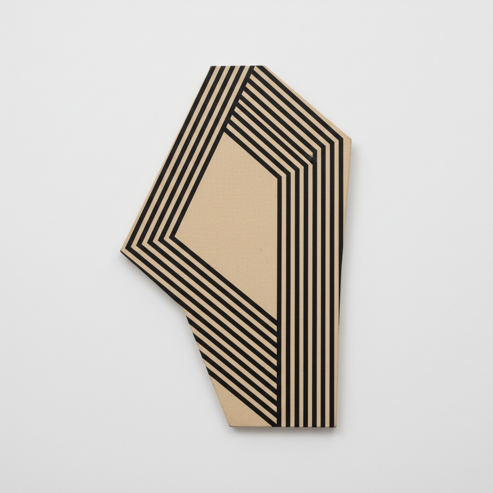

# Frank Stella 弗兰克·斯特拉

> **流派**: 极简主义 · 后绘画性抽象 · 极繁主义  
> **时期**: 1936–2024 美国  
> **关键词**: 条纹绘画、异形画布、金属浮雕、从极简到极繁

## 概述

弗兰克·斯特拉以"你看到的就是你看到的"这句宣言开启了极简主义绘画，又以越来越复杂的三维金属浮雕走向了极繁主义的另一极端。他的职业生涯本身就是一部从平面到空间、从克制到爆发的艺术史。

## 视觉特征

- **早期条纹**: 等宽的平行条纹跟随画布形状
- **异形画布**: 画布不再是矩形，而是V形、L形等
- **金属浮雕**: 后期作品用铝、钢制作巨大的墙面雕塑
- **鲜艳色彩**: 从早期的黑色到后期的荧光色爆炸
- **曲线与混沌**: 晚期作品充满扭曲的曲线和碎片

## 代表作品

- 《黑色绘画》系列 (1958–60)
- 《量角器》系列 (1967–71)
- 《波兰村庄》系列 (1970–74)
- 《莫比·迪克》系列 (1980s)

## 历史影响

斯特拉证明了一个艺术家可以不断自我颠覆。他从极简到极繁的转变挑战了艺术史的线性叙事，影响了后来的新几何抽象和当代雕塑。

## 相关风格

- [Minimalism 极简主义](minimalism.md)
- [Donald Judd 唐纳德·贾德](donald-judd.md)
- [Sol LeWitt 索尔·勒维特](sol-lewitt.md)
