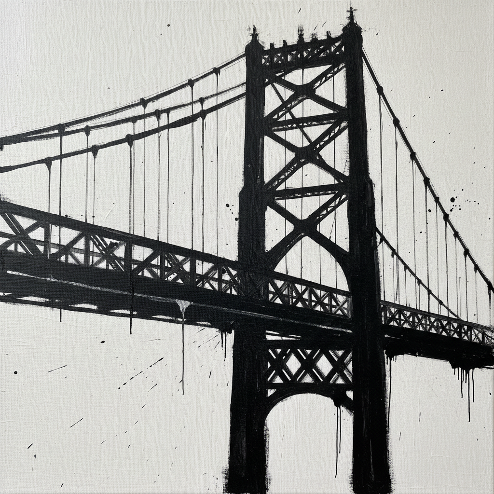

# Franz Kline 弗朗茨·克莱因

> "I paint the white as well as the black, and the white is just as important." — Franz Kline

## 概述

弗朗茨·克莱因（Franz Kline，1910–1962）是美国抽象表现主义的重要代表，以巨大的黑白画作闻名。他用房屋油漆刷在巨幅画布上挥洒粗犷的黑色笔触，创造出如同钢铁桥梁和城市建筑骨架般的抽象结构，将纽约的工业力量转化为纯粹的视觉能量。

## 核心特征

| 特征 | 描述 |
|------|------|
| 黑白巨作 | 房屋油漆刷的粗犷笔触 |
| 建筑结构 | 如钢梁般的抽象骨架 |
| 工业力量 | 纽约桥梁和铁路的视觉翻译 |
| 速度感 | 看似即兴实则精心构思 |
| 正负空间 | 黑白同等重要 |
| 巨大尺幅 | 身体参与的绘画行为 |

## 代表作品

| 作品 | 年代 | 意义 |
|------|------|------|
| *Mahoning* | 1956 | 黑白抽象的经典 |
| *Chief* | 1950 | 突破性的大尺幅黑白画 |
| *Painting Number 2* | 1954 | 建筑结构的抽象 |
| *Meryon* | 1960–61 | 晚期引入色彩的探索 |

## AI生成概念图

## 与其他风格的关系

- **Abstract Expressionism** → 行动绘画的代表
- **Motherwell** → 共享黑白的力量美学
- **Japanese Calligraphy** → 与书法的视觉亲缘
- **de Kooning** → 纽约画派的密友
