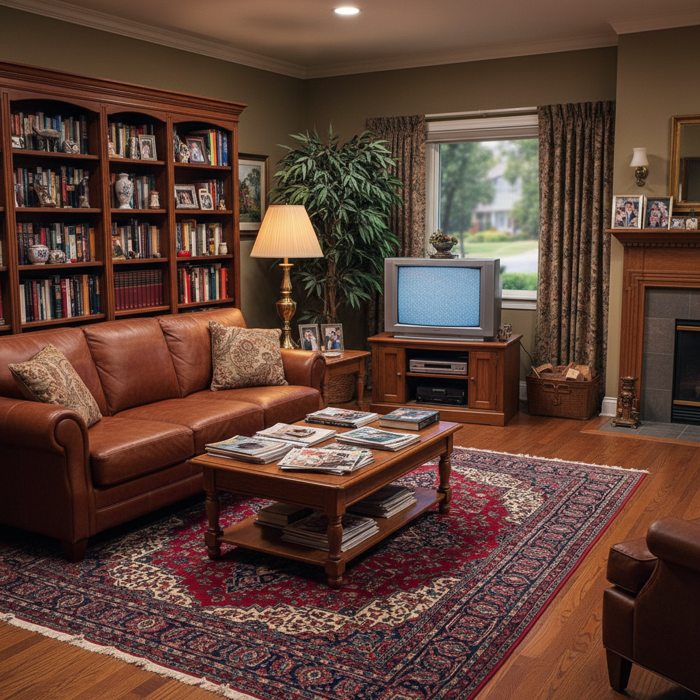
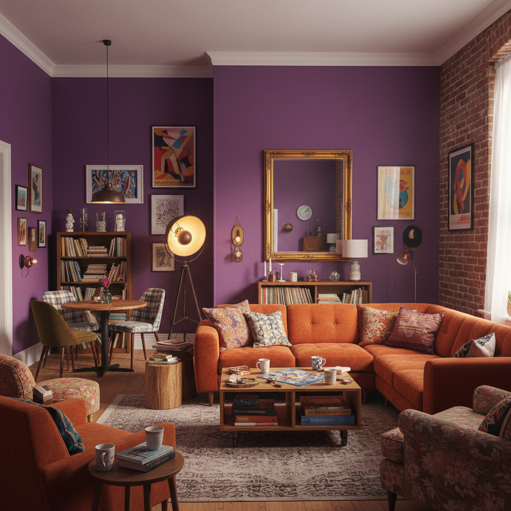

# Frasurbane 郊区怀旧





> **"90年代情景喜剧里那个永远不会变的客厅——米色沙发、木质书架和窗外修剪整齐的草坪。"**

## 概述

| 维度 | 描述 |
|------|------|
| 时期 | 怀念 1993–2004 的郊区生活 |
| 别名 | Frasurbane, Suburban Nostalgia, 90s Sitcom Core |
| 核心色彩 | 米色、深绿、酒红、橡木棕、奶油白 |
| 关键元素 | 皮沙发、木质书架、台灯暖光、地毯、盆栽 |
| 代表人物 | 《Frasier》、《Friends》客厅、《Seinfeld》公寓 |
| 关联风格 | Gen X Soft Club, Nostalgiacore, Mallsoft |

---

## 历史脉络

### 什么是 Frasurbane？

Frasurbane 是一个相对新的互联网美学标签（约 2021 年在 Aesthetics Wiki 上被命名），它指向一种非常具体的视觉记忆：**1990年代中期至2000年代初期，北美中产阶级郊区生活的室内美学**。

名字来源于美剧《Frasier》（1993–2004）——Frasier Crane 在西雅图的高层公寓，以其精致但温暖的室内设计成为这种美学的视觉标杆：Eames 躺椅、非洲艺术品、深色木质家具、暖色调灯光。

但 Frasurbane 不仅仅是《Frasier》。它涵盖了整个 90 年代情景喜剧的室内世界：
- 《Friends》的紫色公寓墙壁和橙色沙发
- 《Seinfeld》的极简纽约公寓
- 《Will & Grace》的曼哈顿上西区品味
- 《The Fresh Prince》的 Bel-Air 豪宅

### 为什么怀念这些客厅？

这些虚构的客厅代表了一种**已经消失的"家"的概念**：

1. **前智能手机时代**：人们坐在沙发上面对面交谈，而不是各自看手机
2. **实体媒介**：书架上有真正的书、CD架上有真正的CD、电视柜里有VHS录像带
3. **固定空间**：每集都在同一个客厅发生，空间是稳定的、可预测的
4. **暖色调照明**：台灯和落地灯的暖光，而不是LED的冷白光
5. **"成人生活"的想象**：对于看着这些剧长大的千禧一代来说，这些客厅代表了"长大后的生活应该是什么样子"

---

## 视觉语法

### 色彩系统

```
主色：
  米色/奶油色 (#F5F5DC) — 墙壁、沙发
  橡木棕 (#806517) — 家具、地板
  深绿 (#2E4E3F) — 盆栽、装饰
  酒红 (#722F37) — 靠垫、地毯
  暖白 (#FFF8E7) — 灯光色温

辅色：
  海军蓝 (#000080) — 书籍封面
  铜色 (#B87333) — 灯具、把手
  砖红 (#CB4154) — 砖墙、陶器

质感：
  皮革（沙发、扶手椅）
  木材（书架、茶几、地板）
  织物（地毯、窗帘、靠垫）
  陶瓷（花瓶、咖啡杯）
  纸张（书籍、杂志、报纸）
```

### 标志性元素

| 类别 | 元素 | 文化来源 |
|------|------|----------|
| 家具 | 皮质沙发/扶手椅 | 中产阶级客厅标配 |
| 家具 | 实木书架（满载书籍） | 知识分子身份标识 |
| 照明 | Tiffany 台灯/落地灯 | 暖色调的核心来源 |
| 地面 | 波斯/东方风格地毯 | 文化品味的展示 |
| 墙面 | 有框艺术品/照片墙 | 个人历史的物质化 |
| 媒介 | CD架、VHS柜、黑胶唱片 | 前数字时代的娱乐 |
| 植物 | 大型室内盆栽（琴叶榕等） | 生命感和自然连接 |
| 饮品 | 咖啡杯/红酒杯 | 成人社交的道具 |

### 与当代极简主义的对比

| 维度 | Frasurbane (90s) | 当代极简 (2020s) |
|------|-----------------|-----------------|
| 色调 | 暖色、深色 | 冷色、白色 |
| 材质 | 皮革、木材、织物 | 混凝土、金属、玻璃 |
| 物品密度 | 高（书、CD、装饰品） | 低（"less is more"） |
| 照明 | 暖黄台灯 | 冷白LED |
| 媒介 | 实体（书、唱片） | 数字（流媒体） |
| 植物 | 大型盆栽 | 多肉/极简绿植 |
| 情感 | 温暖、包裹感 | 清爽、开放感 |

---

## 文化分析

### "第三空间"的消失

Frasurbane 怀念的不仅是室内设计风格，更是一种**社交方式**：
- 《Friends》的 Central Perk 咖啡馆 = 第三空间（家和工作之外的社交场所）
- 《Frasier》的 Café Nervosa = 知识分子的公共客厅
- 《Seinfeld》的 Monk's Café = 日常闲聊的固定场所

这些空间在现实中正在消失——被外卖、远程工作和社交媒体取代。

### 对"成人生活"的失落

对于 1985–1995 年出生的千禧一代来说，这些情景喜剧塑造了他们对"成人生活"的想象：
- 有一个属于自己的公寓/房子
- 公寓里有真正的家具（不是宜家平板包装）
- 朋友们会不请自来地敲门
- 下班后在固定的咖啡馆/酒吧聚会

但现实是：高房价、远程工作、社交原子化让这种生活变得越来越难以实现。Frasurbane 的怀旧，本质上是对一种**从未真正拥有过的生活方式**的怀念。

---

## 中国语境

在中国，Frasurbane 的对应记忆可能包括：
- 2000年代初的情景喜剧布景（《家有儿女》《武林外传》的客栈/客厅）
- 父母家的客厅：实木家具、CRT电视、VCD机、书架
- 90年代末的"样板间"美学：皮沙发+水晶灯+深色木地板
- 小时候看的美剧/港剧中的"外国客厅"想象

---

## 设计应用

| 场景 | 应用方式 |
|------|----------|
| 空间设计 | 暖色调+实木家具+皮质沙发+大量书籍 |
| 品牌设计 | 复古暖色调+衬线字体+纸质质感 |
| 摄影 | 暖色灯光+浅景深+生活化道具 |
| 视频 | 情景喜剧式固定机位+暖色调色 |

---

## 延伸阅读

- Aesthetics Wiki: [Frasurbane](https://aesthetics.fandom.com/wiki/Frasurbane)
- 《Frasier》室内设计分析
- 90年代情景喜剧的布景设计史

---

## 相关风格

← [Gen X Soft Club](gen-x-soft-club.md) | [Nostalgiacore](nostalgiacore.md) →

↑ [返回千禧怀旧目录](README.md) | [返回总目录](../README.md)
