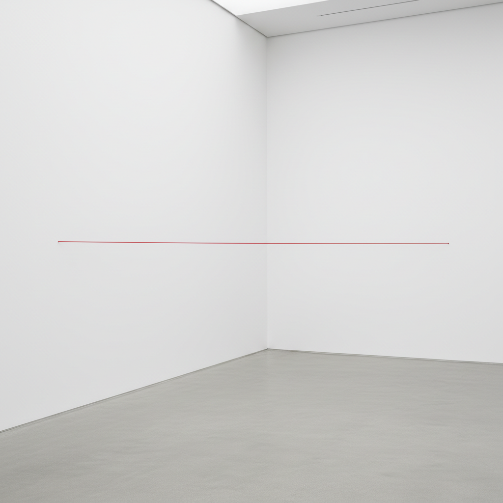

# Fred Sandback 弗雷德·桑德巴克

> **时期：** 1943–2003  
> **关键词：** 纱线雕塑、虚拟体量、空间划分、极简主义诗学

## 概述

Fred Sandback 是美国雕塑家，以用彩色丙烯纱线在空间中勾勒出虚拟的平面和体量而闻名。他的作品仅由几根从地面到天花板或墙到墙拉伸的纱线组成，却能让观者感知到一个完整的平面或封闭空间的存在——用最少的物质创造最大的空间感知。

## 风格特征

- **纱线作为媒介**：彩色丙烯纱线是唯一的材料
- **虚拟体量**：几根线条暗示出完整的平面、角落或封闭空间
- **空间划分**：作品将展厅空间分割为不同的感知区域
- **色彩的线性**：纱线的颜色（黑、红、蓝）在空间中如同绘画的线条
- **可穿越性**：观者可以穿过"虚拟墙面"，体验感知与现实的差异

## 代表作品

- *Untitled (Sculptural Study, Two-part Vertical Construction)*（1982）
- *Untitled (Broken Line)*（多个版本）
- Dia:Beacon 永久装置
- 各种场域特定纱线装置

## 历史意义

Sandback 将极简主义推向了物质性的极限——用几乎不存在的材料创造出强烈的空间体验。他证明了雕塑不需要体量和重量，只需要对空间感知的精确操控。

## 概念图

