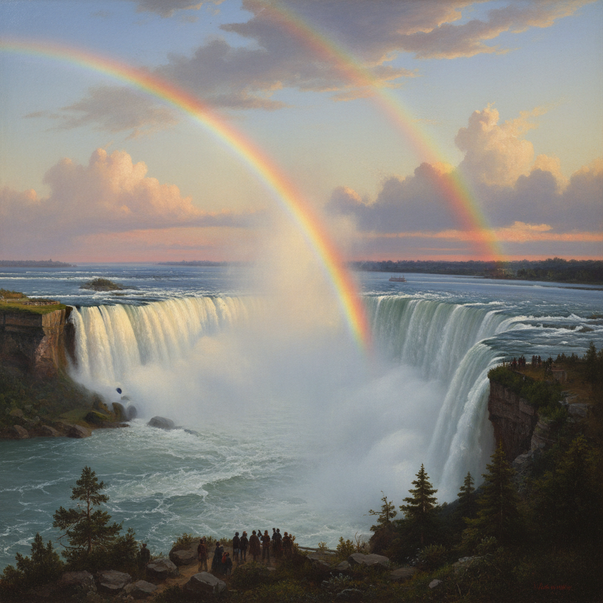

# Frederic Edwin Church 弗雷德里克·丘奇

> "To walk with nature as a poet is the necessary condition of a perfect artist." — Frederic Edwin Church

## 概述

弗雷德里克·埃德温·丘奇（Frederic Edwin Church，1826–1900）是美国哈德逊河画派第二代的领军人物，托马斯·科尔的唯一正式学生。他以描绘全球壮丽自然奇观闻名——从南美安第斯山脉到北极冰山，从尼亚加拉瀑布到中东古迹，用科学般的精确和戏剧性的光线将自然的崇高推向极致。

## 核心特征

| 特征 | 描述 |
|------|------|
| 全球视野 | 南美、北极、中东的异域风景 |
| 科学精确 | 地质学和气象学的视觉记录 |
| 戏剧光线 | 日出日落的壮丽色彩 |
| 巨幅画布 | 展览级的超大尺寸 |
| 自然崇高 | 火山、冰山、瀑布的力量 |
| 探险精神 | 艺术家作为科学探险者 |

## 代表作品

| 作品 | 年代 | 意义 |
|------|------|------|
| *The Heart of the Andes* | 1859 | 南美风景的史诗巨作 |
| *Niagara* | 1857 | 瀑布的全景震撼 |
| *The Icebergs* | 1861 | 北极崇高的视觉翻译 |
| *Twilight in the Wilderness* | 1860 | 美国荒野的燃烧天空 |

## AI生成概念图

## 与其他风格的关系

- **Hudson River School** → 第二代领军人物
- **Thomas Cole** → 科尔的唯一正式学生
- **Bierstadt** → 同代西部风景画家
- **Luminism** → 光辉主义的壮丽版本
