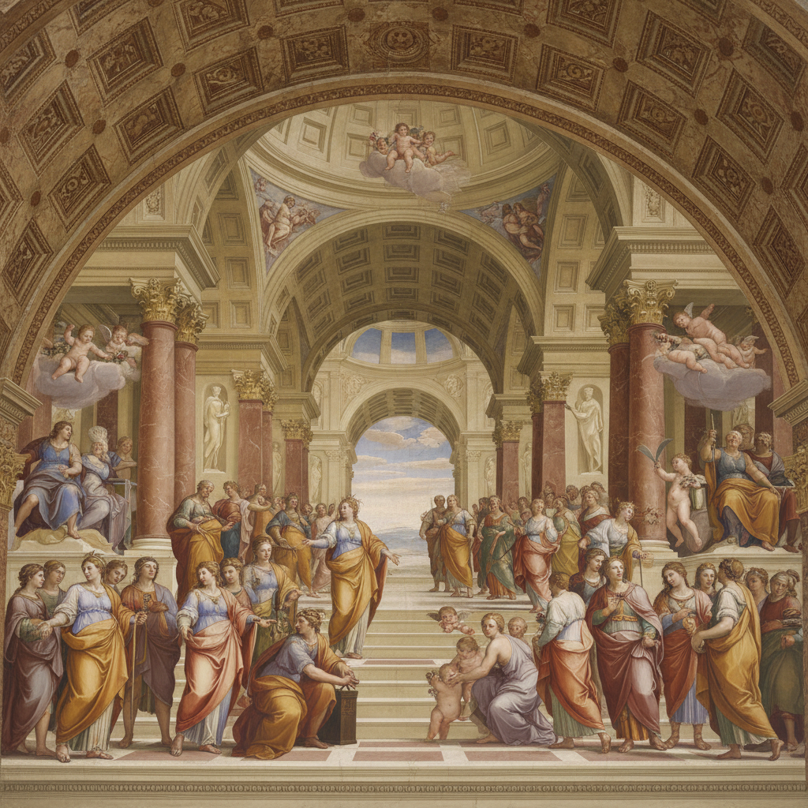

# Fresco Art 湿壁画

> **时期：** 公元前1500年–至今  
> **关键词：** 灰泥、矿物颜料、建筑绘画、永久性、纪念性

## 概述

Fresco（湿壁画）是将颜料直接涂绘在湿石灰灰泥上的壁画技法，颜料随灰泥干燥而化学结合，成为墙壁的一部分。从米诺斯文明的克诺索斯宫殿到米开朗基罗的西斯廷天顶画，湿壁画承载了人类最宏伟的视觉叙事——它不是挂在墙上的画，而是墙壁本身在说话。

## 风格特征

- **湿画法**：颜料在灰泥未干时涂绘（buon fresco）
- **矿物颜料**：使用耐碱性天然矿物色粉
- **分区作业**：每日完成一个"giornata"区域
- **建筑一体**：画面与建筑空间融为一体
- **持久性**：化学结合使色彩历经千年不褪

## 代表人物与作品

- 米开朗基罗《西斯廷天顶画》《最后的审判》
- 拉斐尔《雅典学院》
- 乔托《斯克罗维尼礼拜堂》壁画
- 迭戈·里维拉 墨西哥壁画运动

## 概念图

