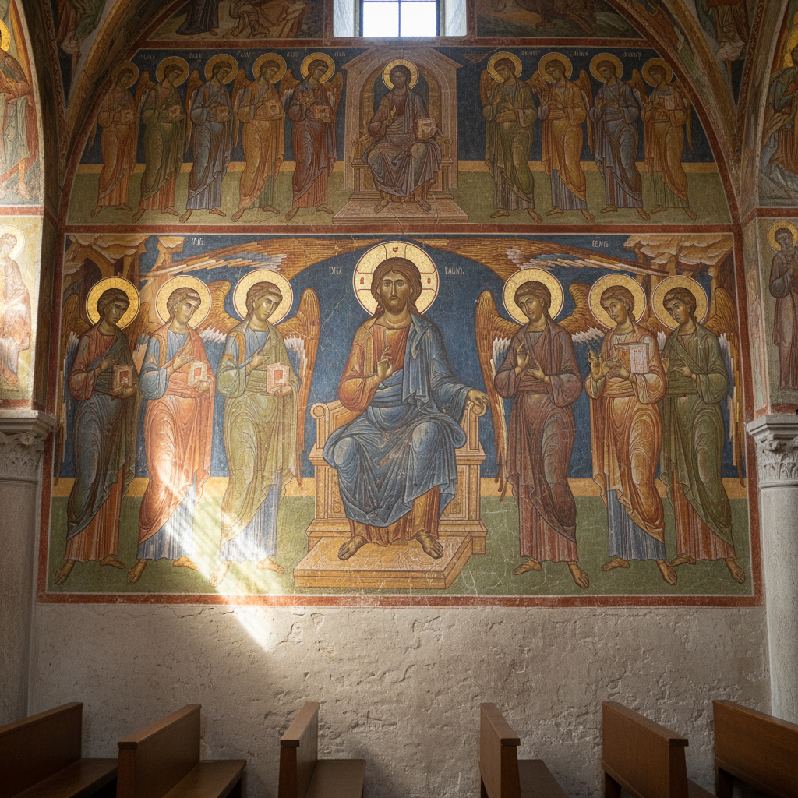

# Fresco Secco Art 干壁画艺术

> "Fresco secco is painting on memory — unlike buon fresco where pigment bonds chemically with wet plaster, secco applies paint to dry walls using binding media like egg, casein, or lime water. The technique offers more time and detail than true fresco but trades some of its permanence, creating murals that sit upon the wall rather than becoming part of it." — Unknown

## 概述

干壁画艺术（Fresco Secco Art）是一种在干燥的灰泥墙面上使用结合剂（如蛋液、酪蛋白或石灰水）混合颜料进行绘画的壁画技法。与湿壁画（buon fresco）在湿灰泥上绘画不同，干壁画在已干燥的墙面上工作——允许更多的修改和细节处理，但颜料与墙面的结合不如湿壁画牢固。

干壁画艺术的实践包括：1）墙面准备——确保干燥灰泥墙面的清洁和平整；2）结合剂选择——选择蛋液、酪蛋白或石灰水作为结合剂；3）颜料调配——将颜料与结合剂混合；4）绘画——在干燥墙面上绘画；5）细节处理——利用干燥时间进行精细描绘；6）修补——修补和调整已绘制的区域；7）当代干壁画——将传统技法与现代壁画创作结合。

## 核心特征

| 特征 | 描述 |
|------|------|
| 干燥 | 在干燥墙面上绘画 |
| 结合剂 | 需要结合剂固定颜料 |
| 灵活 | 比湿壁画更灵活 |
| 细节 | 允许更多细节处理 |
| 修改 | 可以修改和调整 |
| 壁画 | 壁画的重要形式 |

## 视觉特征

- **哑光**：哑光的表面效果
- **色彩**：丰富的色彩表现
- **细节**：精细的细节描绘
- **纹理**：墙面的纹理质感
- **叙事**：大型叙事场景
- **建筑**：与建筑空间的融合

## 代表作品

| 作品 | 艺术家/文化 | 年代 | 意义 |
|------|-------------|------|------|
| *Egyptian tomb paintings* | 古埃及 | 古代 | 埃及墓室壁画 |
| *Byzantine church murals* | 拜占庭 | 中世纪 | 拜占庭教堂壁画 |
| *Indian cave paintings* | 印度 | 古代-中世纪 | 印度石窟壁画 |
| *Medieval church secco* | 欧洲 | 中世纪 | 中世纪教堂干壁画 |
| *Contemporary murals* | 国际 | 当代 | 当代壁画 |

## 历史时间线

| 时期 | 事件 |
|------|------|
| 古埃及 | 干壁画技法的早期使用 |
| 古代-中世纪 | 印度阿旃陀石窟壁画 |
| 中世纪 | 欧洲教堂干壁画的广泛使用 |
| 文艺复兴 | 干壁画与湿壁画的结合使用 |
| 当代 | 干壁画技法的持续应用 |

## 中国语境

干壁画在中国有极其悠久和丰富的传统。中国的敦煌莫高窟壁画——大部分是干壁画技法，是世界上最重要的壁画遗产之一。中国的寺庙壁画传统——从唐代到清代都大量使用干壁画技法。中国的墓室壁画——从汉代到明代都是干壁画的重要应用。中国的壁画修复中，干壁画技法的研究——是文物保护的核心课题。中国的美术教育中，壁画（包括干壁画）作为重要的绘画形式——在各大美术院校教授。中国当代的壁画创作——继续使用和发展干壁画技法。中国的永乐宫壁画——是元代干壁画的杰出代表。

## AI生成概念图

## 与其他风格的关系

- **Buon Fresco** → 湿壁画
- **Mural Art** → 壁画艺术
- **Tempera** → 蛋彩画
- **Cave Painting** → 洞穴壁画
- **Religious Art** → 宗教艺术
- **Architectural Art** → 建筑艺术

---

*浮光艺志 | Chronicle of Artistry*
