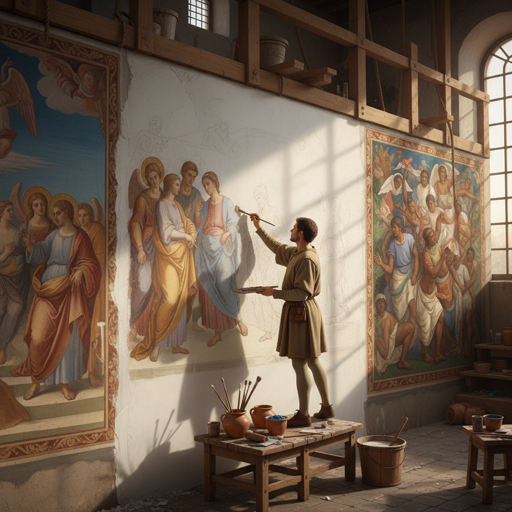

# Fresco 湿壁画

> "Fresco is painting into the wall itself — pigment becomes one with plaster, and the image lives as long as the building stands." — Unknown

## 概述

湿壁画（Fresco，意大利语"新鲜"）是将颜料涂在刚抹好的湿石灰灰泥上，使颜料在灰泥干燥过程中与墙面化学结合的壁画技法。这是最持久的绘画技法之一——颜料不是附着在表面，而是成为墙壁本身的一部分。湿壁画要求艺术家在灰泥干燥前完成绘画（通常只有几小时），这意味着必须事先精确计划，且不容许犯错。

湿壁画的哲学在于：不可逆的承诺——每一笔都是永久的，没有修改的余地，艺术家必须在有限的时间内做出完美的决定。

## 核心特征

| 特征 | 描述 |
|------|------|
| 湿灰泥 | 在湿灰泥上绑画 |
| 化学结合 | 颜料与墙面结合 |
| 不可逆 | 不能修改 |
| 持久 | 极其持久的画面 |
| 时限 | 必须在灰泥干前完成 |
| 计划 | 需要精确计划 |

## 视觉特征

- **哑光**：自然的哑光效果
- **色彩**：矿物颜料的色彩
- **大型**：通常为大型壁画
- **建筑**：与建筑融为一体
- **叙事**：叙事性的画面
- **庄严**：庄严宏大的效果

## 代表作品

| 作品 | 艺术家 | 年代 | 意义 |
|------|--------|------|------|
| *Pompeii frescoes* | 匿名 | 公元前1世纪 | 古罗马湿壁画 |
| *Giotto's Scrovegni Chapel* | Giotto | 1305 | 文艺复兴先驱 |
| *Sistine Chapel ceiling* | Michelangelo | 1508-12 | 西方艺术巅峰 |
| *Raphael's School of Athens* | Raphael | 1509-11 | 文艺复兴经典 |
| *Diego Rivera murals* | Diego Rivera | 1920s-50s | 墨西哥壁画运动 |

## 历史时间线

| 时期 | 事件 |
|------|------|
| 公元前1500年 | 克里特岛米诺斯壁画 |
| 古罗马 | 庞贝壁画的繁荣 |
| 中世纪 | 教堂壁画传统 |
| 14-16世纪 | 意大利文艺复兴的巅峰 |
| 1920s-50s | 墨西哥壁画运动 |
| 当代 | 当代壁画艺术 |

## 中国语境

中国有悠久的壁画传统——虽然技法与西方湿壁画不完全相同（中国壁画多为干壁画），但同样辉煌。敦煌莫高窟壁画是世界上最伟大的壁画艺术宝库之一，跨越千年。此外还有永乐宫壁画、法海寺壁画等杰作。中国传统壁画使用矿物颜料在干燥的泥灰墙面上绑画。当代中国的壁画艺术家也在探索湿壁画技法，将西方fresco技术与中国传统壁画美学结合。

## AI生成概念图

## 与其他风格的关系

- **Mural Art** → 壁画艺术
- **Painting** → 绘画
- **Architecture** → 建筑装饰
- **Sgraffito** → 刮画（在灰泥上）
- **Encaustic** → 蜡画
- **Mosaic** → 马赛克（另一种墙面装饰）

---

*浮光艺志 | Chronicle of Artistry*
