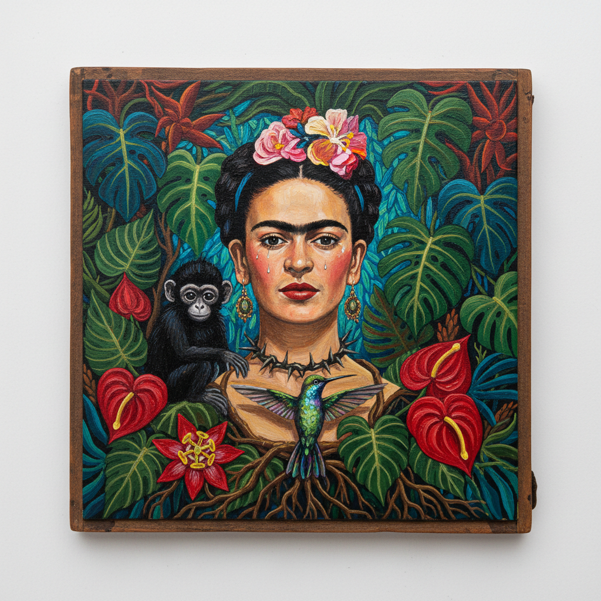

# Frida Kahlo 弗里达·卡罗

> "I paint myself because I am so often alone and because I am the subject I know best." — Frida Kahlo

## 概述

弗里达·卡罗（Frida Kahlo，1907–1954）是墨西哥最著名的画家，以强烈的自画像和融合超现实主义、民间艺术与个人痛苦的独特风格闻名于世。她的作品是身体、身份、性别和后殖民文化的深刻探索。

弗里达将个人的肉体痛苦和情感创伤转化为普世的艺术语言，她的每一幅自画像都是一面镜子，映射出人类存在的脆弱与坚韧。

## 核心特征

| 特征 | 描述 |
|------|------|
| 自画像 | 55幅自画像——以自我为宇宙 |
| 身体政治 | 伤痛、手术、流产的直接呈现 |
| 墨西哥民间 | 前哥伦布和民间艺术的色彩与符号 |
| 超现实元素 | 梦境般的象征和并置 |
| 双重性 | 生/死、男/女、欧洲/美洲的对立统一 |
| 叙事性 | 每幅画都是一个完整的个人故事 |

## 视觉特征

- **色彩**：浓烈的墨西哥色彩——深红、钴蓝、翠绿、金黄
- **人物**：正面或四分之三侧面的自画像，连眉
- **符号**：荆棘、猴子、鹿、心脏、根茎
- **背景**：热带植物或平坦的单色背景
- **边框**：有时带有民间艺术风格的装饰边框
- **比例**：小幅画面中的巨大情感密度

## 代表作品

| 作品 | 年代 | 意义 |
|------|------|------|
| *The Two Fridas* | 1939 | 双重身份的象征 |
| *Self-Portrait with Thorn Necklace* | 1940 | 痛苦与坚韧 |
| *The Broken Column* | 1944 | 身体的碎裂 |
| *Henry Ford Hospital* | 1932 | 流产的直接表达 |
| *Diego and I* | 1949 | 爱与执念 |
| *What the Water Gave Me* | 1938 | 超现实的自传 |

## 真实作品（公共领域）

| 作品 | 来源 |
|------|------|
| *The Two Fridas* | [Museo de Arte Moderno](https://mam.inba.gob.mx/) |
| *Self-Portrait with Thorn Necklace* | [Harry Ransom Center](https://hrc.contentdm.oclc.org/) |
| *Frieda and Diego Rivera* | [SFMOMA](https://www.sfmoma.org/artwork/91.178/) |

> ⚠️ 本条目优先使用真实作品。

## AI生成概念图

## 与其他风格的关系

- **Surrealism** → 被超现实主义者认领，但她自称画的是现实
- **Mexican Muralism** → 与里维拉的壁画运动并行
- **Folk Art** → 墨西哥民间艺术的现代转化
- **Feminist Art** → 女性主义艺术的先驱图标
