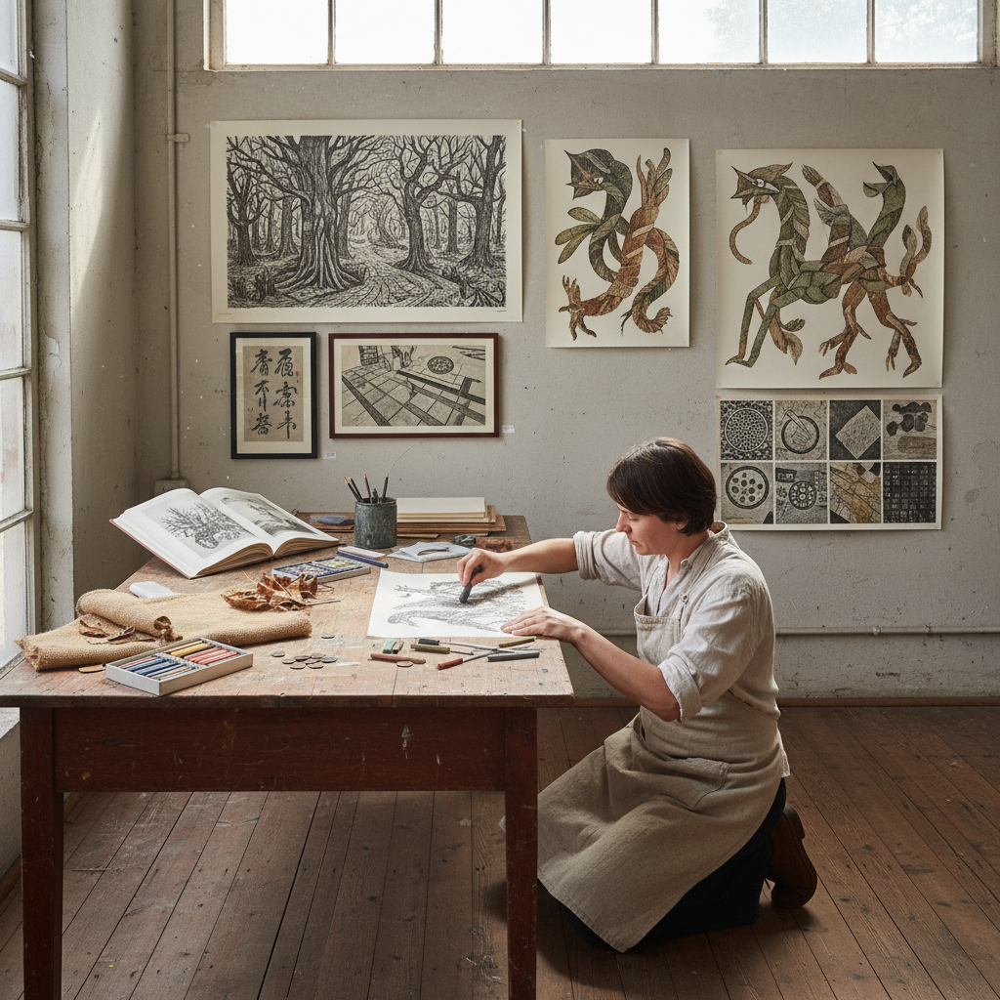

# Frottage Art 拓印艺术

> "Frottage is drawing by touch rather than sight — placing paper over a textured surface and rubbing with pencil or crayon to capture its pattern, the hand discovering what the eye might miss, each rubbing a direct physical impression of the world's hidden textures, a technique that Max Ernst elevated from childhood play to surrealist revelation by letting the grain of wood and the weave of fabric suggest landscapes, forests, and creatures from the unconscious." — Unknown

## 概述

拓印艺术（Frottage），来自法语"frotter"（摩擦），是一种将纸张放在有纹理的表面上，用铅笔、蜡笔或炭笔在纸面上摩擦，使底面的纹理图案转印到纸上的艺术技法。Frottage是最直接的"接触印记"技法之一——它捕捉的是物体表面的物理纹理，而非其视觉外观。

Frottage作为一种有意识的艺术创作方法，由超现实主义艺术家马克斯·恩斯特（Max Ernst）在1925年系统化发展。恩斯特将frottage视为一种"自动主义"（automatism）技法——通过摩擦木地板、树叶、绳索等物体的纹理，获得意想不到的图案，然后从这些图案中"发现"和发展出超现实的图像。恩斯特的《自然史》（Histoire Naturelle, 1926）是frottage的代表作品集。

## 核心特征

| 特征 | 描述 |
|------|------|
| 摩擦 | 在纹理表面上摩擦 |
| 转印 | 纹理图案的转印 |
| 接触 | 直接的物理接触 |
| 偶然 | 偶然性的图案发现 |
| 超现实 | 超现实主义的方法 |
| 自动 | 自动主义的创作 |

## 视觉特征

- **纹理**：清晰的纹理图案
- **偶然**：偶然性的形态
- **有机**：有机的自然纹理
- **灰度**：铅笔/蜡笔的灰度
- **层次**：纹理的层次变化
- **发现**：从纹理中发现图像

## 代表作品

| 作品 | 艺术家 | 年代 | 意义 |
|------|--------|------|------|
| *Histoire Naturelle* | Max Ernst | 1926 | 恩斯特的拓印自然史 |
| *Forest series* | Max Ernst | 1920-30年代 | 恩斯特的森林系列 |
| *Brass rubbings* | 中世纪传统 | 中世纪-当代 | 铜版拓印传统 |
| *Contemporary frottage* | Various | 当代 | 当代拓印艺术 |
| *Urban frottage* | Various | 当代 | 城市纹理拓印 |

## 历史时间线

| 时期 | 事件 |
|------|------|
| 古代 | 拓印的早期实践 |
| 中世纪 | 铜版墓碑拓印传统 |
| 1925 | Max Ernst系统化frottage |
| 1926 | 《自然史》出版 |
| 当代 | Frottage的多元化发展 |

## 中国语境

拓印在中国有极其悠久和丰富的传统——中国的"拓片"（碑帖拓印）是世界上最古老的拓印艺术形式之一，有两千多年的历史。中国的金石学传统中，拓片是研究和保存碑刻、铜器铭文的重要手段。中国的拓片技法（湿拓、干拓）与西方的frottage有技法上的相似性但目的不同——中国拓片追求精确复制，而恩斯特的frottage追求偶然发现。当代中国的一些艺术家将传统拓片技法与当代艺术创作结合。中国的儿童美术教育中也广泛使用frottage作为创意活动。

## AI生成概念图

## 与其他风格的关系

- **Surrealism** → 超现实主义
- **Automatism** → 自动主义
- **Max Ernst** → 马克斯·恩斯特
- **Grattage** → 刮擦画
- **Decalcomania** → 转印画
- **Rubbing** → 拓片

---

*浮光艺志 | Chronicle of Artistry*
