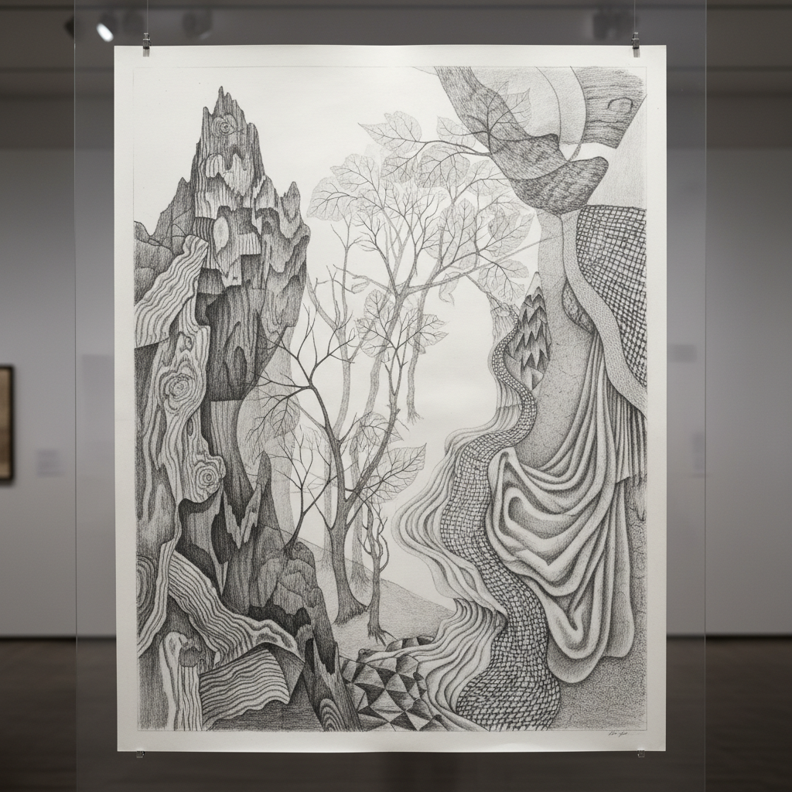

# Frottage 拓印法

> "Frottage is the art of revelation — rubbing the surface to discover the hidden image beneath." — Max Ernst

## 概述

拓印法（Frottage，法语"摩擦"）是将纸张放在有纹理的表面上，用铅笔或蜡笔摩擦纸面来获取下方纹理图案的技法。1925年由马克斯·恩斯特（Max Ernst）发展为超现实主义的自动创作方法——他在木地板、树叶、绳子等各种表面上拓印，然后从获得的纹理中"发现"隐藏的图像，如同在云朵中看到面孔。

拓印法的哲学在于：图像不是被创造的，而是被发现的——它们一直存在于世界的表面之下，等待被揭示。

## 核心特征

| 特征 | 描述 |
|------|------|
| 摩擦 | 在有纹理的表面上摩擦 |
| 发现 | 从纹理中"发现"图像 |
| 自动 | 超现实主义的自动技法 |
| 纹理 | 获取真实物体的纹理 |
| 偶然 | 偶然发现的图像 |
| 简单 | 技术上非常简单 |

## 视觉特征

- **纹理**：真实物体的纹理转印
- **铅笔**：铅笔或蜡笔的痕迹
- **有机**：自然有机的图案
- **层次**：摩擦力度的层次变化
- **发现**：从纹理中浮现的图像
- **混合**：多种纹理的混合

## 代表作品

| 作品 | 艺术家 | 年代 | 意义 |
|------|--------|------|------|
| *Histoire Naturelle* | Max Ernst | 1926 | 拓印法的经典系列 |
| *Forest series* | Max Ernst | 1927-28 | 拓印法的森林主题 |
| *Frottage drawings* | Max Ernst | 1925-30s | 早期拓印实验 |
| *Contemporary frottage* | Various | 2000s+ | 当代拓印艺术 |
| *Urban frottage* | Various | 2010s+ | 城市表面的拓印 |

## 历史时间线

| 时期 | 事件 |
|------|------|
| 古代 | 早期的拓印实践（如碑拓） |
| 1925 | Max Ernst发展拓印法为艺术 |
| 1926 | 《自然史》系列出版 |
| 1920s-30s | 超现实主义者的拓印实验 |
| 当代 | 拓印法的当代应用 |

## 中国语境

拓印法在中国有极其悠久的传统——中国的"碑拓"（stone rubbing）可追溯到汉代，是保存和传播书法、碑文的重要方法。中国的拓片艺术比恩斯特的frottage早了近两千年。当代中国艺术家将传统碑拓与当代艺术观念结合，创造出独特的当代拓印艺术。徐冰的《天书》等作品也涉及拓印的概念。

## AI生成概念图

## 与其他风格的关系

- **Surrealism** → 超现实主义是拓印法的精神背景
- **Automatism** → 自动主义技法的一种
- **Stone Rubbing** → 碑拓是中国的古老拓印
- **Texture Art** → 质感艺术的基础技法
- **Decalcomania** → 转印法是相关技法
- **Found Art** → 发现的艺术精神

---

*浮光艺志 | Chronicle of Artistry*
