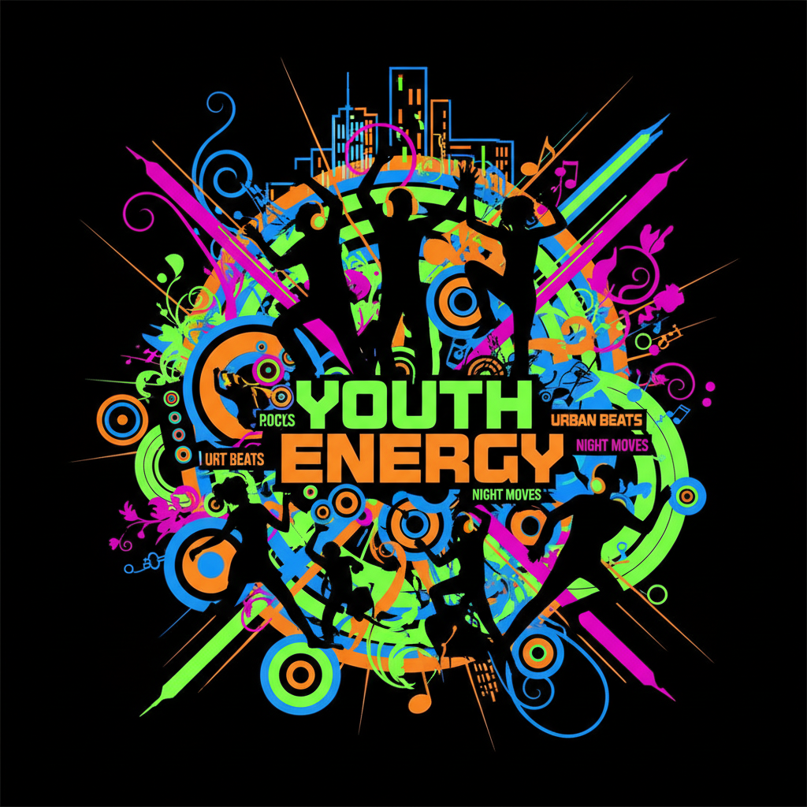
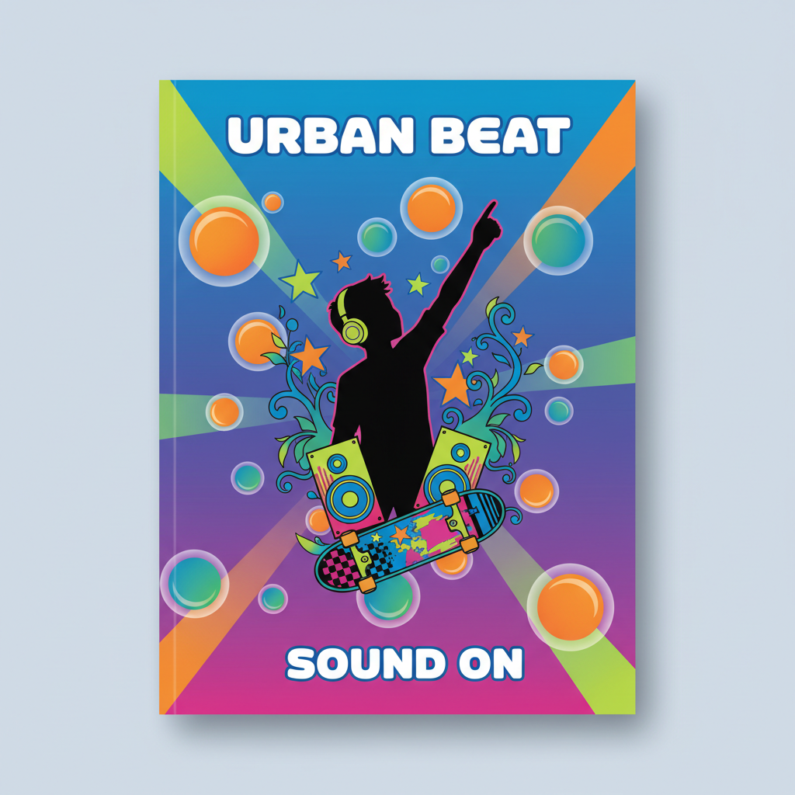

# Frutiger Metro 弗鲁提格都市





> **"鲜艳色块、巨大圆圈、放射线条、黑色人物剪影——2008年老商场里的青春配方。"**

## 概述

| 维度 | 描述 |
|------|------|
| 时期 | 2005–2012 |
| 别名 | Frutiger Metro, Vector Delia, Urban Vector Style, Silhouette Graphics |
| 核心色彩 | 荧光绿、亮橙、电光蓝、品红、纯白 |
| 关键元素 | 黑色人物剪影、同心圆、放射线、耳机音箱、矢量花纹 |
| 代表人物 | 素材库设计师群体、iStockphoto 时代 |
| 关联风格 | Frutiger Aero, McBling, Y2K, Scene |

---

## 历史脉络

### 2005–2008：矢量素材的黄金时代

Frutiger Metro 并非某位设计师的发明，而是一种**集体无意识的设计模式**——当 Illustrator 和 CorelDRAW 让每个人都能画出光滑曲线时，一种"标准青春视觉"自然涌现：

**工作流程**：
1. 打开 Illustrator
2. 找一组人物剪影素材
3. 画几个同心圆和放射线
4. 加入耳机、音箱、城市天际线
5. 拖入几朵矢量花纹/藤蔓
6. 把所有东西叠在一起
7. 用最亮的颜色填充
8. "青春"诞生了

### 命名考古

这些名称大多是**后来互联网整理怀旧美学时补上的**：

| 名称 | 解释 |
|------|------|
| **Frutiger** | 与 Frutiger Aero 时代相近，共享鲜艳色彩和数字乐观主义 |
| **Metro** | 与微软 Metro 设计语言有关，强调其平面图形化特征 |
| **Vector Delia** | Vector（矢量图形）+ Psychedelia（迷幻视觉）的结合 |

当年的设计师不会说"我今天做了一张 Frutiger Metro"——他们只是在做"年轻人喜欢的设计"。

### 文化基因

| 来源 | 贡献 |
|------|------|
| 60–70年代迷幻海报 | 卷曲线条、放射构图 |
| 街头涂鸦/滑板文化 | 城市元素、叛逆感 |
| 2000s 夜店传单 | 荧光色、DJ/音乐元素 |
| 矢量素材库 | 标准化、可复制的设计模块 |
| Flash 动画 | 矢量图形的流行和普及 |

### 为什么它泛滥了？

关键推手是**电脑矢量软件和素材库**：
- Illustrator/CorelDRAW 让曲线无限光滑
- 矢量图形可以无限放大不模糊
- 素材库提供了现成的剪影、花纹、城市元素
- 这些元素像积木一样可以反复组合
- 设计门槛大幅降低——会用软件就能"设计"

### 它真正售卖的是什么？

**年轻。**

Frutiger Metro 几乎总和以下场景绑定：
- **音乐**：耳机和音箱 = 你拥有自己的音乐世界
- **运动**：奔跑和跳舞的剪影 = 自由和活力
- **城市**：楼群和涂鸦 = 你已经离开家庭客厅，进入青年文化
- **派对**：DJ台和舞池 = 你的夜晚属于自己

---

## 视觉语法

### 色彩系统

```
主色（全部高饱和、高明度）：
  荧光绿 (#39FF14) — 活力、数字感
  亮橙 (#FF6600) — 能量、青春
  电光蓝 (#0066FF) — 科技、音乐
  品红 (#FF0066) — 时尚、派对
  纯白 (#FFFFFF) — 背景或高光

辅色：
  黑色 (#000000) — 人物剪影专用
  亮黄 (#FFFF00) — 点缀
  紫色 (#9900FF) — 夜店感

构图规则：
  - 颜色越亮越好
  - 元素越多越好
  - 所有东西互相叠压
  - 留白 = 不够"设计"
```

### 标志性元素

| 类别 | 元素 |
|------|------|
| 人物 | 黑色剪影（奔跑、跳舞、伸手指天、DJ） |
| 音乐 | 耳机、音箱、音符、均衡器波形 |
| 几何 | 同心圆、放射线、箭头、星星 |
| 装饰 | 矢量花纹、藤蔓、卷曲线条 |
| 城市 | 天际线剪影、涂鸦文字、街灯 |
| 运动 | 滑板、篮球、极限运动姿态 |

### Frutiger Metro vs Frutiger Aero

| 维度 | Frutiger Metro | Frutiger Aero |
|------|---------------|---------------|
| 质感 | 平面、矢量 | 拟物、光泽、3D |
| 色彩 | 纯色块、高对比 | 渐变、透明、柔和 |
| 元素 | 剪影、几何图形 | 自然、水滴、气泡 |
| 情绪 | 青春、派对、城市 | 清新、科技、自然 |
| 载体 | 海报、传单、文具 | 系统UI、软件界面 |

---

## 你在哪里见过它？

### 2008年的老商场

> 一楼卖翻盖手机的音响店门口放着节奏很重的电子乐，饮料冰柜贴着荧光绿广告，文具店里的笔记本封面印满耳机、星星、藤蔓和黑色人物剪影。旁边可能还有一家叫"酷炫地带"的青年服装店。

### 其他典型场景
- QQ空间皮肤和装饰
- MP3/MP4播放器包装盒
- 学校周边文具店的笔记本封面
- 网吧海报和会员卡
- 手机主题和壁纸
- 街舞/滑板比赛宣传单

---

## 为什么现在看它会怀旧？

它怀念的不只是2008年，也是一种**已经消失的互联网性格**：

### 那个时代的数字世界
- QQ空间充满按钮、皮肤、壁纸、播放器
- 视觉效果和可以随意更换的个人主页
- 大家努力把电子产品做得有个性
- 现在看可能有点俗，但你能感到**有人在里面认真**

### 后来发生了什么
- 设计逐渐变得统一
- 纯色图标、标准组件、规范网格
- 无处不在的极简页面
- 它们可能更好用，却也更像同一栋写字楼里的不同公司

### 补偿心理
- 想找回电脑还像玩具、网络还像游乐场的时刻
- 书包挂满徽章，QQ签名写得很长，照片加三层滤镜
- 人还没找到自己的风格，于是把所有喜欢的东西同时穿在身上
- 如今看起来有点笨拙，可那种笨拙里有一种今天很少见的东西：
  - **它真的很想让你开心**

---

## 中国语境

- 2005–2012年文具店笔记本封面的标准视觉
- QQ空间/51.com 的装扮素材
- 非主流文化中的矢量元素
- 步步高/OPPO 音乐手机广告
- 街舞/轮滑/极限运动赛事海报
- "动感地带"品牌视觉

---

## 设计应用（复古/致敬）

| 场景 | 应用方式 |
|------|----------|
| 品牌 | 荧光色+黑色剪影+放射线（怀旧营销） |
| 活动 | 音乐节/运动赛事的复古主题海报 |
| 产品 | 文具/手机壳的"2008复古"系列 |
| 数字 | QQ空间/MySpace 怀旧主题网页 |

---

## 延伸阅读

- Aesthetics Wiki: [Frutiger Metro](https://aesthetics.fandom.com/wiki/Frutiger_Metro)
- "The Rise and Fall of Vector Art" — 矢量素材时代回顾
- iStockphoto 早期素材库的视觉考古

---

## 相关风格

← [Frutiger Aero 弗鲁提格航空](frutiger-aero.md) | [McBling 麦闪](mcbling.md) →

↑ [返回千禧怀旧目录](README.md) | [返回总目录](../README.md)
