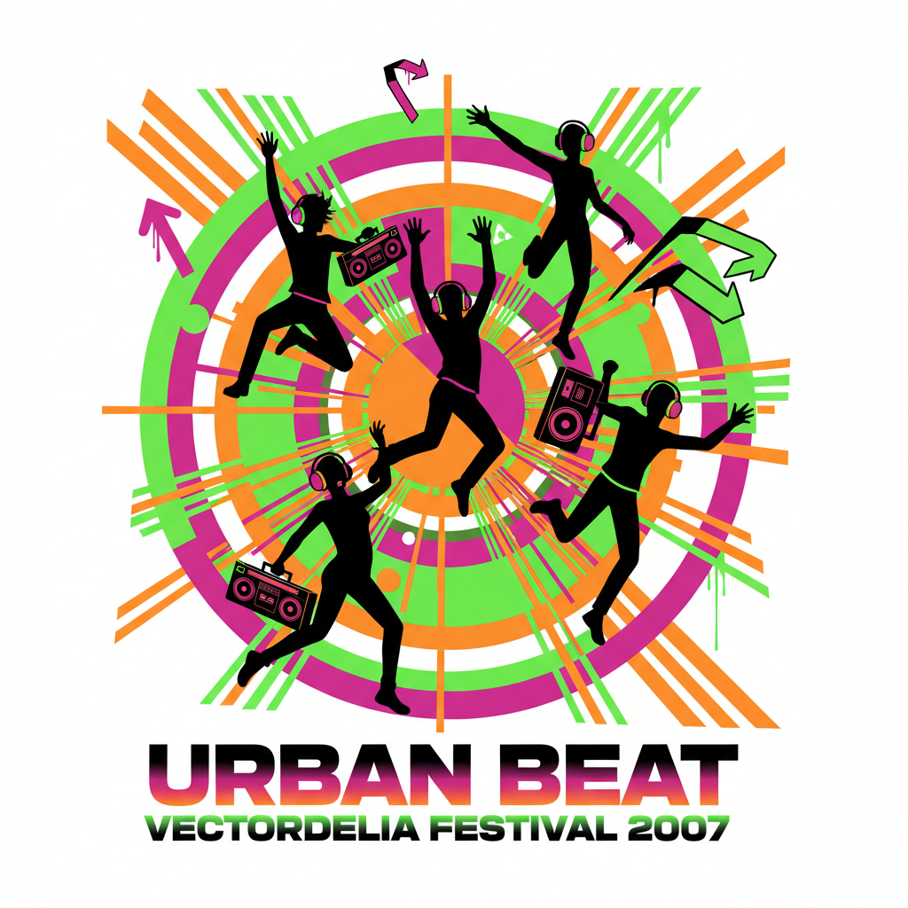
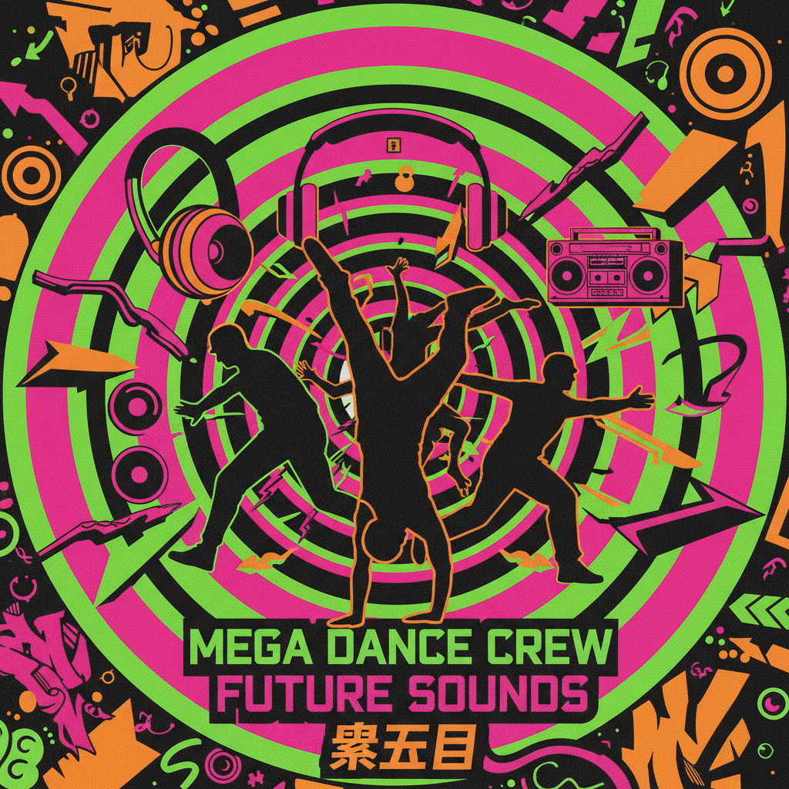
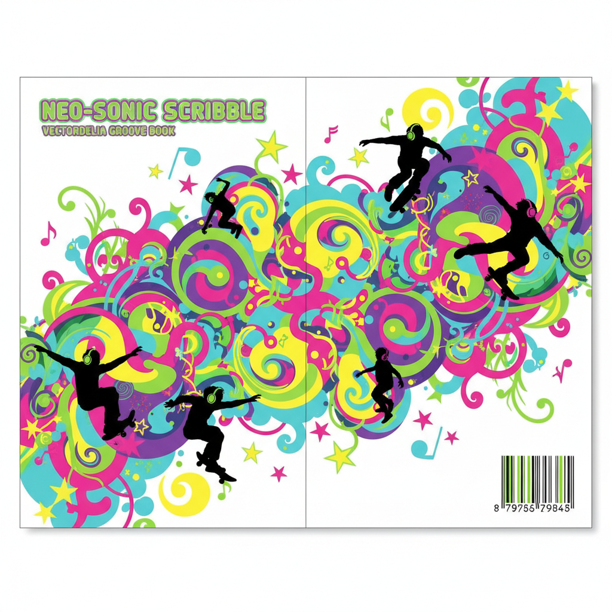
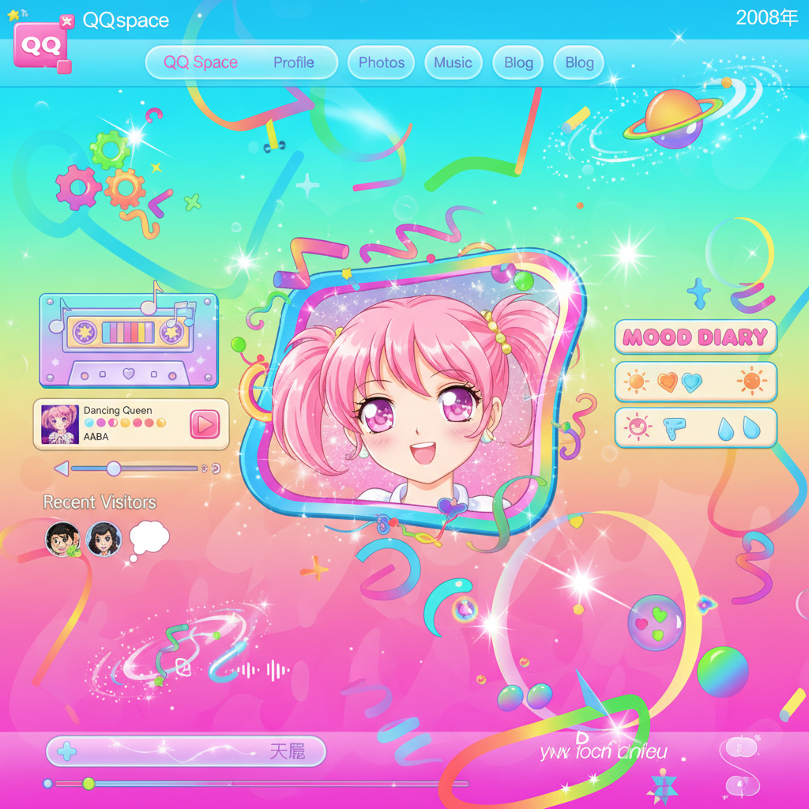
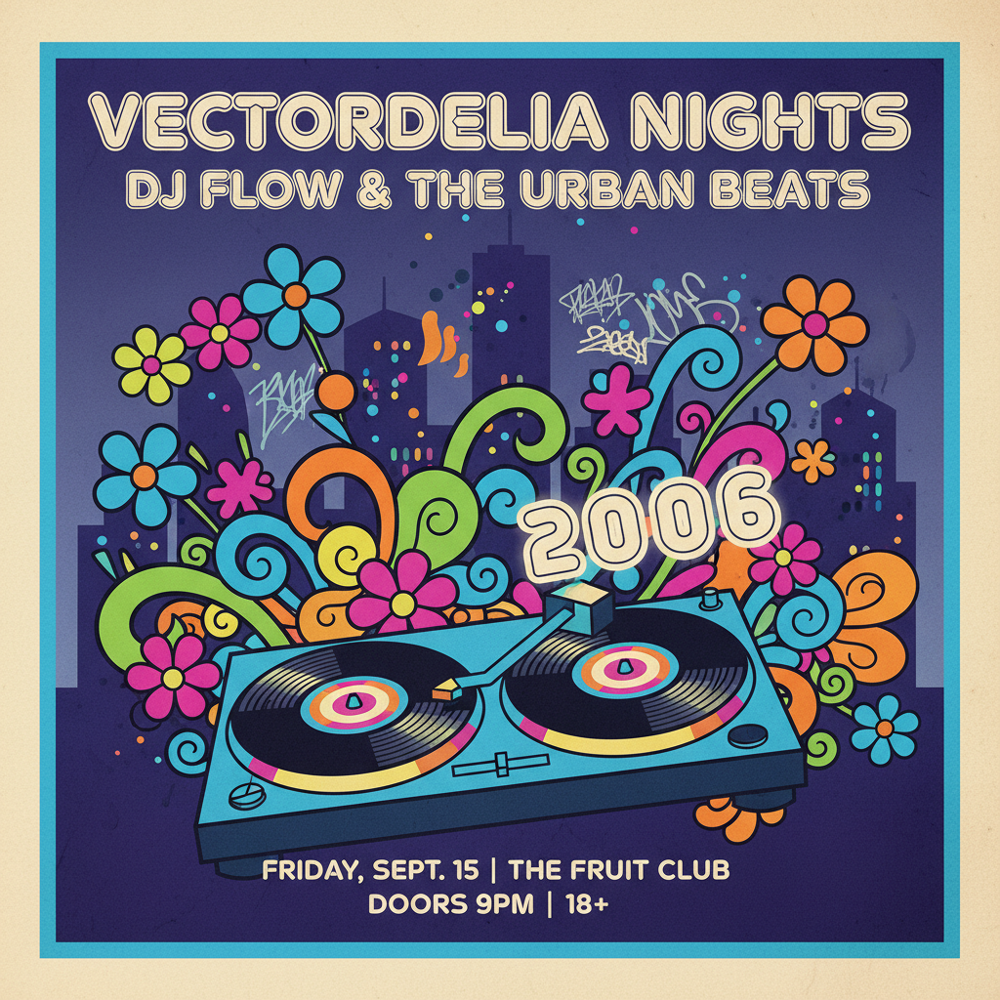

# Frutiger Metro / Vectordelia | 矢量迷幻风

## 概述

- **时间跨度**：2005 – 2014（回潮：2022–至今）
- **发源地**：全球商业平面设计（素材库、广告、青少年商品）
- **核心理念**：用矢量软件批量生产的"青春活力"视觉——鲜艳色块、人物剪影、音乐元素、放射线构图
- **别名**：Vectordelia、Vector Metro、Vector Vomit、Flat Frutiger Aero、Funky Metro

## 你一定见过它

> 2008年的老商场，一楼卖翻盖手机，音响店门口放着节奏很重的电子乐，冰柜贴着荧光绿广告，文具店里的笔记本封面印满耳机、星星、藤蔓和黑色人物剪影。旁边可能还有一家叫"酷炫地带"的青年服装店。

这就是 Frutiger Metro。

## 历史背景

### 命名的后知后觉

严格来说，这些名称大多是后来互联网整理怀旧美学时补上的。当年的设计师未必会说"我今天做了一张 Frutiger Metro"——他们只是打开 Illustrator，找一组人物剪影素材，拖几朵矢量花纹，加3个同心圆，放入音箱和耳机，"青春"便诞生了。

### 为什么叫 Frutiger Metro？

- **Frutiger**：与 Frutiger Aero 时代相近，共享鲜艳色彩、数字技术乐观主义、有机曲线和部分光泽质感，所以被归入同一个 Frutiger 家族
- **Metro**：源自微软的 Metro 设计语言，强调它较为**平面/图形化**，与 Frutiger Aero 的拟物3D风格形成对比

### 为什么叫 Vectordelia？

**Vector**（矢量图形）+ **Psychedelia**（迷幻视觉）的合成词。它确实能看到60-70年代迷幻海报的卷曲线条和放射构图的影子。

### 技术驱动

真正让这种风格泛滥的是**电脑矢量软件和素材库**：
- Illustrator、CorelDRAW 让设计师能迅速绘制光滑曲线，无限放大不模糊
- 各种花纹、剪影、城市潮流元素像积木一样反复组合
- 素材网站（ShutterStock、iStockPhoto）大量供应现成矢量包

于是出现了一种典型的工作方法：找一组人物剪影 → 找几朵矢量花纹 → 加3个同心圆 → 拖入音箱和耳机 → 青春诞生了。

## 视觉特征

### 色彩
- 高饱和度鲜艳色（荧光绿、电蓝、品红、橙黄、紫色）
- 大面积纯色/渐变色块
- 黑色背景或白色背景上的色彩爆炸
- 部分带光泽/发光效果

### 核心视觉元素
- **黑色人物剪影**（奔跑、跳舞、伸手指向天空、DJ打碟）
- **巨大的同心圆和放射线**
- **音乐元素**：耳机、音箱、DJ混音台、音符、均衡器
- **抽象花纹/藤蔓卷曲**（flourishes）
- **星星、飞溅、光点**
- **城市天际线剪影**
- **涂鸦/喷漆效果**
- **蝴蝶、翅膀**

### 构图特征
- **极繁主义**：能塞多少元素就塞多少
- 所有东西互相叠压、层层堆叠
- 放射状/爆炸式构图
- 对称或半对称布局

### 与 Frutiger Aero 的关键区别

| 维度 | Frutiger Aero | Frutiger Metro |
|------|---------------|----------------|
| 维度感 | 3D、拟物、有深度 | 2D、平面、矢量 |
| 质感 | 毛玻璃、光泽、水滴 | 纯色块、渐变、无纹理 |
| 主题 | 科技+自然 | 音乐+运动+青年文化 |
| 受众 | 大众/科技用户 | 青少年/潮流消费 |
| 工具 | 3D渲染+照片合成 | Illustrator矢量绘制 |
| 精致度 | 高（HD时代产物） | 中低（素材拼贴感） |

## 子流派

| 子流派 | 特征 |
|--------|------|
| **Vectorbloom / Vectorgarden** | 大量花朵、华丽装饰、蝴蝶、藤蔓 |
| **Funky Metro** | 音乐元素、DJ剪影、舞蹈、派对 |
| **Rave Metro** | 粉色系、迪斯科、摇滚音乐 |
| **Grungy Metro** | 深色系、街头美学、涂鸦、滑板 |
| **Musica Metro** | 纯音乐主题（乐器、音符、均衡器） |

## 文化内核

### 它真正售卖的是"年轻"

Frutiger Metro 几乎总和音乐、运动、派对以及青少年商品绑在一起：
- **音箱和耳机** = 你拥有自己的音乐世界
- **奔跑和跳舞的人物剪影** = 自由
- **城市楼群和涂鸦** = 你已经离开家庭客厅，进入了更大的青年文化
- **曲线越流畅、颜色越亮、元素越多** = 越现代

### 它保存了一个时代的直观想象

这恰恰是它的历史价值——它保存了一个时代对"会用电脑做设计"的直观想象。

### 为什么现在看它会觉得怀旧？

它怀念的并不只是2008年，也是一种**已经消失的互联网性格**：

- 当时的数字世界（QQ空间）充满按钮、皮肤、壁纸、播放器、可以随意更换的个人主页
- 大家努力把电子产品做得有个性——现在看可能有点俗，但你能感到有人在里面认真装扮
- 后来设计逐渐变得统一：纯色图标、标准组件、规范网格、无处不在的极简页面
- 它们可能更好用，却也更像同一栋写字楼里的不同公司

所以总会有人重新喜欢 Frutiger Metro——多少带着一种**补偿心理**，想找回电脑还像玩具、网络还像游乐场的时刻。

> 书包挂满徽章，QQ签名写得很长，照片加三层滤镜，人还没找到自己的风格，于是把所有喜欢的东西同时穿在身上。如今看起来有点笨拙，可那种笨拙里有一种今天很少见的东西——**它真的很想让你开心**。

## 典型应用场景

| 场景 | 说明 |
|------|------|
| 文具/笔记本封面 | 耳机+星星+藤蔓+人物剪影 |
| 手机壳/MP3播放器贴纸 | 音乐主题矢量图案 |
| 青年服装店海报 | "酷炫地带"式视觉 |
| QQ空间皮肤/博客模板 | 个性化装饰 |
| 夜店/派对传单 | DJ剪影+放射线+荧光色 |
| 运动品牌广告 | 奔跑剪影+城市天际线 |
| 学校课本/教辅封面 | 至今仍有残留 |

## 图片画廊

| | |
|:---:|:---:|
|  |  |
| *核心视觉：剪影+同心圆+音箱* | *商场海报风格：街舞与涂鸦* |
|  |  |
| *2008年文具店笔记本封面* | *QQ空间个性化装扮时代* |
|  | |
| *夜店传单：城市剪影+唱片机* | |

> 以上图片由 AI (Gemini 2.5 Flash Image) 生成，用于展示风格视觉特征。

## 延伸阅读

- [Vectordelia | Aesthetics Wiki](https://aesthetics.fandom.com/wiki/Vectordelia)
- [Frutiger Metro | 2000 Aesthetics Wiki](https://2000-aesthetics.fandom.com/wiki/Frutiger_Metro)
- [Frutiger Aero Archive - Metro PNG Images](https://frutigeraeroarchive.org/resources/metro)
- [Pixabay: 51+ Free Frutiger Metro Vectors](https://pixabay.com/vectors/search/frutiger%20metro/)
- [被遗忘的美学：Frutiger Metro（抖音）](https://m.douyin.com/share/note/7375490593927089443)
- [豆瓣：Frutiger Metro 豆列](https://www.douban.com/doulist/160670980/)

---

[← Frutiger Aero](frutiger-aero.md) | [→ 梦核与怪核](dreamcore-weirdcore.md) | [↑ 返回目录](README.md)
