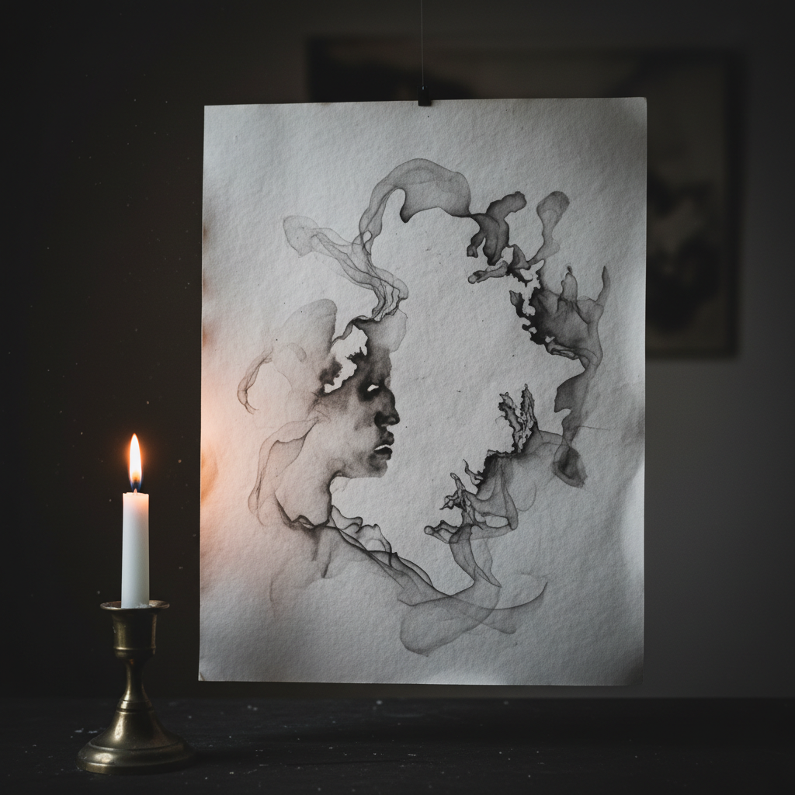

# Fumage 烟熏画法

> "Smoke is the ghost of fire — fumage captures its fleeting dance on paper." — Wolfgang Paalen

## 概述

烟熏画法（Fumage，法语"烟熏"）是用蜡烛或油灯的烟雾在纸张或画布上留下痕迹的超现实主义绘画技法。1936年由奥地利-墨西哥艺术家沃尔夫冈·帕伦（Wolfgang Paalen）发明，烟熏画法利用火焰产生的碳黑烟雾在表面上创造出如幽灵般的、流动的、不可预测的图像。萨尔瓦多·达利和伊夫·唐吉等超现实主义者也曾使用这一技法。

烟熏画法的哲学在于：让偶然和自然力量参与创作——烟雾的流动不受人的完全控制，它是火与空气的即兴舞蹈。

## 核心特征

| 特征 | 描述 |
|------|------|
| 烟雾 | 用蜡烛烟雾作为媒介 |
| 偶然 | 不可完全控制的效果 |
| 超现实 | 超现实主义的自动技法 |
| 碳黑 | 碳黑颗粒的沉积 |
| 幽灵感 | 如幽灵般的模糊图像 |
| 脆弱 | 烟雾痕迹相对脆弱 |

## 视觉特征

- **模糊**：烟雾的模糊边缘
- **流动**：烟雾流动的痕迹
- **黑灰**：碳黑的灰色调
- **幽灵**：如幽灵般的形态
- **层次**：烟雾浓淡的层次
- **有机**：自然有机的形态

## 代表作品

| 作品 | 艺术家 | 年代 | 意义 |
|------|--------|------|------|
| *Fumage paintings* | Wolfgang Paalen | 1936-40s | 烟熏画法的发明 |
| *Fumage experiments* | Salvador Dalí | 1930s-40s | 达利的烟熏实验 |
| *Smoke paintings* | Yves Tanguy | 1930s-40s | 唐吉的烟熏作品 |
| *Smoke drawings* | Steven Spazuk | 2000s+ | 当代烟熏画大师 |
| *Contemporary fumage* | Various | 2010s+ | 当代烟熏画复兴 |

## 历史时间线

| 时期 | 事件 |
|------|------|
| 1936 | Paalen发明烟熏画法 |
| 1930s-40s | 超现实主义者的烟熏实验 |
| 1940s-50s | 烟熏画法的相对沉寂 |
| 2000s+ | Steven Spazuk的当代复兴 |
| 当代 | 烟熏画法作为当代艺术媒介 |

## 中国语境

烟熏画法在中国是相对小众的艺术形式。中国传统中有"熏画"的概念——用烟熏在纸上留下痕迹，但更多是作为民间装饰而非纯艺术。当代中国的实验艺术家中有人探索烟熏技法。中国水墨画中的"泼墨"和"破墨"在精神上与烟熏画法有相通——都是利用材料的自然流动来创造不可预测的效果。

## AI生成概念图

## 与其他风格的关系

- **Surrealism** → 超现实主义是烟熏画法的精神背景
- **Automatism** → 自动主义技法的一种
- **Sfumato** → 渐隐法与烟熏有"烟"的联系
- **Ink Wash** → 水墨的偶然效果
- **Fire Art** → 火是烟熏画法的核心元素
- **Experimental Art** → 实验艺术的代表技法

---

*浮光艺志 | Chronicle of Artistry*
