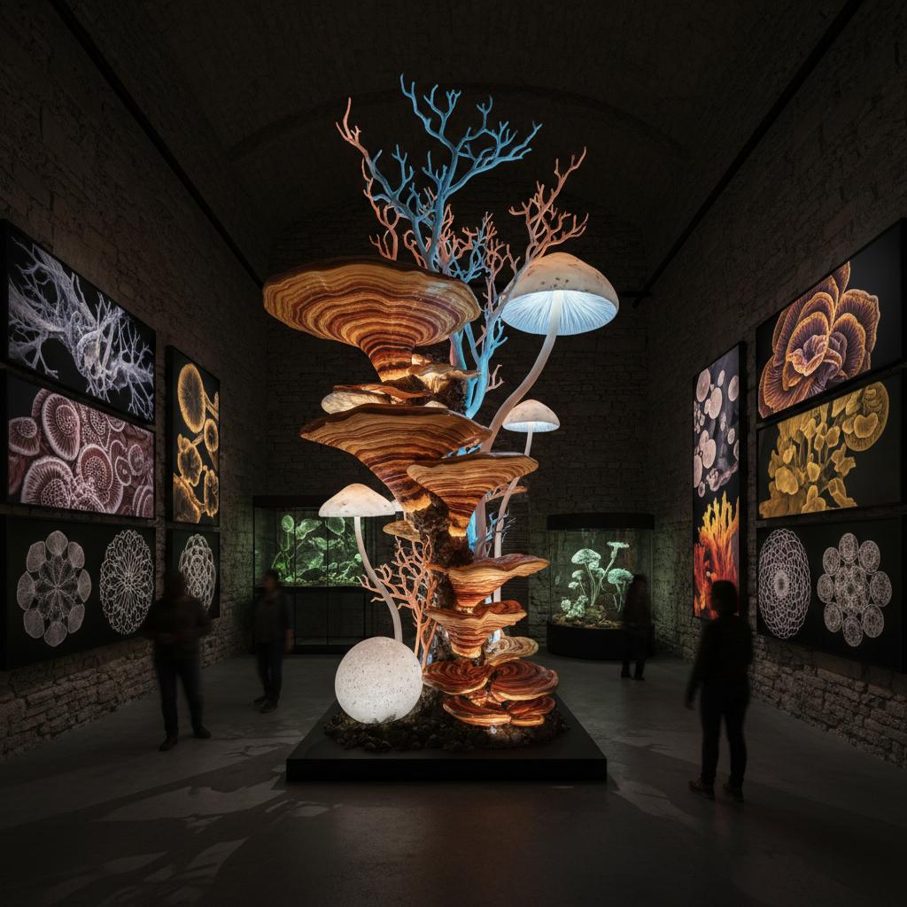

# Fungal Art 真菌造型艺术

> "Fungal art grows in the dark — it thrives on decay and transforms death into beauty, it builds networks that connect the living, it fruits in forms that defy geometry, and it reminds us that the most creative force on Earth is not the human mind but the fungal mycelium, which has been designing, building, connecting, and transforming for a billion years before we arrived, and will continue long after we are gone, patiently decomposing our monuments back into soil." — Unknown

## 概述

真菌造型艺术（Fungal Art）是以真菌的形态、生长过程和生态功能为核心灵感的视觉艺术实践。与真菌艺术（Mycological Art）的广泛范围不同，真菌造型艺术更专注于真菌的视觉形态——蘑菇的奇异造型、菌丝的网络结构、孢子的微观美学——作为艺术创作的直接灵感和视觉语言。

真菌造型艺术的实践包括：1）蘑菇形态的艺术化——将蘑菇的多样形态（伞形、珊瑚形、球形、杯形）转化为雕塑、绘画和装置；2）菌丝网络的视觉化——将地下菌丝网络的分支结构转化为视觉图案和空间设计；3）孢子美学——利用孢子印（spore prints）的自然图案作为艺术形式；4）真菌色彩——利用真菌产生的天然色素进行创作；5）腐朽美学——将真菌分解有机物的过程视为一种美学体验。

## 核心特征

| 特征 | 描述 |
|------|------|
| 形态 | 奇异的形态 |
| 网络 | 菌丝网络 |
| 色彩 | 真菌色彩 |
| 腐朽 | 腐朽美学 |
| 生长 | 生长过程 |
| 微观 | 微观结构 |

## 视觉特征

- **伞形**：蘑菇的伞形结构
- **褶皱**：菌褶的精细结构
- **网络**：菌丝的分支网络
- **色彩**：从白到黑的丰富色彩
- **发光**：生物发光真菌
- **纹理**：独特的表面纹理

## 代表作品

| 作品 | 艺术家 | 年代 | 意义 |
|------|--------|------|------|
| *Mushroom illustrations* | Beatrix Potter | 1890年代 | 经典蘑菇插画 |
| *Fungal sculptures* | Various | 2010年代 | 真菌雕塑 |
| *Spore print art* | Various | 2010年代 | 孢子印艺术 |
| *Bioluminescent installations* | Various | 2020年代 | 发光真菌装置 |
| *Mycelium fashion* | Various | 当代 | 菌丝体时尚 |

## 历史时间线

| 时期 | 事件 |
|------|------|
| 1890年代 | Beatrix Potter的真菌插画 |
| 1960年代 | 迷幻文化中的蘑菇美学 |
| 2010年代 | 真菌造型艺术的独立发展 |
| 2020 | Merlin Sheldrake引发的真菌热 |
| 当代 | 真菌美学的主流化 |

## 中国语境

真菌造型艺术在中国有深厚的视觉传统。中国传统艺术中，灵芝是最常见的真菌造型——出现在绘画、雕刻、建筑装饰和织物图案中，象征长寿和吉祥。灵芝的"如意"造型甚至影响了中国传统器物的设计（如意的形状源自灵芝）。中国云南的野生菌文化为真菌造型艺术提供了丰富的视觉素材——从鸡枞的优雅到牛肝菌的厚重，从竹荪的精致网裙到虎掌菌的奇异纹理。中国当代的一些艺术家在探索真菌造型：将中国传统的灵芝美学与当代设计结合、用中国特有的真菌物种作为创作灵感、以及将真菌的网络结构应用于建筑和空间设计。

## AI生成概念图

## 与其他风格的关系

- **Mycological Art** → 真菌艺术
- **Bio Art** → 生物艺术
- **Natural History Illustration** → 博物画
- **Botanical Art** → 植物艺术
- **Psychedelic Art** → 迷幻艺术
- **Material Art** → 材料艺术

---

*浮光艺志 | Chronicle of Artistry*
