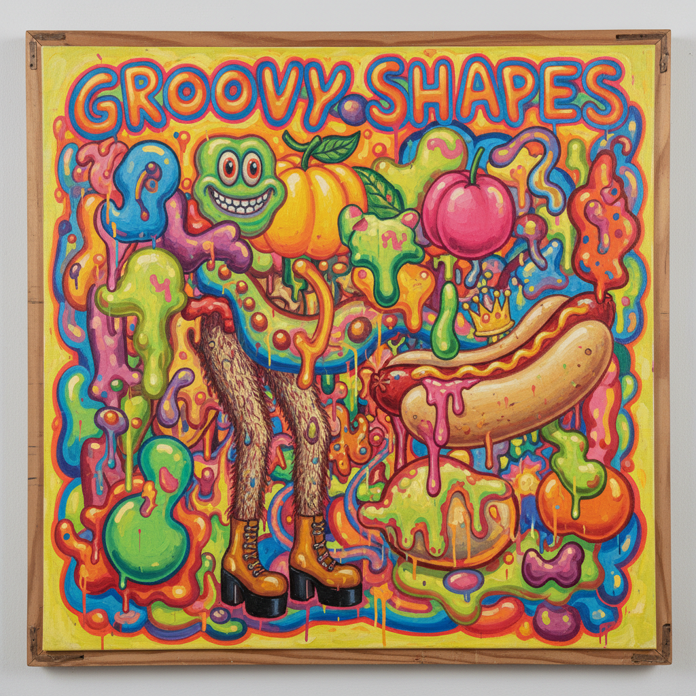

# Funk Art Painting 放克艺术绘画

> **时期：** 1960年代–1970年代  
> **关键词：** 加州、幽默、粗俗、反精英、嬉皮文化

## 概述

Funk Art（放克艺术）是1960年代在旧金山湾区兴起的艺术运动，与嬉皮文化和反文化运动同步。它用幽默、粗俗、荒诞和刻意的"坏品味"来反抗纽约艺术界的严肃和精英化——如果极简主义是穿西装的，放克艺术就是穿着花衬衫、嚼着口香糖、讲着下流笑话的那个人。

## 风格特征

- **幽默荒诞**：刻意的搞笑和不正经
- **粗俗美学**：拥抱"坏品味"和低俗
- **有机形态**：软塌塌的、肉感的形状
- **鲜艳色彩**：迷幻色彩和荧光色
- **反精英**：拒绝艺术界的严肃标准

## 代表人物与作品

- 罗伯特·阿尼森 陶瓷人物
- 威廉·T·威利 叙事绘画
- 罗伊·德·福雷斯特 丛林幻想
- 琼·布朗 动物与自画像

## 概念图

