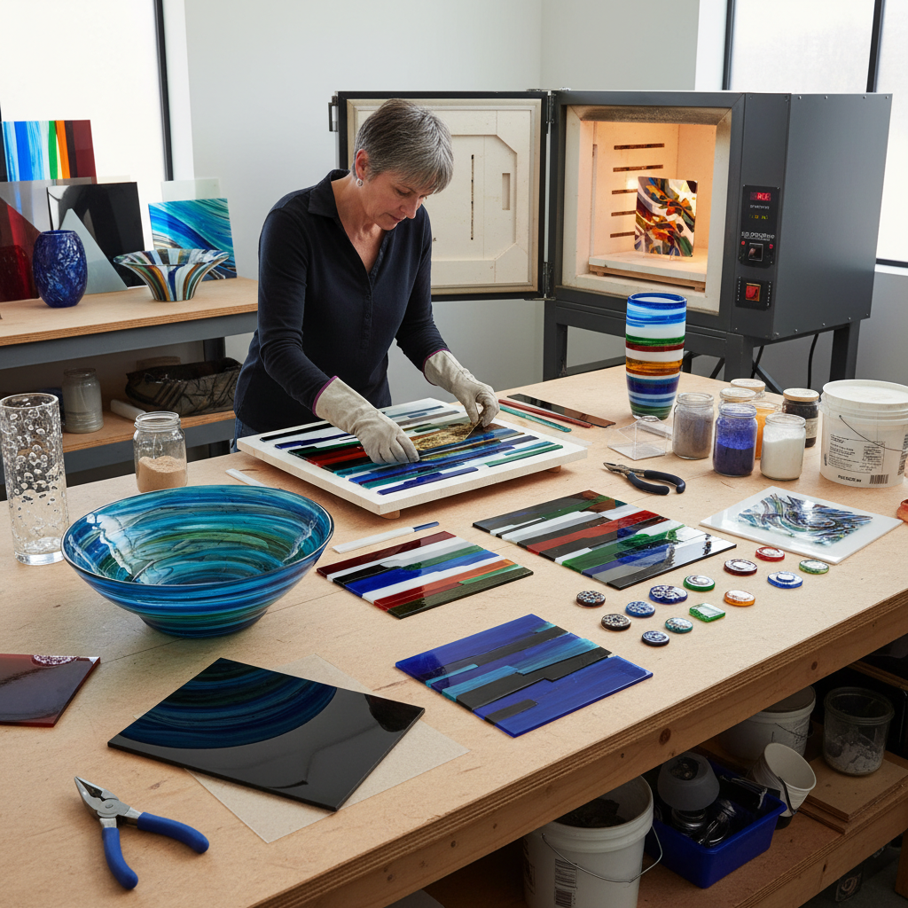

# Fused Glass Art 熔融玻璃艺术

> "Fused glass is painting with fire — layers of colored glass stacked and arranged cold, then surrendered to the kiln where heat transforms separate pieces into a single unified whole. The glass artist must think in temperatures: at 1100°F the pieces tack together, at 1300°F they slump into molds, at 1500°F they flow into full fusion. Each temperature reveals different possibilities, and the kiln's heat is both collaborator and wild card." — Unknown

## 概述

熔融玻璃艺术（Fused Glass Art）是将多片玻璃在窑炉中加热至熔融温度，使其融合成为一体的玻璃工艺——通过控制温度和时间，可以实现从轻微粘合（tack fusing）到完全熔融（full fusing）的不同效果，创造出色彩丰富、层次分明的玻璃艺术品。

熔融玻璃艺术的实践包括：1）全熔融——玻璃完全融合成平滑表面；2）半熔融——保留部分立体质感；3）热弯成型——熔融后在模具中弯曲成型；4）玻璃粉画——用玻璃粉末创造图案后熔融；5）嵌入物——在玻璃层间嵌入金属箔等材料；6）多层叠加——多次入窑叠加不同层次；7）当代熔融玻璃——将技法与当代艺术理念结合的创作。

## 核心特征

| 特征 | 描述 |
|------|------|
| 透明 | 玻璃的透明和半透明 |
| 色彩 | 丰富的色彩可能性 |
| 融合 | 多片融为一体 |
| 光线 | 与光线的互动 |
| 温度 | 温度控制的精确性 |
| 层次 | 多层叠加的深度 |

## 视觉特征

- **透光**：光线穿透玻璃的效果
- **色彩**：鲜艳的玻璃色彩
- **融合**：不同颜色的融合边界
- **气泡**：熔融过程中的气泡
- **纹理**：玻璃流动的纹理
- **光泽**：玻璃表面的光泽

## 代表作品

| 作品 | 艺术家/文化 | 年代 | 意义 |
|------|-------------|------|------|
| *Klaus Moje bowls* | Klaus Moje | 1980s-2000s | 澳大利亚熔融玻璃 |
| *Bullseye Glass works* | Bullseye Glass | 1974至今 | 熔融玻璃材料革命 |
| *Richard Whiteley* | Richard Whiteley | 当代 | 当代熔融玻璃雕塑 |
| *Egyptian fused glass* | 古埃及 | 公元前1500年 | 最早的熔融玻璃 |
| *Warm glass movement* | Various | 1980s至今 | 工作室熔融玻璃运动 |

## 历史时间线

| 时期 | 事件 |
|------|------|
| 公元前1500年 | 古埃及最早的熔融玻璃 |
| 古代-中世纪 | 熔融技术的缓慢发展 |
| 1960s | 工作室玻璃运动开始 |
| 1980s | 熔融玻璃的现代复兴 |
| 当代 | 熔融玻璃的艺术化发展 |

## 中国语境

熔融玻璃艺术在中国是一个相对较新但快速发展的领域。中国古代虽然有琉璃（铅钡玻璃）的传统，但现代意义上的熔融玻璃艺术主要是从西方引入的。中国当代的玻璃艺术教育在清华大学美术学院、中国美术学院等院校开设了相关课程——培养了一批熔融玻璃艺术家。中国的一些城市（如上海、深圳）出现了熔融玻璃工作室——提供体验课程和定制服务。中国的建筑装饰市场对熔融玻璃有越来越大的需求——用于酒店、商场和高端住宅的装饰。中国的一些玻璃艺术家将中国传统美学元素融入熔融玻璃创作——如水墨意境、山水主题等。中国的琉璃品牌（如琉璃工房）虽然主要使用脱蜡铸造技法，但也在探索熔融技术的应用。

## AI生成概念图

## 与其他风格的关系

- **Glass Blowing** → 吹制玻璃
- **Stained Glass** → 彩色玻璃
- **Kiln Art** → 窑炉艺术
- **Mosaic** → 马赛克
- **Enamel Art** → 珐琅艺术
- **Light Art** → 光艺术

---

*浮光艺志 | Chronicle of Artistry*
