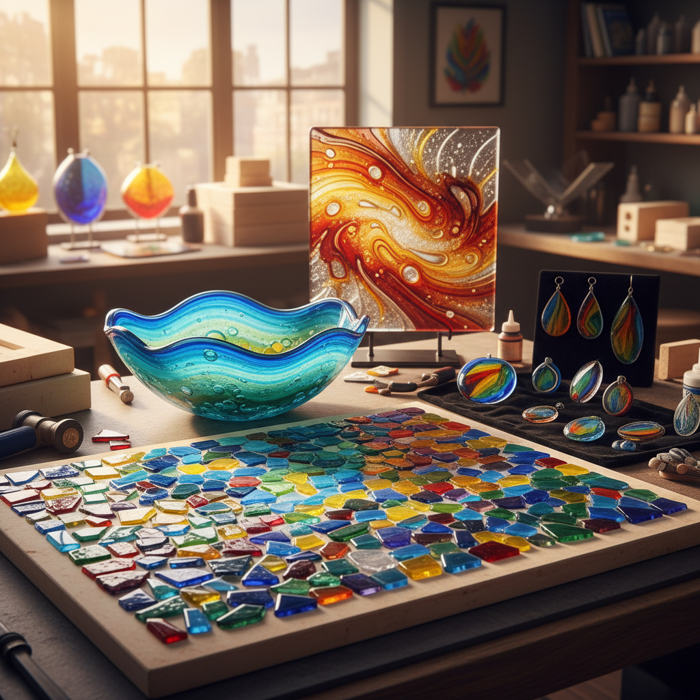

# Fused Glass 熔融玻璃

> "In the kiln, glass remembers its liquid past — pieces merge, colors blend, and something new is born from fire." — Unknown

## 概述

熔融玻璃（Fused Glass）是将多块玻璃片在窑炉中加热至熔融温度（通常700-820°C），使它们融合为一体的玻璃艺术技法。与吹制玻璃不同，熔融玻璃在平面或模具中完成——艺术家将预先切割的彩色玻璃片、玻璃粉、玻璃条等排列组合，然后通过窑烧使其融合。这种技法允许精确的设计控制，同时又保留了玻璃在高温下自然流动的有机美感。

熔融玻璃的魅力在于：预设与惊喜的共存——你可以精心设计每一片玻璃的位置，但窑炉中的热力学总会带来意想不到的效果。

## 核心特征

| 特征 | 描述 |
|------|------|
| 窑烧 | 在窑炉中加热融合 |
| 拼合 | 多片玻璃的组合 |
| 色彩 | 丰富的色彩可能 |
| 层次 | 多层玻璃的叠加 |
| 平面 | 主要在平面上工作 |
| 控制 | 精确的设计控制 |

## 视觉特征

- **透明**：玻璃的透明与半透明
- **色彩**：鲜艳的色彩融合
- **流动**：热融后的流动痕迹
- **光泽**：玻璃的光滑光泽
- **层次**：多层叠加的深度
- **纹理**：可加入纹理和气泡

## 代表作品

| 作品 | 艺术家 | 年代 | 意义 |
|------|--------|------|------|
| *Egyptian mosaic glass* | 匿名 | 公元前15世纪 | 最早的熔融玻璃 |
| *Bullseye Glass panels* | Various | 1970s+ | 现代熔融玻璃先驱 |
| *Klaus Moje bowls* | Klaus Moje | 1980s-2000s | 熔融玻璃大师 |
| *Richard Whiteley sculptures* | Richard Whiteley | 2000s+ | 窑铸玻璃雕塑 |
| *Contemporary fused jewelry* | Various | 当代 | 熔融玻璃首饰 |

## 历史时间线

| 时期 | 事件 |
|------|------|
| 公元前15世纪 | 古埃及的马赛克玻璃 |
| 古罗马 | 罗马马赛克玻璃碗 |
| 中世纪 | 技法几乎失传 |
| 1960s-70s | 工作室玻璃运动复兴 |
| 1970s | Bullseye Glass公司推动标准化 |
| 当代 | 熔融玻璃成为主流玻璃艺术 |

## 中国语境

中国的玻璃艺术近年来发展迅速。上海玻璃博物馆是亚洲最重要的玻璃艺术机构之一。中国当代玻璃艺术家如庄小蔚、王沁等在国际上获得认可。熔融玻璃作为相对容易入门的玻璃技法，在中国的手工艺爱好者中越来越受欢迎，许多城市都有提供熔融玻璃体验课程的工作室。

## AI生成概念图

## 与其他风格的关系

- **Glass Blowing** → 吹制玻璃（热加工）
- **Slumping** → 玻璃塌陷成型
- **Kiln Casting** → 窑铸玻璃
- **Millefiori** → 千花玻璃
- **Stained Glass** → 彩色玻璃窗
- **Mosaic** → 马赛克拼贴

---

*浮光艺志 | Chronicle of Artistry*
