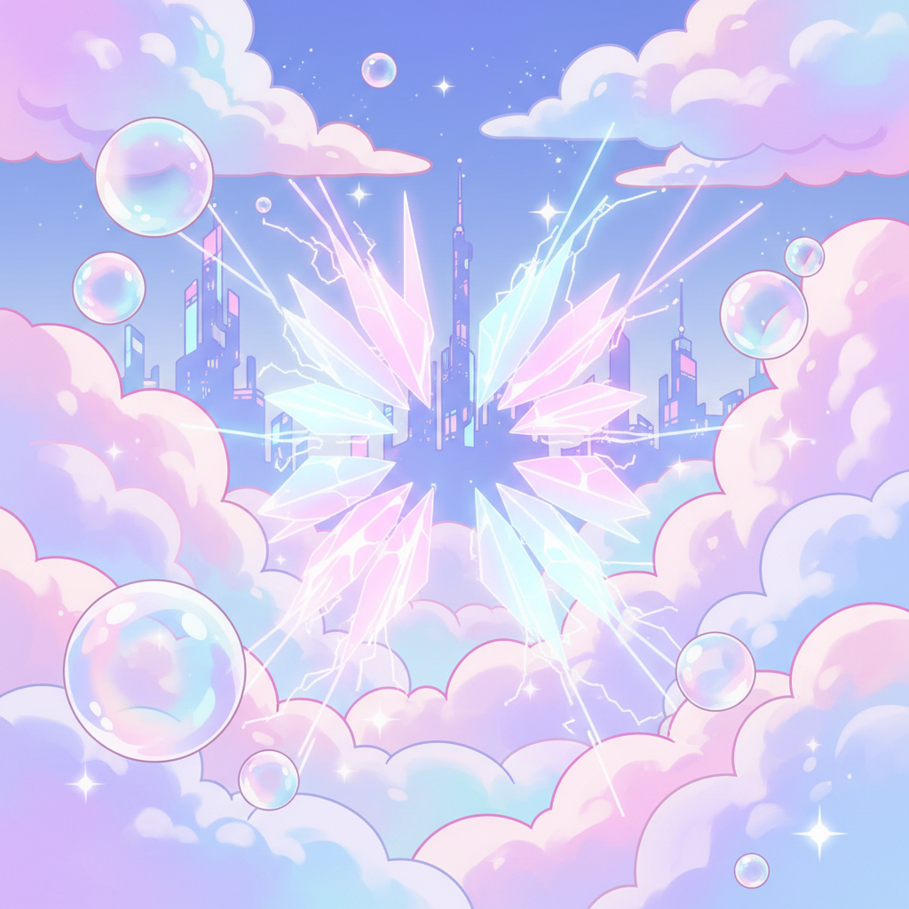

# Future Bass 未来贝斯



> **"超锯齿和弦、侧链压缩、彩虹色彩——EDM时代最甜美的电子音乐。"**

## 概述

| 维度 | 描述 |
|------|------|
| 时期 | 2012–至今 |
| 别名 | Future Bass, Kawaii Bass, Colour Bass |
| 核心色彩 | 粉色、紫色、蓝色、彩虹渐变 |
| 关键元素 | 超锯齿和弦(Supersaw)、侧链压缩、Vocal chops、甜美旋律 |
| 代表人物 | Flume, San Holo, Marshmello, Porter Robinson |
| 关联风格 | Dubstep, Trap, Chillwave, J-Pop, EDM |

---

## 历史脉络

| 年份 | 事件 |
|------|------|
| 2012 | Flume 同名专辑——Future Bass 先声 |
| 2014 | Wave Racer, Lido——SoundCloud 场景 |
| 2015 | Marshmello 崛起——Future Bass 主流化 |
| 2016 | Porter Robinson "Shelter"——动画+Future Bass |
| 2017 | San Holo "Light"——全球突破 |
| 2020s | 融入更广泛的电子音乐 |

### 核心哲学

Future Bass 的精神是**"电子音乐可以是甜美的、情感的、彩色的"**：
- 情感 = 核心（"让你想哭的Drop"）
- 色彩 = 视觉（"每个和弦都有颜色"）
- 甜美 = 不是软弱（"温柔也是力量"）
- 社区 = 温暖（"我们不需要黑暗——我们选择光"）
- "Future Bass 是给那些在Dubstep里找不到自己的人的音乐"

---

## 视觉语法

### 色彩系统

```
主色：
  粉色 (#FF69B4) — 甜美、情感
  紫色 (#9370DB) — 梦幻
  天蓝 (#87CEEB) — 清新、希望

辅色：
  彩虹渐变 — 多色过渡
  白色 (#FFFFFF) — 纯净
  薄荷绿 (#98FB98) — 清新

规则：
  - 明亮、饱和
  - 渐变为主
  - 柔和但不暗淡
  - 动画/插画风格常见

质感：
  云朵 — 柔软、梦幻
  水晶 — 闪烁、透明
  彩虹 — 多色
  泡泡 — 轻盈
```

### 标志性元素

| 类别 | 元素 |
|------|------|
| 视觉 | 彩虹渐变、动画、云朵、几何 |
| 音乐 | Supersaw和弦、Vocal chops、侧链、甜美Drop |
| 封面 | 明亮色彩、渐变、插画、动画 |
| 平台 | SoundCloud、Spotify、YouTube |
| 文化 | 动画MV、Kawaii、情感、社区 |
| 态度 | 甜美、情感、明亮、温暖、希望 |

---

## 与千禧怀旧的关系

### EDM时代的"温柔革命"
- Future Bass = 对Dubstep"攻击性"的温柔回应
- Porter Robinson "Worlds" = 动画+电子+情感
- "Future Bass 让电子音乐可以让你哭"
- 与日本动画/Kawaii文化的深度交叉

### 色彩美学的影响
- Future Bass 的视觉 = 2015-2020 互联网色彩趋势
- 渐变设计 = Future Bass 的视觉对应
- Instagram/Spotify 的渐变封面 = Future Bass 美学的扩散

---

## 中国语境

- Future Bass 在中国电音节的流行
- 中国 Future Bass 制作人
- 与中国"甜系电子"的交叉
- B站动画MV文化

---

## 设计应用

| 场景 | 应用方式 |
|------|----------|
| 品牌 | 明亮+渐变+甜美+年轻+情感 |
| 数字 | 渐变+动画+粒子+明亮+流动 |
| 音乐 | 彩色封面+渐变+插画+动画 |
| 产品 | 年轻+色彩+甜美+科技+温暖 |

---

## 相关风格

← [Dubstep 回响贝斯](dubstep.md) | [Chillwave 寒潮](chillwave.md) →

↑ [返回千禧怀旧目录](README.md) | [返回总目录](../README.md)
