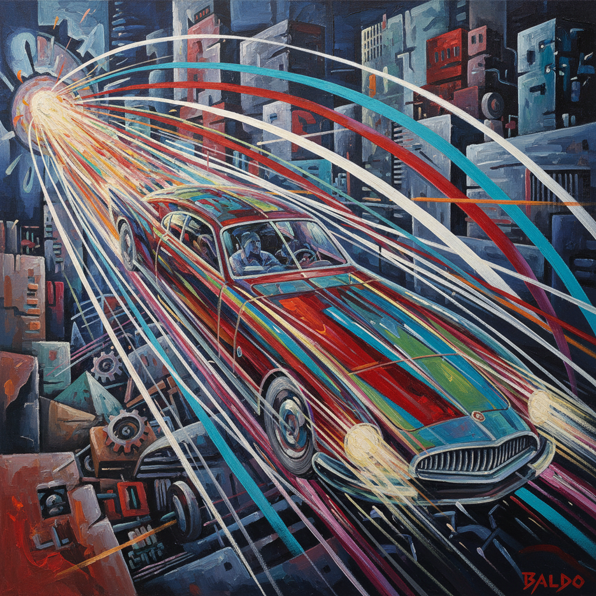

# Futurism Painting 未来主义绘画

> **时期：** 1909年–1920年代  
> **关键词：** 速度崇拜、机械美学、动态分解、意大利、反传统

## 概述

Futurism Painting（未来主义绘画）是1909年由马里内蒂在意大利发起的激进艺术运动——他们崇拜速度、机器和现代都市的能量，要彻底摧毁博物馆和传统。波丘尼的奔跑人物、巴拉的疾驰汽车——未来主义画家用重叠的形体和力线捕捉运动的连续瞬间，让画布本身成为一台振动的能量机器。

## 风格特征

- **运动分解**：连续动作的同时呈现
- **力线**：表示能量和速度的射线
- **碎片化**：物体在运动中分解
- **机械主题**：汽车、火车、飞机、工厂
- **强烈色彩**：电气化的鲜艳对比

## 代表人物与作品

- 翁贝托·波丘尼《城市的崛起》
- 贾科莫·巴拉《链条上的狗的动态》
- 卡洛·卡拉《无政府主义者的葬礼》
- 吉诺·塞韦里尼 舞蹈场景

## 概念图

