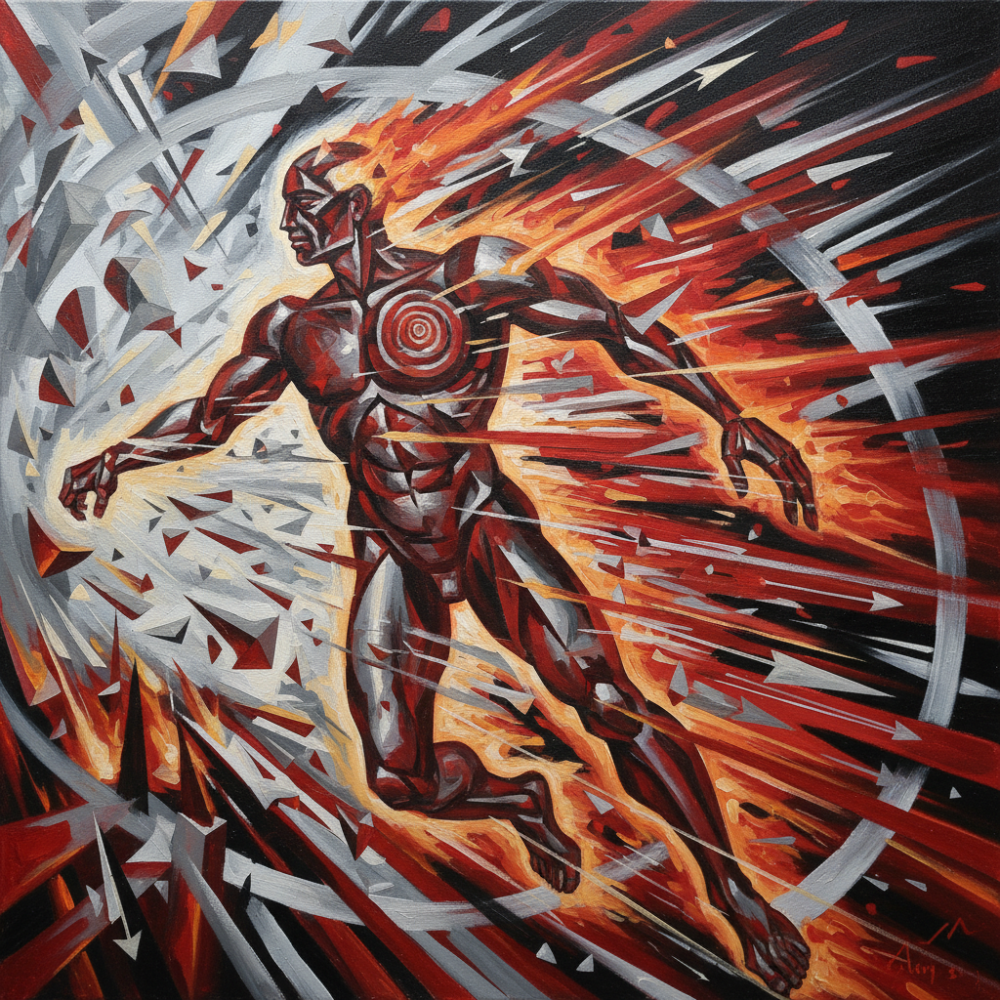

# Futurism 未来主义



> **"速度是新的美——汽车比胜利女神更美——我们要烧掉博物馆！"**

## 概述

| 维度 | 描述 |
|------|------|
| 时期 | 1909–1944/影响至今 |
| 别名 | Futurism, Italian Futurism, 未来主义 |
| 核心色彩 | 金属色、速度模糊色、高对比、动态色彩 |
| 关键元素 | 速度、机器、动态、同时性、暴力美学 |
| 代表人物 | Filippo Marinetti, Umberto Boccioni, Giacomo Balla, Luigi Russolo |
| 关联风格 | Cubism, Constructivism, Art Deco, Streamline Moderne, Cyberpunk |

---

## 历史脉络

| 年份 | 事件 |
|------|------|
| 1909 | Marinetti《未来主义宣言》发表 |
| 1910 | 未来主义绘画宣言 |
| 1912 | Boccioni《空间中连续性的独特形式》 |
| 1913 | Russolo《噪音的艺术》——噪音音乐 |
| 1914 | 未来主义支持一战——争议 |
| 1920s | 未来主义与法西斯的关系——历史污点 |
| 2020s | 未来主义的速度美学在科技设计中延续 |

### 核心哲学

未来主义的精神是**"过去已死——只有未来——速度、机器、暴力"**：
- 速度 = 美（"一辆飞驰的汽车比萨莫色雷斯的胜利女神更美"）
- 机器 = 崇拜（"机器是新的神——工厂是新的教堂"）
- 破坏 = 创造（"烧掉博物馆——在废墟上建新世界"）
- 同时 = 现代（"画出运动的所有瞬间——不是一个静止的瞬间"）
- Marinetti: "我们要歌颂战争——世界唯一的卫生学"（极端且有争议）

---

## 视觉语法

### 色彩系统

```
主色：
  金属银 (#C0C0C0) — 机器、速度
  火焰红 (#FF4500) — 能量、暴力
  电光蓝 (#00BFFF) — 科技、未来
  黑色 (#000000) — 力量、对比

辅色：
  金色 (#FFD700) — 光、速度
  紫色 (#4B0082) — 能量
  白色 (#FFFFFF) — 闪光

规则：
  - 动态色彩（模糊、重叠）
  - 高对比（速度感）
  - 金属质感
  - 色彩 = 能量

质感：
  模糊 — 速度
  重叠 — 同时性
  锐利 — 机器
  碎片 — 爆炸
```

### 标志性元素

| 类别 | 元素 |
|------|------|
| 主题 | 速度、机器、城市、战争、运动 |
| 技法 | 同时性、动态分解、力线(lines of force) |
| 形式 | 碎片化、重叠、模糊、锐角 |
| 媒介 | 绘画、雕塑、建筑、音乐、文学、表演 |
| 态度 | 激进、暴力、反传统、崇拜机器、极端 |
| 争议 | 与法西斯的关系、暴力美学、厌女 |

---

## 与千禧怀旧的关系

### 速度美学的遗产
- 未来主义的"速度" → Streamline → 汽车设计 → 科技产品
- "未来主义是第一个崇拜'科技'的艺术运动"
- 科技公司的视觉语言中有未来主义的DNA
- Cyberpunk = 未来主义的暗黑版本

### 争议与反思
- 未来主义与法西斯的关系 = 艺术与政治的警示
- "美学可以被用于邪恶——这是未来主义的教训"
- 当代"加速主义"思潮与未来主义的回响

---

## 中国语境

- 中国现代化进程中的"未来主义"精神
- 中国科技公司的视觉语言
- 中国当代艺术中的速度与城市主题
- 中国科幻视觉中的未来主义元素

---

## 设计应用

| 场景 | 应用方式 |
|------|----------|
| 科技 | 速度+未来+动态+创新 |
| 汽车 | 流线+速度+力量+金属 |
| 品牌 | 前卫+激进+能量+突破 |
| 运动 | 动态+速度+力量+竞争 |

---

## 相关风格

← [Cubism 立体主义](cubism.md) | [Constructivism 构成主义](constructivism.md) →

↑ [返回千禧怀旧目录](README.md) | [返回总目录](../README.md)
