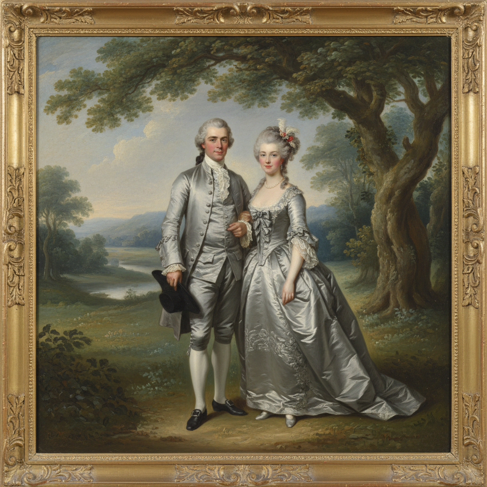

# Thomas Gainsborough 庚斯博罗

> "I'm sick of portraits, and wish very much to take my viol-da-gamba and walk off to some sweet village, where I can paint landscapes." — Thomas Gainsborough

## 概述

托马斯·庚斯博罗（Thomas Gainsborough，1727–1788）是英国18世纪最伟大的画家之一，与雷诺兹并列为英国肖像画的双峰。他将肖像与风景融为一体，用轻盈飘逸的笔触和银灰色调创造出独特的英国优雅。

## 核心特征

| 特征 | 描述 |
|------|------|
| 肖像与风景融合 | 人物置于自然风景中 |
| 轻盈笔触 | 薄涂、飘逸、几乎透明 |
| 银灰色调 | 英国特有的柔和光线 |
| 丝绸质感 | 对织物光泽的精湛表现 |
| 自然姿态 | 非正式的、放松的贵族肖像 |
| 音乐性 | 构图如同视觉音乐 |

## 代表作品

| 作品 | 年代 | 意义 |
|------|------|------|
| *The Blue Boy* | 1770 | 英国绘画最著名的图像 |
| *Mr and Mrs Andrews* | 1750 | 肖像与风景的完美结合 |
| *The Morning Walk* | 1785 | 优雅的散步——英国贵族理想 |
| *Mrs Siddons* | 1785 | 女演员的非正式魅力 |

## AI生成概念图

## 与其他风格的关系

- **Reynolds** → 终身对手，不同的肖像哲学
- **Van Dyck** → 继承凡·戴克的英国肖像传统
- **Constable** → 影响了后来的英国风景画
- **Rococo** → 法国洛可可的英国变体
