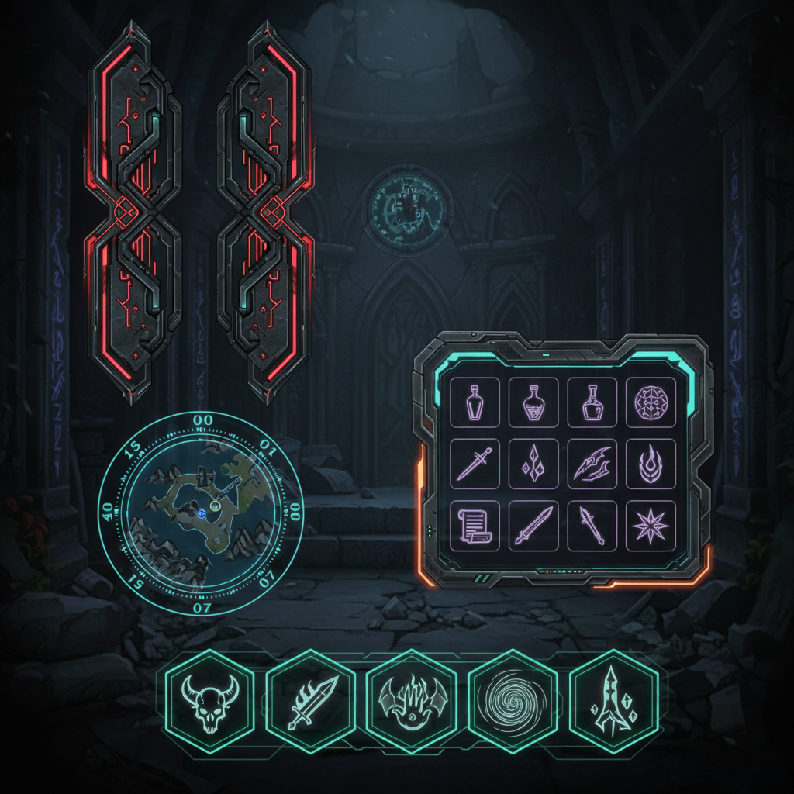

# Game UI Design 游戏界面设计

> **时期：** 1970年代–至今  
> **关键词：** HUD设计、交互反馈、沉浸式界面、信息层级、风格化图标

## 概述

Game UI Design（游戏界面设计）是将信息传达、交互反馈和视觉美学融为一体的设计艺术。从早期街机的像素计分板到当代3A游戏的沉浸式HUD，游戏UI需要在不破坏沉浸感的前提下传递大量实时信息——生命值、地图、物品栏、对话框——每一个元素都必须在毫秒内被玩家理解。

## 风格特征

- **信息层级**：关键信息的即时可读性
- **风格统一**：UI与游戏世界观的视觉一致
- **动态反馈**：动画和音效的交互响应
- **空间效率**：在有限屏幕内组织复杂信息
- **沉浸平衡**：信息传达与画面美感的平衡

## 代表作品

- 《死亡空间》（叙事性HUD）
- 《赛博朋克2077》（科幻UI美学）
- 《塞尔达传说》系列（极简HUD）
- 《女神异闻录5》（风格化菜单设计）

## 概念图

